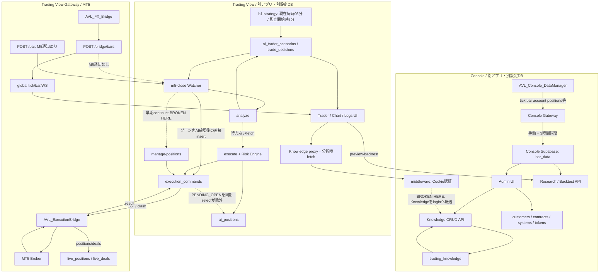

# AVLFX CURRENT SYSTEM AUDIT

- Role: **AVL-FX CURRENT SYSTEM AUDITOR**
- Audit date: **2026-09-23 (Asia/Tokyo)**
- Document type: **CURRENT STATE / repository static audit**
- Scope roots: TV = `/Users/tanakayoshiki/Desktop/AVL_FX　trading view`; CON = `/Users/tanakayoshiki/Desktop/AVL-FX console`
- TV HEAD reference: `f530d5e168a4903bf7f21c1a30ab3b6be1660343`。作業ツリーには本監査以前から変更・削除があるため、HEADだけを監査対象と解釈しない。対象は読取り時の作業ツリー。主要証拠のSHA-256は§19。
- 保存先選択: 両rootの現存Markdownを列挙。同目的の現存監査ファイルなし。TVの既存 `docs/` に本ファイルだけを作成。削除済みの旧ドキュメントは復元しない。MASTER/roadmapは編集しない。
- **並行変更の観測:** 最終照合時、監査者が変更していないTV/vercel.jsonのH1 scheduleが `*/5 * * * *` → `5 * * * *`（毎時05分）へ変化。AUDIT-036は過去の確認事実を保持し、Statusを CHANGED_DURING_AUDIT / PRODUCTION_UNVERIFIED に更新。MASTERファイルの新規存在も検出したが、本文は読み書きしていない。以降のCurrent表は最終読取りを反映。本番反映はUNKNOWN。
- 禁止操作遵守: Source/API/Gateway/EA/migration/DB/ENV/hostingの変更、デプロイ、注文、状態変更APIの実行なし。ビルド・テスト・実API疎通も未実施。
- 別セッションのMASTER設計内容は参照していない。本資料は要求仕様・理想設計・改善ロードマップではない。

**分類の定義**

| Status | この資料での意味 |
|---|---|
| IMPLEMENTED | 明記した限定機能の入力・処理・保存または返却・利用先をコードで追跡。実環境成功を意味しない |
| PARTIAL | 実処理があるが必須経路の断絶、不整合、未接続部分がある |
| UI_ONLY | 対応する実処理に接続していないUI。DB/APIの存在だけでこの分類を変えない |
| MOCK | 模擬データ生成そのもの。存在するだけで現行画面全体をMOCKとしない |
| LEGACY | 現行主要経路から外れた旧実装。併存API・未使用hookを含む |
| NOT_IMPLEMENTED | 調査対象sourceで機能の実処理が見つからない |
| UNKNOWN | コードから確定しない実環境・利用状態。§16のENV-IDで管理 |
| UNKNOWN_IN_PRODUCTION | リポジトリ上の有無とは別に、本番DBの実在・適用状態を確認していない |

問題Statusは原則 `CONFIRMED_CODE / OPEN`（構造・欠落をコード確認、監査者による修正なし）。AUDIT-036のみ並行変更を観測した例外。競合・誤発注等のImpactはその構造からの条件付き帰結であり、実事故の発生を確認した意味ではない。NOT_IMPLEMENTEDは両rootの現存source検索の範囲であり、外部サービスに存在しないことまで断定しない。

# 1. Executive Summary

現在は「Console管理・データ収集」「TV分析・注文API」「Gateway/MT5実行」が実処理を持つ一方、End-to-Endの自動売買はPARTIAL。

- Console: 管理者Knowledge CRUD、顧客/契約/システムの基本管理、Strategy version snapshot、バックテスト計算API、デプロイ記録は実コード接続あり。
- Trading View: Chartの実データ取得、OpenAI分析呼出、Scenario/decision保存、command作成、ログ取得コードあり。ただしDB定義不足と状態不整合がある。
- MT5: Data Bridgeの価格送信、ExecutionBridgeのBuy/Sell/Close/Modifyおよび結果報告あり。これらを連続稼働済みとは判定していない。
- 切断: Console Knowledgeはmiddlewareで遮断。通常EAの `/bridge/bars` は `/bar` のM5通知を通らない。Position Managementは早期continueで到達不能。
- 追跡: M5直接注文はai_positions未作成。通常executeはPENDING_OPEN作成だがWatcherはOPENのみ同期。よって双方に異なる追跡断絶がある。
- 安全性: Risk bypass、AI/データ失敗時ENTER、9時間加算期限、SLを0へ解除して発注、connection isolation/token検査欠落が確認された。
- Console内にAI Trader/毎時LLM分析/Scenario/Entry Recheck/実口座TP/SL判断Runtimeはない。Backtest PositionManagerは実口座管理ではない。
- **83問題**（従前72件のIDを維持し、文書化時の追加確認11件）。**P0=12 / P1=37 / P2=30 / P3=4**。**UNKNOWN=20件**（§16の独立した実環境確認20項目）。各表での同じUNKNOWN再掲は重複計数しない。

# 2. Current Architecture

実線はコード上の呼出/保存、破線は不成立・不足・保証なし。いずれも本番疎通を示さない。

Console setupは別途TV Supabase Admin Authとmt5_connectionsへ直接書き込み、Console customers/system_tokens/contractsも更新する。Console UIからTV売買を直接実行する機能とは別。§7・§10参照。

# 3. Console Current State

| Component | Status | 実コードの接続範囲と制限 |
|---|---|---|
| Market Data | PARTIAL | EA→Gateway→bar_data→画面あり。差分保存/収集設定反映に不足 |
| Historical Data | PARTIAL | bar_dataあり。get_bar_stats RPC定義なし、GOLD表記不整合 |
| Console DataManager | IMPLEMENTED | 価格・履歴・口座情報の収集送信EA。売買実行なし。稼働EX5はUNKNOWN |
| Console Gateway | PARTIAL | 受信・メモリ/JSON・DB同期あり。bulk/差分・コメントと実装に不整合 |
| AI Knowledge | PARTIAL | 管理者CRUDはIMPLEMENTED、TV向け公開経路はmiddlewareで遮断 |
| Research API | PARTIAL | token/契約判定とbars返却あり。TV WFのmethod不一致、期間表示symbol不一致 |
| Backtest | IMPLEMENTED | POST spec→bar_data→runBacktest→report返却の限定機能。結果永続化や全戦略の正しさは未検証 |
| Customer Management | PARTIAL | 台帳CRUDはIMPLEMENTED。TVアカウントセットアップは部分失敗処理不足 |
| Contract Management | IMPLEMENTED | UI/API/customer_contracts、Research利用権検査まで接続。課金決済代行の実装を意味しない |
| System Management | IMPLEMENTED | customer_systems基本登録/更新/表示。遠隔デプロイ機能を意味しない |
| Monitoring | PARTIAL | report→system_health_logs→UIあり。TV Gateway送信元なし |
| Audit Log | PARTIAL | console_audit_log定義/表示、操作INSERTなし。Researchアクセスログは別途保存あり |
| Strategy Registry | IMPLEMENTED | spec管理・strategy_versions snapshot・表示の範囲。実売買実行は含まない |
| EA Registry | PARTIAL | UI/登録/取込APIあり、ea_registry migrationなし、GET認証なし |

URL/AI_GENERATEDの出典選択自体はDBへ保存されるため単なるMOCKではない。ただしURL自動取込/AI生成はNOT_IMPLEMENTED。Knowledgeの過去本文version保存もない。[E37](#e37)–[E39](#e39)。

# 4. Trading View Current State

| Component | Status | 確認範囲と切断点 |
|---|---|---|
| Realtime Market Data | PARTIAL | EA tick/bar→Gateway/WSあり。接続分離なし |
| Chart | PARTIAL | /chart→AVLChart→live/connection/bars、fallbackとWSあり。データ源はglobal、個人口座専用を保証しない |
| MT5 Connection | PARTIAL | token/DB/heartbeat系とglobal Gateway接続系が併存 |
| AI Trader | PARTIAL | 一覧/保存/分析/モードAPI。生成/DB/実行追跡に欠落 |
| AI Trader Builder | PARTIAL | UI・保存APIあり、profile生成APIはNOT_IMPLEMENTED |
| H1 Analysis | PARTIAL | OpenAI実呼出、最終読取りは毎時05分Cron（開始時5分）、共有Scenario、保存エラーとschema不足 |
| Scenario | PARTIAL | 保存/読出/UIあり。列・状態CHECK・active競合 |
| M5 Watcher | PARTIAL | endpoint/trigger評価/補助Cronあり、通常EA経路から通知なし |
| Entry Recheck | PARTIAL | AI ENTER/WAITあり、fail-open・risk bypass・追跡不足 |
| Risk Engine | PARTIAL | DEMO/HEDGING/SL/lot等の実審査。迂回経路、TP/RR/margin不足 |
| Execution Engine | PARTIAL | command→EA実注文コードあり。期限/結果status/SL解除問題 |
| ai_positions | PARTIAL | 通常executeはPENDING_OPENを作るがOPEN昇格未接続。直接注文は未作成 |
| Position Management | PARTIAL | API実装あり、自動呼出到達不能 |
| TP Recheck | PARTIAL | AI/MODIFY_TP/EAあり、自動呼出・ai_positions同期・Timelineなし |
| SL Recheck | PARTIAL | AI/MODIFY_SL/EAあり、同上＋不利変更禁止が未強制 |
| AI Log | PARTIAL | H1/FILLED/CLOSED限定、owner絞り漏れと取得エラー隠蔽 |
| Trade History | PARTIAL | 旧Gateway history→trade_history→History UI。個人口座分離/CREATE定義不足。live_dealsとは別 |
| News | IMPLEMENTED | NewsView→/api/news→RSS取得/翻訳→返却。DB保存はこの表示経路にない。外部可用性UNKNOWN |
| Economic Calendar | PARTIAL | UI→FF、別6時間Cron→economic_events→Watcher。CREATE不足、actualはnull |

現在のChartはMockDataProviderを作成する経路として確認されていない。MockDataProvider自体はMOCK、旧useMonitor/LogsView/旧ordersはLEGACYとして§17に区別する。外部ニュース・カレンダーの現在のサービス仕様の真偽は本監査では調査しない。

# 5. MT5 / Gateway Current State

## EA一覧

| EA | Root | 現在の役割 | 相手 |
|---|---|---|---|
| AVL_FX_Bridge.mq5 | TV/ea | Tick、OHLC、positions、account、history、indicators等のデータ送信 | TV Gateway /bridge系 |
| AVL_ExecutionBridge.mq5 | TV/ea | command poll/claim、BUY/SELL/CLOSE/MODIFY、結果/heartbeat/spec送信 | TV Gateway execution系 |
| AVL_Console_DataManager.mq5 | CON/mt5 | データ収集・履歴同期・口座/注文状態の読取り送信 | Console Gateway |
| AVL_FX_Bridge.ex5 | TV/public/ea | 配布バイナリの存在を確認 | sourceとの一致・稼働UNKNOWN |
| AVL_Console_DataManager.ex5 | CON/mt5 | バイナリの存在を確認 | sourceとの一致・稼働UNKNOWN |

TV設定画面はデータBridgeとExecutionBridge双方の起動を案内。実際のEA導入状況は確認していない。Console DataManagerに実注文処理なし。ExecutionBridgeはInpDemoOnly=trueが初期値。

## Endpoint・データ別

| Data/operation | TV Gateway | Console Gateway | 現状 |
|---|---|---|---|
| tick | /bridge/ticks、/tick、GET /tick/:symbol | /tick | TV global symbol key。ID付きaliasもID無視 |
| bar | /bridge/bars、/bridge/bars/bulk、/bar、/bars/bulk | /bar、/bars/bulk | TVのM5通知は/barだけ |
| account | /account、/bridge/heartbeat→mt5_connections | /account | global accountと接続DB snapshotが別経路 |
| positions | /positions/global、/bridge/positions→live_positions | /positions/read-only収集 | TVの空snapshotはDBクローズを反映しない |
| orders | /orders旧queue、/orders/:id/result | /orders/stream状態受信 | 旧queueとexecution_commandsは別。Consoleは注文発注しない |
| execution commands | /execution-commands/pending、/:id/claim | なし | connection token照合とatomic claimあり |
| results | /execution-commands/:id/result | なし | 接続を認証するが更新条件にconnectionIdなし |
| heartbeat | /bridge/heartbeat | /heartbeat | TVの当該handlerはtoken存在のみで口座DB更新へ進む |
| symbol specs | /bridge/symbol-spec | 指標等のデータ収集 | TV canonicalのUSD除去問題 |
| sync jobs | /data-commands系 | /data-commands/pending、/:id/progress | market_data_sync_jobsとclaim RPC |
| WebSocket | /ws | /ws | TVは全client broadcast。本人用分離なし |

- TV auth: gateway secret一致、またはX-Connection-Id/X-Connection-Tokenの**存在**でnext。全ルートが同じ強度ではない。pending/claim/positions/deals/specは個別verifyBridgeAuthあり。bars/ticks/heartbeatには欠落。
- Token: mt5_connectionsのconnection token hash検証経路あり。Console system_tokensはResearch/System報告用で別物。ENV値・秘密値は本資料へ転記していない。
- connection_id: command/live mirrorには保存・条件利用あり、価格aliasとglobal WSは未分離。
- Timestamp: TV Gateway normalizeTimeは秒をmsへ正規化。RESTによって秒返却/生ms返却が混在し、Chart側の正規化と対で読む必要がある。EA ParseISOはUTCにbroker offsetを加算。Risk Engine側の固定9時間はこれと重複する。
- M5通知はprevTime != newTimeで検出し、厳密な時刻前進・確定値一致を保証する判定ではない。通常EAルートで通知されないという確定問題とは区別。
- symbol specsはEA送信/DB upsert/execute参照あり。broker_symbol fallbackで救われるケースはあるが、EURUSD→EUR canonicalの誤り自体は残る。

# 6. Database Current State

実施したのはSQLファイルと参照コードの静的照合。DDL適用・DB照会はしていない。後述のinventoryはCREATE/RPC/index/RLS宣言をファイルごとに抽出したもので、本番catalogではない。

## Trading View

主要系列:
- 002/003: bar_dataと共有読取。001: cot_positions。
- 004–015: strategy_registry、backtest、分析、version、optimization、WF/MC、user isolation等。
- 016–020: mt5_connections、execution_commands、strategy_signals/runtime、live_positions/live_deals。
- 021–024: ai_traders/versions/knowledge、Scenario、decisions/outcomes/reviews/memories、watcher_events。
- 025–028: ai_positions/system_settings、execution FK patch、symbol_specs/cron_schedules/gateway_state、dry_run_logs。
- 番号014と015は複数ファイル。migration適用履歴・採番の扱いはUNKNOWN。

| 対象 | 収録定義 | コードとの差 |
|---|---|---|
| ai_traders.execution_mode | 025: ANALYSIS_ONLY/MANUAL_APPROVAL/DEMO_AUTONOMOUS | AUTO/STOPPED不許可 |
| Scenario.state | 022: WAITING/WATCHING/CONSIDERING/DECIDED/INVALID | INVALIDATEDを使用 |
| command.action | BUY/SELL/CLOSE/MODIFY_SL/MODIFY_TP | 手動decideがENTER_LONG/SHORTをそのまま使用 |
| command.status | PENDING/CLAIMED/EXECUTING等のterminal管理 | pre-claim拒否結果の更新条件と不一致 |
| ai_positions.status | **027でPENDING_OPEN/OPEN/CLOSING/CLOSED/ERRORに拡張済み** | schema不足ではなくOPEN移行Runtimeの欠落 |
| ai_positions.decision_id | 027に一意indexあり | 通常execute同一decisionの二重作成を抑止。M5直接経路はこの表自体を作らない |
| active Scenario | trader/is_active/created_at検索index | active=true一意indexはない |
| watcher_events | trader_id,m5_bar_time,trigger_type UNIQUE | 直接エントリー分岐は後段dedupを通らない |
| live_positions | connection_id,position_ticket UNIQUE | 保存の紐付けはあるが消えたpositionのCLOSED更新がない |
| symbol_specs | 接続/シンボルlookupとRLS | normalize不整合 |

RLS: AI本体・Scenario・learning・positionsはowner条件とservice_roleのpolicyを収録。AI versions/knowledgeは親所有者参照。015はstrategy_registryでuser_id=NULLの共有読取も許可。bar_data/economic_events/news_itemsは共有読取。Admin Clientはowner条件を別途書く必要があり、policyの存在だけではAI Log等の漏れを補えない。003と015などpolicyは後続SQLと合わせて確認すること。

## Console

bar_data、sync jobs、gold_data_config、customers、customer_systems、customer_contracts、strategy_registry/versions/shares、research_access_log、system_tokens、system_health_logs、deployments、console_audit_log、trading_knowledgeが収録。018はcustomers.tv_password追加。

- trading_knowledge status=DRAFT/ACTIVE/ARCHIVED、source_type=MANUAL/URL/AI_GENERATED、version>=1。version履歴テーブルはない。
- strategy_versionsは(strategy_id,version) UNIQUEとspec_snapshot。Knowledgeの連番上書きとは異なる。
- 各管理テーブルのRLS・service_role policyを収録。bar_dataの公開/共有読取は001/002を併読。
- Console自身のmt5_connections参照はTV用client `tvSb` を用いるsetup/顧客詳細であり、**Console側にCREATEがないこと自体は欠落と判定しない**。
- get_bar_data_status、claim_next_sync_job、recover_stale_sync_jobs等RPC定義あり。get_bar_statsはない。

## コード利用あり・作成/追加定義なし

すべての本番存在・適用状態は **UNKNOWN_IN_PRODUCTION**。

| System | Object | 使用元 | Repository finding |
|---|---|---|---|
| TV | ai_analysis_logs | analyze | CREATEなし |
| TV | economic_events | calendar cron/Watcher/repository | CREATEなし。015でRLS ALTERする前提だけあり |
| TV | news_items | repository | CREATEなし。現在News UIはRSS直返しでこの表を使わない |
| TV | trade_history | history/repository | CREATEなし。015は既存表へのALTERのみ |
| TV | trade_audit_log | TradeAuditLogger | CREATEなし。ヘルパーの存在を全売買経路の監査保証としない |
| TV | ai_trader_scenarios追加列 | H1/analyze/logs | entry_side, entry_price_low, entry_price_high, suggested_sl, suggested_tp, suggested_volume, market_view, risk_context, reasoning_summary, key_levels, fundamental_notes, h1_bar_time, next_30min_outlook, applied_knowledge の追加DDLなし |
| CON | ea_registry | registry API/ea-list | CREATEなし |
| CON | ticks | system診断 | CREATEなし |
| CON | get_bar_stats() | historical画面 | CREATE FUNCTIONなし |

存在しない表に依存するALTERがあるため、クリーンDBへ収録SQLだけを順に適用する再現性にも欠落がある。実適用テストは未実施。

## Migration / RPC / Index / RLS inventory

ファイル内の宣言一覧。index数はCREATE INDEX宣言であり、UNIQUE列/制約から暗黙作成されるindexを含まない。後続ALTERの効果と本番適用は上記注記を参照。

### TV

| Migration | CREATE TABLE | RPC / trigger function | Explicit indexes | ENABLE RLS targets |
|---|---|---|---|---|
| [001_cot_positions.sql](</Users/tanakayoshiki/Desktop/AVL_FX　trading view/supabase/migrations/001_cot_positions.sql>) | cot_positions | — | idx_cot_positions_currency_date | cot_positions |
| [002_bar_data.sql](</Users/tanakayoshiki/Desktop/AVL_FX　trading view/supabase/migrations/002_bar_data.sql>) | bar_data | get_bar_data_status | idx_bar_data_lookup, idx_bar_data_symbol_time | bar_data |
| [003_bar_data_rls_open.sql](</Users/tanakayoshiki/Desktop/AVL_FX　trading view/supabase/migrations/003_bar_data_rls_open.sql>) | — | — | — | — |
| [004_strategy_registry.sql](</Users/tanakayoshiki/Desktop/AVL_FX　trading view/supabase/migrations/004_strategy_registry.sql>) | strategy_registry | — | idx_strategy_registry_type, idx_strategy_registry_status, idx_strategy_registry_created | — |
| [005_backtest.sql](</Users/tanakayoshiki/Desktop/AVL_FX　trading view/supabase/migrations/005_backtest.sql>) | backtest_jobs, backtest_results, backtest_trades | — | idx_backtest_jobs_strategy, idx_backtest_jobs_status, idx_backtest_results_job, idx_backtest_results_strategy, idx_backtest_trades_job, idx_backtest_trades_strategy | — |
| [007_strategy_ai_analyses.sql](</Users/tanakayoshiki/Desktop/AVL_FX　trading view/supabase/migrations/007_strategy_ai_analyses.sql>) | strategy_ai_analyses | — | idx_strategy_ai_analyses_strategy, idx_strategy_ai_analyses_job | — |
| [008_strategy_improvements.sql](</Users/tanakayoshiki/Desktop/AVL_FX　trading view/supabase/migrations/008_strategy_improvements.sql>) | strategy_improvements | — | idx_strategy_improvements_strategy, idx_strategy_improvements_analysis, idx_strategy_improvements_status | — |
| [009_strategy_versions.sql](</Users/tanakayoshiki/Desktop/AVL_FX　trading view/supabase/migrations/009_strategy_versions.sql>) | strategy_versions | — | idx_strategy_versions_strategy, idx_strategy_versions_improvement | — |
| [010_optimization.sql](</Users/tanakayoshiki/Desktop/AVL_FX　trading view/supabase/migrations/010_optimization.sql>) | optimization_jobs, optimization_candidates | — | idx_optimization_jobs_strategy, idx_optimization_jobs_status, idx_optimization_candidates_job, idx_optimization_candidates_rank, idx_optimization_candidates_adopted | — |
| [011_walk_forward.sql](</Users/tanakayoshiki/Desktop/AVL_FX　trading view/supabase/migrations/011_walk_forward.sql>) | walk_forward_jobs | — | idx_walk_forward_jobs_strategy, idx_walk_forward_jobs_status | — |
| [012_monte_carlo.sql](</Users/tanakayoshiki/Desktop/AVL_FX　trading view/supabase/migrations/012_monte_carlo.sql>) | monte_carlo_results | — | idx_monte_carlo_results_strategy, idx_monte_carlo_results_version | — |
| [013_phase4d.sql](</Users/tanakayoshiki/Desktop/AVL_FX　trading view/supabase/migrations/013_phase4d.sql>) | strategy_phase4d_interpretations | — | idx_phase4d_strategy, idx_phase4d_strategy_version, idx_phase4d_analysis | — |
| [014_market_data_sync_jobs.sql](</Users/tanakayoshiki/Desktop/AVL_FX　trading view/supabase/migrations/014_market_data_sync_jobs.sql>) | market_data_sync_jobs | set_sync_job_updated_at, claim_next_sync_job | idx_sync_jobs_status_created, idx_sync_jobs_strategy, idx_sync_jobs_one_active | market_data_sync_jobs |
| [014_user_subscriptions.sql](</Users/tanakayoshiki/Desktop/AVL_FX　trading view/supabase/migrations/014_user_subscriptions.sql>) | user_subscriptions | handle_new_user_subscription | idx_user_subscriptions_user_id, idx_user_subscriptions_stripe_customer, idx_user_subscriptions_stripe_sub | user_subscriptions |
| [015_sync_job_recovery.sql](</Users/tanakayoshiki/Desktop/AVL_FX　trading view/supabase/migrations/015_sync_job_recovery.sql>) | — | claim_next_sync_job, recover_stale_sync_jobs | — | — |
| [015_user_isolation_rls.sql](</Users/tanakayoshiki/Desktop/AVL_FX　trading view/supabase/migrations/015_user_isolation_rls.sql>) | — | — | idx_strategy_registry_user_id | strategy_registry, backtest_jobs, backtest_results, backtest_trades, strategy_ai_analyses, trade_history, bar_data, economic_events, news_items |
| [016_mt5_connections.sql](</Users/tanakayoshiki/Desktop/AVL_FX　trading view/supabase/migrations/016_mt5_connections.sql>) | mt5_connections | — | idx_mt5_connections_user_id, idx_mt5_connections_status | mt5_connections |
| [017_execution_commands.sql](</Users/tanakayoshiki/Desktop/AVL_FX　trading view/supabase/migrations/017_execution_commands.sql>) | execution_commands | — | idx_execution_commands_command_id, idx_execution_commands_user_id, idx_execution_commands_connection_id, idx_execution_commands_strategy_id, idx_execution_commands_status, idx_execution_commands_status_expires | execution_commands |
| [018_strategy_signals.sql](</Users/tanakayoshiki/Desktop/AVL_FX　trading view/supabase/migrations/018_strategy_signals.sql>) | strategy_signals | — | idx_strategy_signals_strategy_id, idx_strategy_signals_connection_id, idx_strategy_signals_signal_time, idx_strategy_signals_symbol_tf | strategy_signals |
| [019_strategy_runtime_state.sql](</Users/tanakayoshiki/Desktop/AVL_FX　trading view/supabase/migrations/019_strategy_runtime_state.sql>) | strategy_runtime_state | — | idx_strategy_runtime_state_connection_id, idx_strategy_runtime_state_runtime_status | strategy_runtime_state |
| [020_live_positions_deals.sql](</Users/tanakayoshiki/Desktop/AVL_FX　trading view/supabase/migrations/020_live_positions_deals.sql>) | live_positions, live_deals | — | idx_live_positions_user_id, idx_live_positions_connection_id, idx_live_positions_strategy_id, idx_live_positions_status, idx_live_positions_magic_symbol, idx_live_deals_user_id, idx_live_deals_connection_id, idx_live_deals_strategy_id, idx_live_deals_deal_time, idx_live_deals_position_ticket | live_positions, live_deals |
| [021_ai_traders.sql](</Users/tanakayoshiki/Desktop/AVL_FX　trading view/supabase/migrations/021_ai_traders.sql>) | ai_traders, ai_trader_versions, ai_trader_knowledge | — | idx_ai_traders_user_id, idx_ai_traders_public_id, idx_ai_trader_versions_trader, idx_ai_trader_knowledge_version | ai_traders, ai_trader_versions, ai_trader_knowledge |
| [022_ai_trader_scenarios.sql](</Users/tanakayoshiki/Desktop/AVL_FX　trading view/supabase/migrations/022_ai_trader_scenarios.sql>) | ai_trader_scenarios | — | idx_ai_trader_scenarios_trader, idx_ai_trader_scenarios_user | ai_trader_scenarios |
| [023_ai_trader_learning.sql](</Users/tanakayoshiki/Desktop/AVL_FX　trading view/supabase/migrations/023_ai_trader_learning.sql>) | trade_decisions, trade_outcomes, trade_reviews, experience_memories | — | idx_trade_decisions_trader, idx_trade_decisions_user, idx_trade_outcomes_trader, idx_experience_memories_trader | trade_decisions, trade_outcomes, trade_reviews, experience_memories |
| [024_ai_trader_watcher.sql](</Users/tanakayoshiki/Desktop/AVL_FX　trading view/supabase/migrations/024_ai_trader_watcher.sql>) | watcher_events | — | idx_watcher_events_trader, idx_watcher_events_symbol_bar | watcher_events |
| [025_ai_trader_phase3.sql](</Users/tanakayoshiki/Desktop/AVL_FX　trading view/supabase/migrations/025_ai_trader_phase3.sql>) | ai_positions, system_settings | — | idx_ai_positions_trader, idx_ai_positions_magic, idx_ai_positions_position_ticket | ai_positions, system_settings |
| [026_phase3_execution_bridge.sql](</Users/tanakayoshiki/Desktop/AVL_FX　trading view/supabase/migrations/026_phase3_execution_bridge.sql>) | — | — | idx_execution_commands_ai_trader, idx_execution_commands_ai_position | — |
| [027_phase35_safety_gate.sql](</Users/tanakayoshiki/Desktop/AVL_FX　trading view/supabase/migrations/027_phase35_safety_gate.sql>) | symbol_specs, cron_schedules, gateway_state | — | idx_symbol_specs_user_symbol, idx_symbol_specs_connection, idx_ai_positions_decision_unique, idx_cron_schedules_trader | symbol_specs, cron_schedules, gateway_state |
| [028_dry_run_logs.sql](</Users/tanakayoshiki/Desktop/AVL_FX　trading view/supabase/migrations/028_dry_run_logs.sql>) | dry_run_logs | — | idx_dry_run_logs_trader | dry_run_logs |

### CON

| Migration | CREATE TABLE | RPC / trigger function | Explicit indexes | ENABLE RLS targets |
|---|---|---|---|---|
| [001_bar_data.sql](</Users/tanakayoshiki/Desktop/AVL-FX console/supabase/migrations/001_bar_data.sql>) | bar_data | get_bar_data_status | idx_bar_data_lookup, idx_bar_data_symbol_time | bar_data |
| [002_bar_data_rls_open.sql](</Users/tanakayoshiki/Desktop/AVL-FX console/supabase/migrations/002_bar_data_rls_open.sql>) | — | — | — | — |
| [003_market_data_sync_jobs.sql](</Users/tanakayoshiki/Desktop/AVL-FX console/supabase/migrations/003_market_data_sync_jobs.sql>) | market_data_sync_jobs | set_sync_job_updated_at, claim_next_sync_job | idx_sync_jobs_status_created, idx_sync_jobs_strategy, idx_sync_jobs_one_active | market_data_sync_jobs |
| [004_sync_job_recovery.sql](</Users/tanakayoshiki/Desktop/AVL-FX console/supabase/migrations/004_sync_job_recovery.sql>) | — | claim_next_sync_job, recover_stale_sync_jobs | — | — |
| [005_gold_data_config.sql](</Users/tanakayoshiki/Desktop/AVL-FX console/supabase/migrations/005_gold_data_config.sql>) | gold_data_config | — | idx_gold_data_config_broker_symbol | gold_data_config |
| [006_customers.sql](</Users/tanakayoshiki/Desktop/AVL-FX console/supabase/migrations/006_customers.sql>) | customers | — | idx_customers_status, idx_customers_code | customers |
| [007_customer_systems.sql](</Users/tanakayoshiki/Desktop/AVL-FX console/supabase/migrations/007_customer_systems.sql>) | customer_systems | — | idx_customer_systems_customer_id, idx_customer_systems_status | customer_systems |
| [008_customer_contracts.sql](</Users/tanakayoshiki/Desktop/AVL-FX console/supabase/migrations/008_customer_contracts.sql>) | customer_contracts | — | idx_customer_contracts_customer_id, idx_customer_contracts_research_access | customer_contracts |
| [009_strategy_registry.sql](</Users/tanakayoshiki/Desktop/AVL-FX console/supabase/migrations/009_strategy_registry.sql>) | strategy_registry | — | idx_strategy_registry_public_id, idx_strategy_registry_visibility, idx_strategy_registry_creator | strategy_registry |
| [010_strategy_versions.sql](</Users/tanakayoshiki/Desktop/AVL-FX console/supabase/migrations/010_strategy_versions.sql>) | strategy_versions | — | idx_strategy_versions_strategy_id | strategy_versions |
| [011_strategy_shares.sql](</Users/tanakayoshiki/Desktop/AVL-FX console/supabase/migrations/011_strategy_shares.sql>) | strategy_shares | — | idx_strategy_shares_source, idx_strategy_shares_target | strategy_shares |
| [012_research_access_log.sql](</Users/tanakayoshiki/Desktop/AVL-FX console/supabase/migrations/012_research_access_log.sql>) | research_access_log | — | idx_research_access_log_customer_time, idx_research_access_log_status_time | research_access_log |
| [013_system_tokens.sql](</Users/tanakayoshiki/Desktop/AVL-FX console/supabase/migrations/013_system_tokens.sql>) | system_tokens | — | idx_system_tokens_customer, idx_system_tokens_token | system_tokens |
| [014_system_health_logs.sql](</Users/tanakayoshiki/Desktop/AVL-FX console/supabase/migrations/014_system_health_logs.sql>) | system_health_logs | — | idx_system_health_logs_system_time, idx_system_health_logs_customer_time | system_health_logs |
| [015_deployments.sql](</Users/tanakayoshiki/Desktop/AVL-FX console/supabase/migrations/015_deployments.sql>) | deployments | — | idx_deployments_customer, idx_deployments_system | deployments |
| [016_console_audit_log.sql](</Users/tanakayoshiki/Desktop/AVL-FX console/supabase/migrations/016_console_audit_log.sql>) | console_audit_log | — | idx_console_audit_log_admin, idx_console_audit_log_resource | console_audit_log |
| [017_trading_knowledge.sql](</Users/tanakayoshiki/Desktop/AVL-FX console/supabase/migrations/017_trading_knowledge.sql>) | trading_knowledge | — | idx_trading_knowledge_status, idx_trading_knowledge_market, idx_trading_knowledge_tags, idx_trading_knowledge_created | trading_knowledge |
| [018_tv_credentials.sql](</Users/tanakayoshiki/Desktop/AVL-FX console/supabase/migrations/018_tv_credentials.sql>) | — | — | — | — |

# 7. API Current State

AUTHはhandlerとmiddlewareを合わせた**現実のコード経路**。Cookie=Supabase getUser、Admin=Cookie＋ADMIN_EMAILS、Cron=対応secret、Bridge=connection token検証。空ENV時の拒否可否は経路別であり統一されていない。§16で実値確認が必要だが本監査は値を読んでいない。

| METHOD | PATH | SYSTEM | AUTH | INPUT | OUTPUT | CALLER | DATABASE | STATUS |
|---|---|---|---|---|---|---|---|---|
| GET | /api/trading-knowledge | CON | 通常Admin。TV secretはmiddlewareに阻まれる | status/category/market | items | CON UI / TV proxy・analyze・H1 | trading_knowledge | PARTIAL |
| POST | /api/trading-knowledge | CON | Admin | Knowledge schema | created row | CON Knowledge UI | trading_knowledge INSERT | IMPLEMENTED |
| GET/PATCH/DELETE | /api/trading-knowledge/[id] | CON | Admin | id / partial schema | row / ok | CON UI | trading_knowledge select/update/archive | IMPLEMENTED |
| GET | /api/knowledge | TV | Cookie | なし | items/source | Builder | Console API間接 | PARTIAL: offline fallback |
| POST | /api/research/bars | CON | Research token＋契約。middleware公開prefix | symbol,tf,from,to,limit | bars/count | Research consumer。TV WFはGET誤用 | bar_data / research_access_log | PARTIAL |
| GET | /api/research/bars-summary | CON | 公開。ログインCookieあり時middlewareはdashboard転送 | なし | TF別count/期間 | TV bars-summary proxy→Builder系 | bar_data GOLD#固定 | PARTIAL |
| GET | /api/research/bars-summary | TV | handlerはConsoleプロキシ | なし | Console応答 | EA Builder系 | CON bar_data間接 | PARTIAL |
| POST | /api/research/backtest | CON | x-backtest-secret またはResearch token＋契約 | strategy_spec/spec,start_date | success/report/trades/barCount | TV preview-backtest | bar_data、顧客経路のみaccess log | IMPLEMENTED: 計算/返却 |
| POST | /api/ai/strategy/preview-backtest | TV | handlerにgetUserなし | spec | Console report | EA Builder | CON bar_data間接 | IMPLEMENTED: 委譲 |
| POST | /api/traders/[id]/walk-forward | TV | Cookie・所有者 | trader id | 検証結果または不足error | Trader detail | profile/TV bars、CON fallback | PARTIAL: fallback method |
| GET/POST | /api/ea-registry | CON | GET検査なし / POST secret | page/limit またはshare payload | items / id/share_code | CON EA UI / TV create | ea_registry | PARTIAL |
| GET | /api/ea-registry/[code] | CON | registry secret | share code | EA定義 | TV import-by-code | ea_registry | PARTIAL: DDL不足 |
| POST | /api/strategies/import-by-code | TV | ユーザー取得はあるが拒否条件はこの表で保証しない | code | imported strategy | TV UI | CON registry→TV strategy_registry | PARTIAL |
| POST | /api/monitoring/report | CON | System token。middleware公開prefix | gateway/mt5 flags/version/count | ok | 送信者は対象TV Gatewayで未検出 | system_tokens/customer_systems/system_health_logs | PARTIAL |
| GET | /api/monitoring | CON | Admin | 監視読出 | 稼働状態 | 監視UI/consumer | customer_systems/system_health_logs | PARTIAL: upstream不在 |
| GET/POST | /api/customers | CON | Admin | 一覧/顧客入力 | rows/created | CON customers UI | customers | IMPLEMENTED |
| GET/PUT | /api/customers/[id] | CON | Admin | id/更新 | row/更新結果 | CON edit | customers | IMPLEMENTED |
| GET/POST/PATCH/PUT | /api/customers/[id]/contract | CON | Admin | 契約情報/変更 | contract/結果 | Contract UI | customer_contracts | IMPLEMENTED |
| GET/POST | /api/customers/[id]/systems | CON | Admin | system fields | rows/created | System UI | customer_systems | IMPLEMENTED |
| GET/POST | /api/customers/[id]/tokens | CON | Admin | token metadata | tokens/new token | Token UI | system_tokens | IMPLEMENTED |
| GET/POST | /api/customers/[id]/setup | CON | Admin | customer id/password option | setup info/package | TV Login/SetupPackage UI | TV Auth+mt5_connections; CON customers/tokens/contracts | PARTIAL |
| GET/POST | /api/customers/[id]/deployments | CON | Admin | deployment record | rows/created | DeploymentLogger | deployments/customer_systems | IMPLEMENTED: 記録のみ |
| GET/POST | /api/strategies | CON | Admin | strategy metadata/spec | rows/created | Strategy UI | strategy_registry | IMPLEMENTED |
| POST | /api/strategies/[id]/versions | CON | Admin | change_notes | snapshot row | Strategy detail | strategy_registry/strategy_versions | IMPLEMENTED |
| GET/PUT/POST | /api/gold-config | CON | Admin | id/enabled/timeframes / stats sync | config/ok | GoldConfig UI | gold_data_config/get_bar_data_status | PARTIAL: EA制御未接続 |
| POST | /api/sync | CON | Admin | なし | Gateway同期結果 | SyncButton | Gateway→bar_data | PARTIAL |
| GET/POST | /api/traders | TV | Cookie | create schema / none | traders/created | Trader UI | ai_traders/versions/knowledge | PARTIAL |
| POST | /api/ai/trader/build | TV | APIなし | description/knowledge_list | 期待profile | Builder | なし | NOT_IMPLEMENTED |
| PATCH | /api/traders/[id] | TV | Cookie＋owner | execution_mode/kill_switch | ok | Trader UI | ai_traders | PARTIAL: CHECK不一致 |
| POST | /api/traders/[id]/analyze | TV | Cookie owner またはCron secret＋user id | trigger/bar/price等 | analysis/scenario/decision | detail/Watcher | scenarios/decisions/logs/knowledge/memories | PARTIAL |
| GET/POST | /api/cron/h1-strategy | TV | secret設定時に検証。未設定時拒否なし | なし | processed/results | Vercel毎時05分設定（開始時5分） | profile/scenarios/bar_data | PARTIAL |
| GET/POST | /api/cron/watch-traders | TV | Cron bearer設定時検証 | なし | checked/results | Vercel5分Cron | ai_traders/scenarios/watcher_events | PARTIAL |
| POST | /api/watcher/m5-close | TV | Watcher secret またはCron bearer | symbol/bar_time/current_price/override | evaluated/results | Gateway / fallback Cron | traders/scenarios/events/commands/positions/deals | PARTIAL |
| GET | /api/traders/[id]/scenario | TV | Cookie＋owner | id | scenario | detail | ai_trader_scenarios | PARTIAL: DDL |
| POST | /api/traders/[id]/decide | TV | Cookie＋owner | decision_id,action | approved/rejected | detail | decisions/connections/strategy/commands | PARTIAL |
| POST | /api/traders/[id]/execute | TV | Cookie owner またはCron | decision_id | command/risk結果 | analyze非同期 | Risk関連/ai_positions/commands/decisions | PARTIAL |
| POST | /api/traders/[id]/manage-positions | TV | Cookie owner またはCron | trader id | managed/results | Watcherの到達不能分岐 | positions/scenarios/profile/commands | PARTIAL |
| POST | /api/traders/[id]/review | TV | Cookie owner またはCron | position_id/outcome | review結果 | Watcher非同期 | outcomes/reviews/memories/positions | PARTIAL |
| GET | /api/logs/trader-activity | TV | Cookie。ただしScenario owner条件なし | limit | entries | AI Log | scenarios/commands/ai_positions | PARTIAL |
| GET | /api/live/connection/status | TV | Cookie | なし | 接続状態 | useUserMT5Connection | mt5_connections | PARTIAL: 下流分離とは別 |
| GET | /api/live/connection/bars | TV | Cookie＋自己connection確認 | symbol/tf/count | bars | AVLChart | global Gateway / global bar_data | PARTIAL |
| GET | /api/live/positions | TV | Cookie＋owner | strategy_id/connection_id optional | positions | API consumer | live_positions | PARTIAL: close sync |
| GET | /api/mt5/history | TV | handlerのgetUserなし | symbol | deals | HistoryView | global Gateway / trade_history | PARTIAL/LEGACY |
| GET | /api/news | TV | handlerにgetUserなし | currency | items/source | NewsView | RSS・翻訳、DB保存なし | IMPLEMENTED: 表示 |
| GET | /api/economic-calendar | TV | handlerにgetUserなし | range | events/meta | Calendar UI | FF取得、DB保存なし | PARTIAL: actualなし |
| POSTのみ | /api/cron/sync-economic-calendar | TV | Cron bearer設定時検証 | なし | upserted | Vercel6時間Cron | economic_events | PARTIAL: CREATEなし |
| POST | /api/ai/analyze | TV | handlerにgetUserなし | symbol | analysis/context | 汎用分析API | DB保存なし | PARTIAL: Trader台帳とは別 |
| POST | /api/ai/autonomous-order | TV | APIなし | 旧signal等 | 期待order | 未使用useMonitor | なし | NOT_IMPLEMENTED/LEGACY |

API表は主要経路であり全routeの完全仕様書ではない。GETでもTV historyはDB保存、Cron GET aliasも状態変更を行うため、本監査ではGET疎通も実施していない。ConsoleのPUBLIC_PATHSはログイン済みCookieを持つ場合APIにも/dashboard転送を行う。サーバー間通信にCookieがない通常ケースと区別する。

# 8. End-to-End Connection Map

**A. Console Market Data**
`DataManager → /bar・/bars/bulk → Console Gateway barStore/bars.json → 手動/3h upsertIncrementalBars → CON bar_data → Gold画面/Research`
保存接続あり。過去欠損・同時刻修正は差分対象外。Historical画面は `bar_data → get_bar_stats → BROKEN HERE（RPC定義なし）→ UI`。

**B. Console Knowledge → Trading View**
`Admin UI → POST/PATCH → CON trading_knowledge → GET API` は接続。
`TV fetch(secretのみ) → CON middleware → BROKEN HERE（/login転送）→ Knowledge handler未到達 → TV empty/offline → 知識なし分析`。

**C. Trading View Market Data**
`AVL_FX_Bridge → /bridge/ticks・bars → global store → WS/REST → AVLChart`。
`自己connection確認 → global /bars → BROKEN HERE（口座別データへの紐付け）→ Chart`。データ配信自体と個人分離を分ける。

**D. H1 Analysis**
`現在の毎時05分Cron設定（監査開始時5分） → active Trader group → 代表profile + H4/H1/M30/M15 + Knowledge/news/calendar → OpenAI → 旧Scenario非active → 新Scenario insert → Log/detail`。
`BROKEN HERE`: 知識auth、Scenario列不足（本番未確認）、保存失敗成功表示、全員共有。最終読取りの毎時05分設定は本番毎時成功の証明ではない。

**E. M5 Watcher**
`通常EA → /bridge/bars → upsertBar → BROKEN HERE（notifyM5Closeなし）`。
別経路 `/bar → notifyM5Close → POST /api/watcher/m5-close` はコードあり。補助Cronも別にあるためWatcherの活動記録だけでは通常EA連携を証明しない。

**F. Entry Recheck**
`Scenario zone内 → confirmEntryTiming(M5/M1) → ENTER/WAIT → WAIT event または command INSERT → EXECUTING`。
`BROKEN HERE`: AI/データ失敗はENTER、Risk Engine不経由、ai_positionsなし、insert error未検査。

**G. Risk / Execution**
`analyze ENTER_LONG/SHORT → 非同期 /execute → owner/decision検査 → Risk Engine → ai_positions PENDING_OPEN → execution_commands PENDING → decision更新`。
`BROKEN HERE`: fetch完了保証なし、UI REALとDEMO条件、DBモード不一致、後続OPEN移行なし。通常経路には同decisionのunique保護がある。

**H. MT5 Order**
`PENDING command → Gateway pending → EA expiry/safety → claim → CTrade → result → Gateway DB update`。
`BROKEN HERE`: pre-claimのREJECTED/EXPIREDはDB更新対象外、9h期限、SLを解除して注文、結果owner条件不足。

**I. Fill → ai_positions**
`EA FILLED → execution_commands.FILLED → handlePositionState`。
`BROKEN HERE`: queryがOPEN限定で/executeのPENDING_OPENを取得しない。直接M5はai_positionsそのものがない。OPENレコードが既存であればチケット補完・live_deals OUTによる決済処理コードはある。

**J. Position Management**
`Watcher POSITION/EXECUTING → handlePositionState → continue → BROKEN HERE → 後段manage-positions未到達`。
APIを個別呼出すコード自体はあるが自動Runtimeと同一視しない。

**K. TP/SL Recheck**
`manage API → OpenAI MODIFY → execution_commands → EA PositionModify → result/live_positions`。
`BROKEN HERE`: Jで起動しない。ai_positionsのSLTPへ反映なし、管理判断Timelineなし、SL有利方向制約なし。

**L. AI Log**
`H1 Scenario + FILLED BUY/SELL + CLOSED ai_positions → /api/logs/trader-activity → /logs`。
`BROKEN HERE`: Schema不一致/保存エラー、fill追跡断絶、Scenario owner漏れ。ai_analysis_logs・watcher_events・HOLD/MODIFYは読まない。

**M. Research / Backtest**
`TV preview → POST CON research/backtest(secret) → CON bar_data → BacktestEngine → report → TV` は計算/返却経路あり。
`TV Trader WF → GET CON research/bars → BROKEN HERE（POSTのみ）`。
`DataManager GOLD# → DB GOLD → bars-summary GOLD# → BROKEN HERE（検索不一致）`。

# 9. Confirmed Problems

Severityは本監査の影響分類。P0=不正確/無審査注文・保護消失・口座境界に直接関わる重大なコード欠陥、P1=主要経路断絶・保存/実行状態不整合、P2=機能/監査性/運用整合の不足、P3=限定的表示/旧機能/コメントの不整合。修正順ロードマップではない。

AUDIT-001〜072は前回報告の番号に対応。AUDIT-073〜083は文書化で補足・再確認した追加項目。監査者は全件未修正。AUDIT-036は文書化中の外部変更観測をStatusへ反映。Related Filesは§19の証拠リンクで絶対パス・行位置・ファイルhashへ辿れる。DB固有証拠は§6のmigrationも併読。

## AUDIT-001

| Field | Value |
|---|---|
| ID | AUDIT-001 |
| Severity | P1 |
| System | TV/MT5 |
| Component | M5 dispatch |
| Problem | 通常EAのバー送信先にM5通知がない |
| Evidence | EAは/bridge/barsへPOST。notifyM5Closeは/bar内のみで、共通upsertBarは通知しない |
| Impact | 通常EA経路でイベント駆動Watcherが起動しない |
| Related Files | [E01: データEA・バー送信](#e01); [E02: /bar M5検出](#e02); [E03: /bridge/bars 受信](#e03) |
| Status | CONFIRMED_CODE / OPEN（本番実発生は未確認） |

## AUDIT-002

| Field | Value |
|---|---|
| ID | AUDIT-002 |
| Severity | P1 |
| System | TV |
| Component | Position Management |
| Problem | 自動管理呼び出しが到達不能 |
| Evidence | POSITION/EXECUTINGはhandlePositionState後にcontinue。同じ状態を条件とする後段manage-positionsに到達しない |
| Impact | 保有AI管理・TP/SL再判定が自動実行されない |
| Related Files | [E05: 約定・決済同期](#e05); [E06: 状態早期continue・直接注文・管理呼出](#e06); [E07: Position Management](#e07) |
| Status | CONFIRMED_CODE / OPEN（本番実発生は未確認） |

## AUDIT-003

| Field | Value |
|---|---|
| ID | AUDIT-003 |
| Severity | P1 |
| System | TV |
| Component | Entry tracking |
| Problem | M5直接注文でai_positionsを作成しない |
| Evidence | 直接分岐はexecution_commands insertとwatcher_state更新のみ |
| Impact | 約定・決済・Reviewの追跡起点がない |
| Related Files | [E06: 状態早期continue・直接注文・管理呼出](#e06); [E05: 約定・決済同期](#e05) |
| Status | CONFIRMED_CODE / OPEN（本番実発生は未確認） |

## AUDIT-004

| Field | Value |
|---|---|
| ID | AUDIT-004 |
| Severity | P0 |
| System | TV |
| Component | Risk bypass |
| Problem | M5直接注文がRisk Engineを迂回 |
| Evidence | /executeもrunRiskEngineも呼ばずDB注文を作る |
| Impact | 当該経路に口座種別・全体/Trader kill switch・日次制限等の共通審査が適用されない。EA側停止判定は別に存在 |
| Related Files | [E06: 状態早期continue・直接注文・管理呼出](#e06); [E08: Risk Engine](#e08) |
| Status | CONFIRMED_CODE / OPEN（本番実発生は未確認） |

## AUDIT-005

| Field | Value |
|---|---|
| ID | AUDIT-005 |
| Severity | P0 |
| System | TV |
| Component | Entry Recheck |
| Problem | AI失敗時にENTER |
| Evidence | catchがenter:trueとai_check_failed_enter_anywayを返す |
| Impact | 分析失敗が発注許可になる |
| Related Files | [E04: Entry Recheck](#e04) |
| Status | CONFIRMED_CODE / OPEN（本番実発生は未確認） |

## AUDIT-006

| Field | Value |
|---|---|
| ID | AUDIT-006 |
| Severity | P0 |
| System | TV |
| Component | Entry Recheck |
| Problem | 市場データ不足時にENTER |
| Evidence | M5またはM1が5本未満ならenter:true |
| Impact | 確認材料なしで注文経路へ進む |
| Related Files | [E04: Entry Recheck](#e04) |
| Status | CONFIRMED_CODE / OPEN（本番実発生は未確認） |

## AUDIT-007

| Field | Value |
|---|---|
| ID | AUDIT-007 |
| Severity | P1 |
| System | TV |
| Component | Order persistence |
| Problem | 直接注文INSERT失敗を確認しない |
| Evidence | insertのerrorを確認せずEXECUTINGへ更新 |
| Impact | 実在しない注文の実行待ち状態になり得る |
| Related Files | [E06: 状態早期continue・直接注文・管理呼出](#e06) |
| Status | CONFIRMED_CODE / OPEN（本番実発生は未確認） |

## AUDIT-008

| Field | Value |
|---|---|
| ID | AUDIT-008 |
| Severity | P1 |
| System | TV |
| Component | Concurrency |
| Problem | 直接エントリーの排他制御不足 |
| Evidence | read状態→AI確認→UUIDでinsert。直接分岐は後段watcher_events dedupより先 |
| Impact | 同時リクエストで別UUIDの重複注文を作り得る。実発生未確認 |
| Related Files | [E06: 状態早期continue・直接注文・管理呼出](#e06) |
| Status | CONFIRMED_CODE / OPEN（本番実発生は未確認） |

## AUDIT-009

| Field | Value |
|---|---|
| ID | AUDIT-009 |
| Severity | P1 |
| System | TV |
| Component | Fallback state |
| Problem | 補助Cronが保有・実行状態を上書き |
| Evidence | 全対象にwatcher_state=TRIGGERED/WATCHINGをupdate |
| Impact | 追跡状態と再エントリー判定が衝突し得る |
| Related Files | [E28: 補助Cron](#e28) |
| Status | CONFIRMED_CODE / OPEN（本番実発生は未確認） |

## AUDIT-010

| Field | Value |
|---|---|
| ID | AUDIT-010 |
| Severity | P1 |
| System | TV/EA |
| Component | Account mode |
| Problem | UI本番案内とDEMO限定実行が矛盾 |
| Evidence | UI確認文は本番口座。Risk EngineはDEMO/HEDGING必須、EA InpDemoOnly=true |
| Impact | 本番案内どおり通常実行できない。直接分岐は別の条件 |
| Related Files | [E65: モードUI](#e65); [E08: Risk Engine](#e08); [E09: 期限・停止判定・Claim](#e09) |
| Status | CONFIRMED_CODE / OPEN（本番実発生は未確認） |

## AUDIT-011

| Field | Value |
|---|---|
| ID | AUDIT-011 |
| Severity | P0 |
| System | TV/EA |
| Component | Order expiry |
| Problem | 注文有効期限に余分な9時間 |
| Evidence | COMMAND_EXPIRY_SECONDS=9*3600+300。EA ParseISOもUTC offset補正 |
| Impact | 通常実行の注文期限が約9時間5分になる。実注文未確認 |
| Related Files | [E08: Risk Engine](#e08); [E12: ISO時刻変換](#e12) |
| Status | CONFIRMED_CODE / OPEN（本番実発生は未確認） |

## AUDIT-012

| Field | Value |
|---|---|
| ID | AUDIT-012 |
| Severity | P1 |
| System | EA/Gateway |
| Component | Result state |
| Problem | Claim前のREJECTED/EXPIREDをDB更新できない |
| Evidence | EAがClaim前に結果送信。submitCommandResultはCLAIMED/EXECUTINGのみ更新 |
| Impact | PENDING残留。EAキャッシュとDBが不一致になる |
| Related Files | [E09: 期限・停止判定・Claim](#e09); [E13: pending・claim・結果保存](#e13) |
| Status | CONFIRMED_CODE / OPEN（本番実発生は未確認） |

## AUDIT-013

| Field | Value |
|---|---|
| ID | AUDIT-013 |
| Severity | P1 |
| System | Gateway |
| Component | Position close sync |
| Problem | 消えたlive_positionsをCLOSEDへ更新しない |
| Evidence | 空配列return、受信ポジションをOPEN upsertするのみ |
| Impact | 全決済後もDBのOPENが残り、WatcherのCLOSED fallbackが機能しない。live_deals OUT経路は別にある |
| Related Files | [E14: ポジション・約定保存](#e14); [E05: 約定・決済同期](#e05) |
| Status | CONFIRMED_CODE / OPEN（本番実発生は未確認） |

## AUDIT-014

| Field | Value |
|---|---|
| ID | AUDIT-014 |
| Severity | P1 |
| System | TV/Gateway |
| Component | SLTP sync |
| Problem | 変更後SL/TPをai_positionsへ同期しない |
| Evidence | modify命令保存とlive_positions同期はあるがai_positions SLTP更新経路なし |
| Impact | 以後のAI管理が古いSL/TPを参照し得る |
| Related Files | [E07: Position Management](#e07); [E11: TP/SL変更](#e11); [E14: ポジション・約定保存](#e14) |
| Status | CONFIRMED_CODE / OPEN（本番実発生は未確認） |

## AUDIT-015

| Field | Value |
|---|---|
| ID | AUDIT-015 |
| Severity | P1 |
| System | TV/EA |
| Component | SL widening |
| Problem | SL有利方向限定がプロンプトのみ |
| Evidence | APIはnew_sl truthyで命令作成、EAは現在SLとの有利比較なし |
| Impact | 損失方向へのSL変更をコードが禁止していない |
| Related Files | [E07: Position Management](#e07); [E11: TP/SL変更](#e11) |
| Status | CONFIRMED_CODE / OPEN（本番実発生は未確認） |

## AUDIT-016

| Field | Value |
|---|---|
| ID | AUDIT-016 |
| Severity | P1 |
| System | TV |
| Component | Stale price |
| Problem | 価格不明でも管理判断を続行 |
| Evidence | getCurrentPrice失敗は0、0を用いて損益計算しAIを呼ぶ |
| Impact | 誤った損益材料でCLOSE/MODIFYを判断し得る |
| Related Files | [E07: Position Management](#e07) |
| Status | CONFIRMED_CODE / OPEN（本番実発生は未確認） |

## AUDIT-017

| Field | Value |
|---|---|
| ID | AUDIT-017 |
| Severity | P2 |
| System | TV |
| Component | PnL units |
| Problem | 価格差をpipsとする計算・固定USD係数 |
| Evidence | manage-positionsは差分と*10*volume*100、Watcherは単純価格差 |
| Impact | 市場・lot仕様・口座通貨によって表示と判断材料が不正確 |
| Related Files | [E07: Position Management](#e07); [E05: 約定・決済同期](#e05) |
| Status | CONFIRMED_CODE / OPEN（本番実発生は未確認） |

## AUDIT-018

| Field | Value |
|---|---|
| ID | AUDIT-018 |
| Severity | P0 |
| System | Gateway |
| Component | Connection isolation |
| Problem | 接続ID APIがIDを無視 |
| Evidence | /connections/:connectionIdはtickStore/barStoreをsymbolで読む |
| Impact | 別口座の価格を自分の口座価格として使用し得る |
| Related Files | [E16: 接続IDエイリアス](#e16) |
| Status | CONFIRMED_CODE / OPEN（本番実発生は未確認） |

## AUDIT-019

| Field | Value |
|---|---|
| ID | AUDIT-019 |
| Severity | P0 |
| System | Gateway |
| Component | Market store |
| Problem | 価格・バー保存キーが口座非分離 |
| Evidence | tickはsymbol、barはsymbol:timeframe |
| Impact | 同銘柄・異なる接続の値が共通領域へ上書きされる |
| Related Files | [E03: /bridge/bars 受信](#e03); [E16: 接続IDエイリアス](#e16) |
| Status | CONFIRMED_CODE / OPEN（本番実発生は未確認） |

## AUDIT-020

| Field | Value |
|---|---|
| ID | AUDIT-020 |
| Severity | P0 |
| System | Gateway |
| Component | WebSocket |
| Problem | WS認証・ユーザー別配信分離なし |
| Evidence | clients集合全体へbroadcast、接続時に認証/所有者選別なし |
| Impact | 当該WSへ届く口座/ポジション等の情報が全接続へ配信される。ネットワーク公開状態未確認 |
| Related Files | [E15: WS配信・auth](#e15) |
| Status | CONFIRMED_CODE / OPEN（本番実発生は未確認） |

## AUDIT-021

| Field | Value |
|---|---|
| ID | AUDIT-021 |
| Severity | P0 |
| System | Gateway |
| Component | Token validation |
| Problem | ヘッダー存在のみでauth通過するルート |
| Evidence | authはConnection ID/tokenの存在でnext。ticks/bars側にverifyBridgeAuthなし |
| Impact | 無効tokenでも当該受信処理へ到達可能なコード |
| Related Files | [E15: WS配信・auth](#e15); [E03: /bridge/bars 受信](#e03) |
| Status | CONFIRMED_CODE / OPEN（本番実発生は未確認） |

## AUDIT-022

| Field | Value |
|---|---|
| ID | AUDIT-022 |
| Severity | P0 |
| System | Gateway |
| Component | Execution result owner |
| Problem | 結果保存の所有接続制約がない |
| Evidence | routeは接続を認証するがsubmitCommandResultにconnectionIdを渡さずcommand_id/statusだけ更新 |
| Impact | 他接続の既知command_idへの結果更新をDB条件で防げない |
| Related Files | [E13: pending・claim・結果保存](#e13); [E15: WS配信・auth](#e15) |
| Status | CONFIRMED_CODE / OPEN（本番実発生は未確認） |

## AUDIT-023

| Field | Value |
|---|---|
| ID | AUDIT-023 |
| Severity | P1 |
| System | Gateway |
| Component | Legacy orders |
| Problem | 旧/orders受付が認証なし |
| Evidence | app.post('/orders', handler)でorderQueueへ追加 |
| Impact | 無認証の旧キュー投入。現行EAで実注文されることは未確認 |
| Related Files | [E17: 旧orders・heartbeat](#e17) |
| Status | CONFIRMED_CODE / OPEN（本番実発生は未確認） |

## AUDIT-024

| Field | Value |
|---|---|
| ID | AUDIT-024 |
| Severity | P0 |
| System | TV |
| Component | AI Log owner |
| Problem | Scenarioログにuser_id条件なし |
| Evidence | Admin ClientでH1_STRATEGY全体をselect |
| Impact | 別ユーザーのScenarioがログ取得対象 |
| Related Files | [E30: AI Log取得](#e30) |
| Status | CONFIRMED_CODE / OPEN（本番実発生は未確認） |

## AUDIT-025

| Field | Value |
|---|---|
| ID | AUDIT-025 |
| Severity | P2 |
| System | TV |
| Component | Connection UI |
| Problem | Gateway疎通と個人MT5 onlineが別 |
| Evidence | ConnectionManagerはhealth/WS成功、useUserMT5ConnectionはDB heartbeat |
| Impact | 接続表示だけでは本人MT5の稼働や注文権限を証明しない |
| Related Files | [E20: Gateway疎通・接続状態](#e20); [E21: ユーザーMT5接続状態](#e21) |
| Status | CONFIRMED_CODE / OPEN（本番実発生は未確認） |

## AUDIT-026

| Field | Value |
|---|---|
| ID | AUDIT-026 |
| Severity | P2 |
| System | TV |
| Component | AutoConnect |
| Problem | autoConnect=falseでも既定接続を実行 |
| Evidence | (config?.autoConnect ? config : null) ?? getDefaultConfig() |
| Impact | 保存した自動接続OFFが停止にならない |
| Related Files | [E19: 自動接続](#e19) |
| Status | CONFIRMED_CODE / OPEN（本番実発生は未確認） |

## AUDIT-027

| Field | Value |
|---|---|
| ID | AUDIT-027 |
| Severity | P1 |
| System | TV |
| Component | Builder |
| Problem | Trader生成APIがない |
| Evidence | Builderは/api/ai/trader/buildを呼ぶ。src/app/apiにrouteもrewriteもない |
| Impact | 自然言語→profile生成の主要UI経路が断絶 |
| Related Files | [E22: 生成・作成UI](#e22) |
| Status | CONFIRMED_CODE / OPEN（本番実発生は未確認） |

## AUDIT-028

| Field | Value |
|---|---|
| ID | AUDIT-028 |
| Severity | P1 |
| System | TV |
| Component | Manual approval |
| Problem | 新規Traderのstrategy_idと承認要件が不一致 |
| Evidence | 作成時strategy_id=null、decideは非null必須 |
| Impact | 通常の新規Traderでは手動承認を422で拒否 |
| Related Files | [E23: Trader一覧・保存](#e23); [E24: 手動承認](#e24) |
| Status | CONFIRMED_CODE / OPEN（本番実発生は未確認） |

## AUDIT-029

| Field | Value |
|---|---|
| ID | AUDIT-029 |
| Severity | P1 |
| System | TV |
| Component | Decision mapping |
| Problem | 手動承認のaction変換不足 |
| Evidence | decision.decisionをそのままexecution_commands.actionへinsert |
| Impact | ENTER_LONG/SHORTはBUY/SELL用CHECKとEA actionに不一致 |
| Related Files | [E24: 手動承認](#e24); [E09: 期限・停止判定・Claim](#e09) |
| Status | CONFIRMED_CODE / OPEN（本番実発生は未確認） |

## AUDIT-030

| Field | Value |
|---|---|
| ID | AUDIT-030 |
| Severity | P1 |
| System | TV |
| Component | Manual tracking |
| Problem | 手動承認がAI追跡レコードへ接続しない |
| Evidence | ai_trader_idはmetadataのみ、専用FKとai_positions作成なし |
| Impact | 当該発注のAI Log join・決済Review追跡が不足 |
| Related Files | [E24: 手動承認](#e24); [E30: AI Log取得](#e30) |
| Status | CONFIRMED_CODE / OPEN（本番実発生は未確認） |

## AUDIT-031

| Field | Value |
|---|---|
| ID | AUDIT-031 |
| Severity | P2 |
| System | TV |
| Component | Shared Scenario |
| Problem | 同ユーザー×市場へ代表Scenarioをコピー |
| Evidence | AUTO優先の代表profileだけ分析しgroup全員に同一payload保存 |
| Impact | 個別Traderの性格/ルールによるH1独立分析ではない |
| Related Files | [E27: H1知識・分析・共有Scenario](#e27) |
| Status | CONFIRMED_CODE / OPEN（本番実発生は未確認） |

## AUDIT-032

| Field | Value |
|---|---|
| ID | AUDIT-032 |
| Severity | P1 |
| System | TV |
| Component | AI validation |
| Problem | AI JSONの構造・数値検証不足 |
| Evidence | H1はJSON.parseと型cast、analyzeはdecision/bias存在の最低検査 |
| Impact | 無効な方向/価格/ゾーン等が保存・直接注文へ進み得る |
| Related Files | [E26: 個別分析・知識・保存](#e26); [E27: H1知識・分析・共有Scenario](#e27); [E04: Entry Recheck](#e04) |
| Status | CONFIRMED_CODE / OPEN（本番実発生は未確認） |

## AUDIT-033

| Field | Value |
|---|---|
| ID | AUDIT-033 |
| Severity | P1 |
| System | TV |
| Component | Risk checks |
| Problem | TP方向/最低RR/条件付き証拠金検査不足 |
| Evidence | Risk EngineはSL方向のみ。marginInitial>0のときだけ必要証拠金比較 |
| Impact | TP不整合や未算定Marginを審査で拒否しない |
| Related Files | [E08: Risk Engine](#e08) |
| Status | CONFIRMED_CODE / OPEN（本番実発生は未確認） |

## AUDIT-034

| Field | Value |
|---|---|
| ID | AUDIT-034 |
| Severity | P2 |
| System | TV |
| Component | Profile settings |
| Problem | 設定と実行制限の接続不足 |
| Evidence | execute鮮度は60秒/10秒固定、Risk EngineはopenPositionCount>0で拒否 |
| Impact | max_positions等の設定が表示どおり適用されない |
| Related Files | [E25: 実行API](#e25); [E08: Risk Engine](#e08) |
| Status | CONFIRMED_CODE / OPEN（本番実発生は未確認） |

## AUDIT-035

| Field | Value |
|---|---|
| ID | AUDIT-035 |
| Severity | P2 |
| System | TV |
| Component | Volume normalization |
| Problem | lot丸め桁数を1/2桁固定 |
| Evidence | volumeStep<0.1ならtoFixed(2)、それ以外1桁 |
| Impact | 0.001刻み等で刻み・risk上限を正確に維持できない |
| Related Files | [E08: Risk Engine](#e08) |
| Status | CONFIRMED_CODE / OPEN（本番実発生は未確認） |

## AUDIT-036

| Field | Value |
|---|---|
| ID | AUDIT-036 |
| Severity | P2 |
| System | TV |
| Component | H1 schedule |
| Problem | 毎時という説明と5分Cronが不一致 |
| Evidence | 開始時vercel */5、handler内部に毎時制限なし。最終照合でschedule=5 * * * *への外部変更を読取り確認 |
| Impact | 開始時の呼び出し/費用/更新頻度は説明と相違。現在のrepository設定は毎時05分へ変更済みだが本番適用・成功はUNKNOWN |
| Related Files | [E29: Cronスケジュール](#e29); [E27: H1知識・分析・共有Scenario](#e27) |
| Status | CHANGED_DURING_AUDIT / PRODUCTION_UNVERIFIED（監査者による変更なし） |

## AUDIT-037

| Field | Value |
|---|---|
| ID | AUDIT-037 |
| Severity | P2 |
| System | TV |
| Component | Analysis schedule |
| Problem | H1と60分Watcherの間隔管理が独立 |
| Evidence | H1はlast_analysis_at更新なし、analyzeは更新 |
| Impact | 二重の分析起点が独立して作動し得る |
| Related Files | [E27: H1知識・分析・共有Scenario](#e27); [E26: 個別分析・知識・保存](#e26); [E06: 状態早期continue・直接注文・管理呼出](#e06) |
| Status | CONFIRMED_CODE / OPEN（本番実発生は未確認） |

## AUDIT-038

| Field | Value |
|---|---|
| ID | AUDIT-038 |
| Severity | P1 |
| System | TV |
| Component | Scenario concurrency |
| Problem | 同一active Scenarioへの競合対策不足 |
| Evidence | H1とanalyzeが非トランザクションで無効化→insert。active一意制約なし |
| Impact | 競合時に複数activeや意図しない採用順序になり得る |
| Related Files | [E27: H1知識・分析・共有Scenario](#e27); [E26: 個別分析・知識・保存](#e26); [E68: Scenario読出](#e68) |
| Status | CONFIRMED_CODE / OPEN（本番実発生は未確認） |

## AUDIT-039

| Field | Value |
|---|---|
| ID | AUDIT-039 |
| Severity | P1 |
| System | TV |
| Component | Scenario persistence |
| Problem | 旧Scenario失効後の保存失敗 |
| Evidence | 非active化と新規insertが分離 |
| Impact | 有効Scenarioがなくなる可能性 |
| Related Files | [E27: H1知識・分析・共有Scenario](#e27); [E26: 個別分析・知識・保存](#e26) |
| Status | CONFIRMED_CODE / OPEN（本番実発生は未確認） |

## AUDIT-040

| Field | Value |
|---|---|
| ID | AUDIT-040 |
| Severity | P2 |
| System | TV |
| Component | False success |
| Problem | H1保存失敗でもok結果を返す |
| Evidence | insertErrログ後もok_primary/ok_sharedをpush |
| Impact | API成功とDB保存成功を区別できない |
| Related Files | [E27: H1知識・分析・共有Scenario](#e27) |
| Status | CONFIRMED_CODE / OPEN（本番実発生は未確認） |

## AUDIT-041

| Field | Value |
|---|---|
| ID | AUDIT-041 |
| Severity | P1 |
| System | TV DB |
| Component | Execution mode CHECK |
| Problem | AUTO/STOPPEDをmigrationが許容しない |
| Evidence | 025はANALYSIS_ONLY/MANUAL_APPROVAL/DEMO_AUTONOMOUS、PATCHはAUTO/STOPPED |
| Impact | 収録migrationで現行モード操作を再現不可。本番UNKNOWN_IN_PRODUCTION |
| Related Files | [E69: モード更新](#e69); [E65: モードUI](#e65) |
| Status | CONFIRMED_CODE / OPEN（本番実発生は未確認） |

## AUDIT-042

| Field | Value |
|---|---|
| ID | AUDIT-042 |
| Severity | P1 |
| System | TV DB |
| Component | Scenario schema |
| Problem | 使用Scenario列の追加migration不足 |
| Evidence | entry_side等をコードがselect/insert、022/024等に列定義なし |
| Impact | DB再構築と現行Runtimeが一致しない。本番UNKNOWN_IN_PRODUCTION |
| Related Files | [E26: 個別分析・知識・保存](#e26); [E27: H1知識・分析・共有Scenario](#e27); [E30: AI Log取得](#e30) |
| Status | CONFIRMED_CODE / OPEN（本番実発生は未確認） |

## AUDIT-043

| Field | Value |
|---|---|
| ID | AUDIT-043 |
| Severity | P1 |
| System | TV DB |
| Component | Scenario state CHECK |
| Problem | INVALIDATEDとINVALIDの不一致 |
| Evidence | analyze mapはINVALIDATED、022 CHECKはINVALID |
| Impact | 無効化結果の保存失敗。本番UNKNOWN_IN_PRODUCTION |
| Related Files | [E26: 個別分析・知識・保存](#e26) |
| Status | CONFIRMED_CODE / OPEN（本番実発生は未確認） |

## AUDIT-044

| Field | Value |
|---|---|
| ID | AUDIT-044 |
| Severity | P1 |
| System | TV DB |
| Component | Analysis log schema |
| Problem | ai_analysis_logs作成migrationなし |
| Evidence | analyzeからinsert/update、全収録SQLにCREATEなし |
| Impact | テレメトリ保存を再現できない。本番UNKNOWN_IN_PRODUCTION |
| Related Files | [E26: 個別分析・知識・保存](#e26) |
| Status | CONFIRMED_CODE / OPEN（本番実発生は未確認） |

## AUDIT-045

| Field | Value |
|---|---|
| ID | AUDIT-045 |
| Severity | P2 |
| System | TV |
| Component | Telemetry execution |
| Problem | 事後ログUPDATEを実行していない |
| Evidence | void db.from(...).update(...).eq(...)だけでawait/thenなし |
| Impact | decision/confidenceが事後反映されない |
| Related Files | [E26: 個別分析・知識・保存](#e26) |
| Status | CONFIRMED_CODE / OPEN（本番実発生は未確認） |

## AUDIT-046

| Field | Value |
|---|---|
| ID | AUDIT-046 |
| Severity | P1 |
| System | TV |
| Component | Async dispatch |
| Problem | execute/Review呼び出しを待たない |
| Evidence | fetch().catch()をawaitせずrouteが終了 |
| Impact | サーバーレス終了で完遂保証なし。実際の中断は未確認 |
| Related Files | [E26: 個別分析・知識・保存](#e26); [E05: 約定・決済同期](#e05) |
| Status | CONFIRMED_CODE / OPEN（本番実発生は未確認） |

## AUDIT-047

| Field | Value |
|---|---|
| ID | AUDIT-047 |
| Severity | P2 |
| System | TV |
| Component | Review delivery |
| Problem | Reviewフラグを配送成功前に立てる |
| Evidence | review_dispatched=true後に非同期fetch |
| Impact | 失敗を未送信として再試行できない可能性 |
| Related Files | [E05: 約定・決済同期](#e05) |
| Status | CONFIRMED_CODE / OPEN（本番実発生は未確認） |

## AUDIT-048

| Field | Value |
|---|---|
| ID | AUDIT-048 |
| Severity | P2 |
| System | TV |
| Component | AI Log coverage |
| Problem | AI Logが全判断の台帳ではない |
| Evidence | H1 Scenario/FILLED BUY SELL/CLOSED ai_positionsのみunion |
| Impact | 他判断が網羅されない |
| Related Files | [E30: AI Log取得](#e30) |
| Status | CONFIRMED_CODE / OPEN（本番実発生は未確認） |

## AUDIT-049

| Field | Value |
|---|---|
| ID | AUDIT-049 |
| Severity | P2 |
| System | TV |
| Component | Analysis log visibility |
| Problem | 手動/Watcher分析はScenarioログ対象外 |
| Evidence | trigger_type=H1_STRATEGYで限定 |
| Impact | 手動分析が成功しても当該Timelineに出ない |
| Related Files | [E30: AI Log取得](#e30); [E26: 個別分析・知識・保存](#e26) |
| Status | CONFIRMED_CODE / OPEN（本番実発生は未確認） |

## AUDIT-050

| Field | Value |
|---|---|
| ID | AUDIT-050 |
| Severity | P2 |
| System | TV |
| Component | Management timeline |
| Problem | Entry WAIT/HOLD/TP/SL理由が表示されない |
| Evidence | watcher_events/管理metadataをTimelineは読まない |
| Impact | 見送り/管理判断の監査がUIでできない |
| Related Files | [E30: AI Log取得](#e30); [E07: Position Management](#e07); [E04: Entry Recheck](#e04) |
| Status | CONFIRMED_CODE / OPEN（本番実発生は未確認） |

## AUDIT-051

| Field | Value |
|---|---|
| ID | AUDIT-051 |
| Severity | P2 |
| System | TV |
| Component | Log errors |
| Problem | DBエラーと空ログを分けない |
| Evidence | query errorを見ずdata??[] |
| Impact | スキーマ不一致・障害をログなし表示にする |
| Related Files | [E30: AI Log取得](#e30) |
| Status | CONFIRMED_CODE / OPEN（本番実発生は未確認） |

## AUDIT-052

| Field | Value |
|---|---|
| ID | AUDIT-052 |
| Severity | P3 |
| System | TV |
| Component | Log refresh |
| Problem | AI Logに自動更新なし |
| Evidence | useEffect初回load、setInterval/Realtime購読なし |
| Impact | 表示が自動で最新にならない |
| Related Files | [E31: AI Log UI](#e31) |
| Status | CONFIRMED_CODE / OPEN（本番実発生は未確認） |

## AUDIT-053

| Field | Value |
|---|---|
| ID | AUDIT-053 |
| Severity | P3 |
| System | TV |
| Component | Legacy aiLogs |
| Problem | 旧aiLogsは永続化対象外 |
| Evidence | Zustand partializeはmodeだけ |
| Impact | リロードで旧ログ消失。DBのAI Logとは別 |
| Related Files | [E32: 旧AIログストア](#e32) |
| Status | CONFIRMED_CODE / OPEN（本番実発生は未確認） |

## AUDIT-054

| Field | Value |
|---|---|
| ID | AUDIT-054 |
| Severity | P2 |
| System | TV |
| Component | Legacy monitor |
| Problem | useMonitor呼び出し元/APIなし |
| Evidence | hook定義以外に使用なし、autonomous-order route不在 |
| Impact | 旧自律監視は現在の稼働経路ではない |
| Related Files | [E33: 旧自律監視hook](#e33) |
| Status | CONFIRMED_CODE / OPEN（本番実発生は未確認） |

## AUDIT-055

| Field | Value |
|---|---|
| ID | AUDIT-055 |
| Severity | P2 |
| System | TV |
| Component | Positions UI |
| Problem | 表示とAI追跡のデータ源が別 |
| Evidence | PositionsViewはGatewayイベント、manageはai_positions |
| Impact | 表示があってもAI追跡存在を証明しない |
| Related Files | [E34: 保有UI](#e34); [E07: Position Management](#e07) |
| Status | CONFIRMED_CODE / OPEN（本番実発生は未確認） |

## AUDIT-056

| Field | Value |
|---|---|
| ID | AUDIT-056 |
| Severity | P1 |
| System | CON/TV |
| Component | Knowledge auth |
| Problem | Knowledge APIがmiddlewareで遮断 |
| Evidence | PUBLIC_PATHSにtrading-knowledgeなし。TV fetchはConsole Cookieなし |
| Impact | secret検証前にloginへ転送される |
| Related Files | [E36: Console middleware](#e36); [E37: 知識API](#e37); [E35: Console知識プロキシ](#e35) |
| Status | CONFIRMED_CODE / OPEN（本番実発生は未確認） |

## AUDIT-057

| Field | Value |
|---|---|
| ID | AUDIT-057 |
| Severity | P2 |
| System | CON/TV |
| Component | Knowledge fallback |
| Problem | 知識なしで分析継続 |
| Evidence | 取得失敗catch/空配列、H1も接続エラーテキストで続行 |
| Impact | AI稼働がConsole知識適用を意味しない |
| Related Files | [E35: Console知識プロキシ](#e35); [E26: 個別分析・知識・保存](#e26); [E27: H1知識・分析・共有Scenario](#e27) |
| Status | CONFIRMED_CODE / OPEN（本番実発生は未確認） |

## AUDIT-058

| Field | Value |
|---|---|
| ID | AUDIT-058 |
| Severity | P2 |
| System | CON/TV |
| Component | Knowledge version |
| Problem | 過去本文が保存されない |
| Evidence | 同レコード上書きversion++、TVはACTIVE最新本文を取得 |
| Impact | knowledge_id/versionだけでは判断の本文再現ができない |
| Related Files | [E38: 知識更新](#e38); [E26: 個別分析・知識・保存](#e26) |
| Status | CONFIRMED_CODE / OPEN（本番実発生は未確認） |

## AUDIT-059

| Field | Value |
|---|---|
| ID | AUDIT-059 |
| Severity | P2 |
| System | CON/TV |
| Component | Knowledge selection |
| Problem | H1と個別分析の選択方式が違う |
| Evidence | H1はACTIVE最大12、個別はリンクID最大8 |
| Impact | Trader選択知識とH1の使用知識が一致しない |
| Related Files | [E27: H1知識・分析・共有Scenario](#e27); [E26: 個別分析・知識・保存](#e26) |
| Status | CONFIRMED_CODE / OPEN（本番実発生は未確認） |

## AUDIT-060

| Field | Value |
|---|---|
| ID | AUDIT-060 |
| Severity | P2 |
| System | CON/TV |
| Component | Knowledge scope |
| Problem | 市場/時間足属性を利用側が十分絞らない |
| Evidence | 現行TVのfetchはstatus=ACTIVE。選択/カテゴリ優先中心 |
| Impact | 保存した適用範囲が分析選別の保証にならない |
| Related Files | [E37: 知識API](#e37); [E26: 個別分析・知識・保存](#e26); [E27: H1知識・分析・共有Scenario](#e27) |
| Status | CONFIRMED_CODE / OPEN（本番実発生は未確認） |

## AUDIT-061

| Field | Value |
|---|---|
| ID | AUDIT-061 |
| Severity | P3 |
| System | CON |
| Component | Knowledge generation |
| Problem | URL自動取込/AI生成なし |
| Evidence | source_type/URL入力は保存のみ、取得/LLM endpointなし |
| Impact | 区分選択を自動生成機能と誤認できる |
| Related Files | [E39: 知識UI](#e39); [E37: 知識API](#e37) |
| Status | CONFIRMED_CODE / OPEN（本番実発生は未確認） |

## AUDIT-062

| Field | Value |
|---|---|
| ID | AUDIT-062 |
| Severity | P1 |
| System | CON/TV |
| Component | Research method |
| Problem | WF fallbackがGET、ConsoleはPOSTのみ |
| Evidence | TV fetch無method、Console barsはPOST exportのみ |
| Impact | fallbackは405相当でデータ取得不能 |
| Related Files | [E40: WF Console fallback](#e40); [E41: Research bars](#e41) |
| Status | CONFIRMED_CODE / OPEN（本番実発生は未確認） |

## AUDIT-063

| Field | Value |
|---|---|
| ID | AUDIT-063 |
| Severity | P2 |
| System | TV/CON |
| Component | Symbol mapping |
| Problem | GOLD#固定とGOLD正規化が経路で混在 |
| Evidence | 分析/発注はGOLD#、Console保存はsuffix除去 |
| Impact | ブローカー実銘柄と取得/注文シンボルの対応が未統一 |
| Related Files | [E25: 実行API](#e25); [E44: 差分保存](#e44); [E42: Research期間表示](#e42) |
| Status | CONFIRMED_CODE / OPEN（本番実発生は未確認） |

## AUDIT-064

| Field | Value |
|---|---|
| ID | AUDIT-064 |
| Severity | P1 |
| System | Gateway |
| Component | Symbol specs |
| Problem | USD除去が一般FXシンボルを壊す |
| Evidence | canonical計算に.replace('USD','') |
| Impact | EURUSD→EUR等。broker_symbol fallbackが一部を救うがcanonical不正 |
| Related Files | [E18: symbol spec正規化](#e18) |
| Status | CONFIRMED_CODE / OPEN（本番実発生は未確認） |

## AUDIT-065

| Field | Value |
|---|---|
| ID | AUDIT-065 |
| Severity | P2 |
| System | CON |
| Component | Historical summary |
| Problem | bars-summaryがGOLD#固定 |
| Evidence | GatewayはGOLDへ正規化、summaryはGOLD#検索 |
| Impact | データが存在しても期間なしになり得る |
| Related Files | [E42: Research期間表示](#e42); [E44: 差分保存](#e44) |
| Status | CONFIRMED_CODE / OPEN（本番実発生は未確認） |

## AUDIT-066

| Field | Value |
|---|---|
| ID | AUDIT-066 |
| Severity | P2 |
| System | CON DB |
| Component | Historical RPC |
| Problem | get_bar_stats作成定義なし |
| Evidence | UIはrpc(get_bar_stats)、SQLにあるのはget_bar_data_status |
| Impact | 表示が空になる。本番UNKNOWN_IN_PRODUCTION |
| Related Files | [E43: Historical RPC](#e43) |
| Status | CONFIRMED_CODE / OPEN（本番実発生は未確認） |

## AUDIT-067

| Field | Value |
|---|---|
| ID | AUDIT-067 |
| Severity | P2 |
| System | CON |
| Component | Historical sync |
| Problem | 古い欠損/修正を差分同期しない |
| Evidence | bars.filter(b.time>latestMs) |
| Impact | 過去補完・同時刻修正が保存対象外 |
| Related Files | [E44: 差分保存](#e44) |
| Status | CONFIRMED_CODE / OPEN（本番実発生は未確認） |

## AUDIT-068

| Field | Value |
|---|---|
| ID | AUDIT-068 |
| Severity | P2 |
| System | CON |
| Component | Collection control |
| Problem | gold_data_configがEA制御へ未接続 |
| Evidence | APIでDB更新、Gateway/EAから同設定の読出なし |
| Impact | UI設定変更が収集変更を意味しない |
| Related Files | [E45: GOLD収集設定](#e45); [E64: Console EA](#e64); [E51: Console3時間同期・受信](#e51) |
| Status | CONFIRMED_CODE / OPEN（本番実発生は未確認） |

## AUDIT-069

| Field | Value |
|---|---|
| ID | AUDIT-069 |
| Severity | P1 |
| System | CON DB |
| Component | EA Registry schema |
| Problem | ea_registry作成migrationなし |
| Evidence | 登録・参照・UIあり、SQL CREATEなし |
| Impact | Registry再構築不能。本番UNKNOWN_IN_PRODUCTION |
| Related Files | [E46: EA registry](#e46) |
| Status | CONFIRMED_CODE / OPEN（本番実発生は未確認） |

## AUDIT-070

| Field | Value |
|---|---|
| ID | AUDIT-070 |
| Severity | P2 |
| System | CON/TV |
| Component | EA registration |
| Problem | Console HTTP失敗をTVが判定しない |
| Evidence | registerToConsoleはawait fetchのみでres.ok検査なし |
| Impact | TV保存のみ成功しConsoleには登録されない状態 |
| Related Files | [E47: Console EA登録送信](#e47); [E46: EA registry](#e46) |
| Status | CONFIRMED_CODE / OPEN（本番実発生は未確認） |

## AUDIT-071

| Field | Value |
|---|---|
| ID | AUDIT-071 |
| Severity | P2 |
| System | CON/TV |
| Component | Monitoring sender |
| Problem | 監視受信に対応するTV送信元なし |
| Evidence | report API/DB/UIあり、TV Gatewayにmonitoring/report呼出なし |
| Impact | 自動監視の入力が調査対象コードで接続していない |
| Related Files | [E48: 監視受信](#e48) |
| Status | CONFIRMED_CODE / OPEN（本番実発生は未確認） |

## AUDIT-072

| Field | Value |
|---|---|
| ID | AUDIT-072 |
| Severity | P2 |
| System | CON |
| Component | Admin audit |
| Problem | console_audit_log書き込み元なし |
| Evidence | migration/設定UIのselectのみ |
| Impact | 管理操作の自動監査履歴が作られない |
| Related Files | [E49: 監査ログ表示](#e49) |
| Status | CONFIRMED_CODE / OPEN（本番実発生は未確認） |

## AUDIT-073

| Field | Value |
|---|---|
| ID | AUDIT-073 |
| Severity | P1 |
| System | CON |
| Component | Credentials |
| Problem | TVパスワードを平文保存 |
| Evidence | setupがcustomers.tv_password=tempPasswordをupdate、018列定義あり |
| Impact | Console DB閲覧権限者がTV資格情報を取得可能 |
| Related Files | [E50: 顧客セットアップ](#e50) |
| Status | CONFIRMED_CODE / OPEN（本番実発生は未確認） |

## AUDIT-074

| Field | Value |
|---|---|
| ID | AUDIT-074 |
| Severity | P1 |
| System | CON |
| Component | Registry auth |
| Problem | EA一覧APIの認証なし |
| Evidence | GET ea-registryに検証なし、middlewareの公開prefix対象 |
| Impact | Registryデータの公開範囲が管理UIの説明と異なる |
| Related Files | [E46: EA registry](#e46); [E36: Console middleware](#e36) |
| Status | CONFIRMED_CODE / OPEN（本番実発生は未確認） |

## AUDIT-075

| Field | Value |
|---|---|
| ID | AUDIT-075 |
| Severity | P1 |
| System | CON/TV |
| Component | Customer setup |
| Problem | 複数システム更新の失敗を見落とす |
| Evidence | Auth更新/既存connection更新/token等で一部error未確認、成功packageを返す |
| Impact | 実際には不完全なセットアップや資格情報不一致になり得る |
| Related Files | [E50: 顧客セットアップ](#e50) |
| Status | CONFIRMED_CODE / OPEN（本番実発生は未確認） |

## AUDIT-076

| Field | Value |
|---|---|
| ID | AUDIT-076 |
| Severity | P0 |
| System | EA |
| Component | Hard Emergency SL |
| Problem | 近すぎるSLを解除して発注する |
| Evidence | Execute_BUY/SELLはstops違反ならroundedSL=0後にBuy/Sell。代替Emergency SL設定処理なし |
| Impact | 初回注文がSLなしになり得る。コメントの安全側は実保護を意味しない |
| Related Files | [E10: 実注文SL/TP処理](#e10) |
| Status | CONFIRMED_CODE / OPEN（本番実発生は未確認） |

## AUDIT-077

| Field | Value |
|---|---|
| ID | AUDIT-077 |
| Severity | P1 |
| System | TV/CON DB |
| Component | Schema reproducibility |
| Problem | 補助テーブルCREATE不足 |
| Evidence | TV economic_events/news_items/trade_history/trade_audit_log、CON ticksをコード参照。CREATE定義なし |
| Impact | 履歴・指標・監査再構築に不足。本番UNKNOWN_IN_PRODUCTION |
| Related Files | [E53: 履歴等のDBリポジトリ](#e53); [E54: 指標同期](#e54); [E70: trade_audit_log参照](#e70); [E49: 監査ログ表示](#e49) |
| Status | CONFIRMED_CODE / OPEN（本番実発生は未確認） |

## AUDIT-078

| Field | Value |
|---|---|
| ID | AUDIT-078 |
| Severity | P0 |
| System | Gateway |
| Component | Heartbeat auth |
| Problem | Heartbeatがtokenを検証せず口座情報更新 |
| Evidence | /bridge/heartbeatはheader存在後updateBridgeHeartbeat(id,data)、verifyBridgeAuthなし |
| Impact | 既知connection IDへの偽heartbeat/残高/口座種別更新をコードで拒否できない |
| Related Files | [E17: 旧orders・heartbeat](#e17); [E13: pending・claim・結果保存](#e13) |
| Status | CONFIRMED_CODE / OPEN（本番実発生は未確認） |

## AUDIT-079

| Field | Value |
|---|---|
| ID | AUDIT-079 |
| Severity | P1 |
| System | TV |
| Component | Fill transition |
| Problem | PENDING_OPENをWatcherが同期対象にしない |
| Evidence | executeはPENDING_OPEN作成、handlePositionStateはstatus=OPENだけselect |
| Impact | 通常/execute経路でもFILLED→OPEN/チケット反映が途切れる |
| Related Files | [E25: 実行API](#e25); [E05: 約定・決済同期](#e05) |
| Status | CONFIRMED_CODE / OPEN（本番実発生は未確認） |

## AUDIT-080

| Field | Value |
|---|---|
| ID | AUDIT-080 |
| Severity | P2 |
| System | TV |
| Component | Calendar actual |
| Problem | 経済指標actualの更新未接続 |
| Evidence | UI APIと同期Cronはいずれもactual:null。別actual更新処理未確認 |
| Impact | 発表結果をこの経路で表示・保存できない |
| Related Files | [E54: 指標同期](#e54); [E55: 経済指標UI API](#e55) |
| Status | CONFIRMED_CODE / OPEN（本番実発生は未確認） |

## AUDIT-081

| Field | Value |
|---|---|
| ID | AUDIT-081 |
| Severity | P3 |
| System | CON |
| Component | Sync comment |
| Problem | 自動同期OFFコメントと3h Runtime不一致 |
| Evidence | barDataStore等の説明は手動のみ、index setIntervalは3h同期 |
| Impact | 現在の同期タイミングをコメントだけでは把握できない |
| Related Files | [E51: Console3時間同期・受信](#e51); [E44: 差分保存](#e44) |
| Status | CONFIRMED_CODE / OPEN（本番実発生は未確認） |

## AUDIT-082

| Field | Value |
|---|---|
| ID | AUDIT-082 |
| Severity | P1 |
| System | TV |
| Component | Legacy trade history |
| Problem | 履歴APIが個人接続へ分離されていない |
| Evidence | /api/mt5/historyはauth.getUserなし、Gateway global history→共通trade_history |
| Impact | 個人履歴との対応を保証しない。GETでDB保存副作用もある |
| Related Files | [E52: 取引履歴API](#e52); [E53: 履歴等のDBリポジトリ](#e53); [E75: History UI](#e75) |
| Status | CONFIRMED_CODE / OPEN（本番実発生は未確認） |

## AUDIT-083

| Field | Value |
|---|---|
| ID | AUDIT-083 |
| Severity | P1 |
| System | TV |
| Component | Calendar Cron method |
| Problem | Cron対象routeにGET handlerなし |
| Evidence | vercel.jsonにsync-economic-calendar指定、routeはPOSTだけexport。H1/watchのようなGET aliasなし |
| Impact | GETで起動されるスケジューラ要求では処理に到達しない。実Vercelリクエスト/405は未確認 |
| Related Files | [E29](#e29); [E54](#e54) |
| Status | CONFIRMED_CODE / OPEN |

# 10. Security Findings

| Boundary | Confirmed current state | Audit IDs |
|---|---|---|
| connectionId isolation | 価格RESTはIDを無視、global symbol store。接続DB照合の存在は価格分離の証明にならない | 018,019,025 |
| Token validation | authのヘッダー存在fallbackを再検証しないbars/ticks/heartbeatあり。pending/claim等には実検証あり | 021,078 |
| WebSocket | 認証/owner選別のないclients broadcast | 020 |
| Result ownership | 接続認証後のcommand更新にconnectionId条件なし | 022 |
| Owner filtering | AI Log ScenarioはAdmin Client＋owner条件なし。履歴もglobal | 024,082 |
| Legacy /orders | 現行DB commandとは別の無認証queue受付。MT5約定に達した実績は未確認 | 023 |
| Plaintext password | Console customers.tv_passwordに資格情報を平文保存。本文に値は記録しない | 073 |
| Knowledge authentication | handlerのsecret認証より先にmiddleware login転送 | 056 |
| Console EA Registry | GET一覧は認証なしで公開prefix | 074 |
| RLS | owner policyの存在とAdmin Clientによるアクセス制御は別。DB本番policyは未確認 | 024,041–044,077 |

脆弱性のネットワーク悪用テストは実施していない。インターネット公開・プロキシ制限・秘密設定はUNKNOWN。コード上の欠落を「実際に漏洩済み」「不正注文済み」と統合しない。

# 11. Trading Safety Findings

| Safety item | Current fact | 判定 |
|---|---|---|
| Risk Engine bypass | M5直接注文はRisk Engine外。手動decideも別経路 | PARTIAL / AUDIT-004,028–030 |
| AI failure時Entry | confirmEntryTiming catch→true | FAIL-OPEN / 005 |
| Missing market data時Entry | M5/M1<5→true | FAIL-OPEN / 006 |
| Order expiration | serverで9h+5m、EAでUTC offset補正 | 不一致 / 011 |
| Duplicate execution | DB claimは同commandをatomicに保護。通常executeのdecision uniqueあり。直接M5で別commandを同時生成する問題は防げない | PARTIAL / 008 |
| ai_positions tracking | 直接経路は未作成、通常はPENDING_OPEN→OPEN未接続 | BROKEN / 003,079 |
| Position close sync | live_deals OUTによるAI閉鎖処理はある。live_positionsの消失同期はない | PARTIAL / 013 |
| SL widening | prompt以外に方向比較なし | 未強制 / 015 |
| **Hard Emergency SL** | 独立した代替SL計算/強制セット経路を調査対象で確認できない。EAは近すぎるSLを0にして新規発注 | **NOT_IMPLEMENTED as mandatory fallback / 076** |
| Margin validation | marginInitial>0時のみ比較。ゼロ時はrequiredMargin=0 | PARTIAL / 033 |
| Symbol specs | EA→DB→Riskの経路あり。USD除去canonicalと口座分離に問題 | PARTIAL / 018,064 |
| stale data | /executeはtick/account鮮度審査。manageは価格0で続行、直接経路も同等審査なし | PARTIAL / 004,016,034 |
| account mode | 通常RiskはDEMO/HEDGING。UI本番案内。EA初期DemoOnly | 不一致 / 010 |
| emergency_stop | EAはBUY/SELL停止、CLOSE許可。trading_enabled=falseはCLOSEも止める | 実装あり、Hard SLとは別 |
| profit/risk unit | equity口座通貨とUSD表記、価格差pips、固定概算に混在 | PARTIAL / 017 |

MT5側が提示SLを拒否/注文拒否した事実は取得していない。SLなしを許すコードがあることと、実口座に無保護ポジションがあることは別。

# 12. AI Trader Findings

- Builder: 入力→missing /api/ai/trader/buildで断絶。POST /api/tradersは別に存在しprofile保存可能（027）。
- Trader Profile: ai_trader_versionsにpersonality/style/risk/timeframes/rr/max_positions/instructions等保存。H1は代表profileだけ利用。max_positionsや鮮度の全設定が実行へ反映されるわけではない（031,034）。
- Knowledge: Consoleが原本。ai_trader_knowledgeはid/version/title/category等リンク・メタで、本文snapshotではない。Console取得障害でも継続。H1全体選別と個別リンク選別を区別（056–060）。
- H1: 監査開始時は5分Cron、最終照合では毎時05分へ変更を観測。group=user_id×market、AUTO優先代表、全員同一Scenario（031,036,037）。
- Scenario: ai_trader_scenariosに自然文・bias・zone等保存。active update/insertの非atomic性、DDL欠落、INVALIDATED不一致がある（038–043）。
- Entry Recheck: 独立APIではなくWatcher内関数。M5/M1最新足→小型モデル→ENTER/WAIT。欠測/失敗→ENTER（004–008）。
- Position Management: 別APIはあるが呼び出し到達不能。ai_positions OPENを材料とするが追跡自体も切れている（002,003,079）。
- AI decision validation: JSON parse＋最低存在検査/型castが中心。DB制約がエラーにする場合と、直接発注に進む場合を分ける（032）。
- OpenAIのモデルIDが実サービスで利用できるか・応答形式/費用/遅延は未検証（ENV-013）。ソースのモデル設定を動作証明としない。
- Review: trade_outcomes→trade_reviews/experience_memories保存コードあり。非同期配送/フラグ/前段追跡が障害となる（046,047）。
- Console側に上記AI Trader Runtimeは存在しない。CON BacktestEngineとTV Trader AIの責務は同じではない。

# 13. AI Log Findings

| Producer | 保存処理 | 何を記録するか | 現在の/logs表示 |
|---|---|---|---|
| H1 | ai_trader_scenarios INSERT | 自然文/bias/zone/SLTP/reasoning等 | H1_STRATEGYのみ表示 |
| 個別analyze | ai_trader_scenarios INSERT | Scenarioと判断文 | H1限定queryから除外 |
| 個別analyze | trade_decisions INSERT（実行判断のみ） | direction/候補SLTP/理由 | decisions詳細UI用。統合Timelineは直接読まない |
| 個別analyze | ai_analysis_logs INSERT | model/token/latency/error。decision/confidence事後更新は未実行 | 非表示。CREATEも未収録 |
| Watcher | watcher_events INSERT/UPDATE | trigger、WAIT、skip、dispatch結果 | 非表示 |
| Entry command | execution_commands | action/volume/SLTP/metadata、EA結果 | FILLED BUY/SELLだけ表示 |
| manage-positions HOLD | DB保存なし（managed配列の返却） | 判断はレスポンスのみ。HOLD reasoningは恒久ログにしない | 非表示 |
| manage-positions CLOSE/MODIFY | execution_commands metadata | 短いreasoning/source | 当該actionの判断理由は非表示 |
| 閉鎖検知 | ai_positions CLOSED、trade_outcomes | 損益/時刻/価格 | CLOSED位置を表示。前段同期が未完成 |
| Review | trade_reviews/experience_memories | AI振り返りと経験 | Trader詳細の別表示。Timelineではない |
| 旧useMonitor | Zustand aiLogs | signal/order等 | 旧LogsView/History補助。mode以外永続化なし |
| EA戦略backtest AI | strategy_ai_analyses | バックテスト分析 | AI Trader Timelineとは別 |
| 汎用/api/ai/analyze | DB保存なし | analysis/contextレスポンス | このAPIだけでは恒久ログにならない |

共通問題: Scenario owner漏れ、query error非表示、自動更新なし。Timelineにないものを「保存も一切ない」としない。execution_commands metadataやwatcher_eventsには残る経路がある。逆にHOLDは返却だけ。保存コードがあることと保存成功はDDL/Runtime未確認のため別。

# 14. Console Integration Findings

| Integration | TV caller → Console receiver | 現在の結論 |
|---|---|---|
| Knowledge proxy | /api/knowledge → GET /api/trading-knowledge?status=ACTIVE | middlewareでBROKEN。cookie転送なし |
| Knowledge analysis | analyze/H1 → 同API | 同じBROKEN。catchで知識なし継続 |
| Knowledge links | POST /api/traders → 同API、TV ai_trader_knowledge保存 | 取得失敗でもIDとnull snapshot metadataで継続し得る |
| Research bars | Trader WF GET → Console POST-only /api/research/bars | BROKEN HERE: method |
| Data summary | TV proxy → Console GET bars-summary | HTTPの呼出は一致、symbol=GOLD#と保存GOLDが不一致 |
| Preview backtest | TV POST preview → Console POST backtest、x-backtest-secret | payload/認証・runBacktest・report返却コード接続あり。実行未検証 |
| Monitoring | 期待TV Gateway → Console POST report | 対象TV Gatewayで送信実装なし。受信/DB/UIは存在 |
| EA registration | TV create registerToConsole → Console POST ea-registry | 呼出あり、HTTP失敗無視・DDL不足 |
| EA import | TV import-by-code → Console GET ea-registry/[code] | code/secretの経路あり、DDL本番未確認 |
| Customer setup | CON setup → TV Supabase Auth/mt5_connections | 外部API経由ではなくAdmin Clientで直接。多段失敗処理不足 |
| Deployment | CON UI→deployments API→DB | 実デプロイではなく記録 |
| Audit log | CON設定UI→console_audit_log | 記録元なし。Research access logとは別 |

ConsoleからTrading ViewへKnowledge本文をpush同期する処理は確認していない。現コードはTV側がpullする。Console表とTV表が同じDBだと推定しない。接続ENVの実プロジェクトはENV-001/002で確認対象。

# 15. Runtime / Repository Mismatch

| Mismatch | Repository fact | 本番について |
|---|---|---|
| migration不足 | §6のCREATE/Scenario列がない | UNKNOWN_IN_PRODUCTION |
| status名 | INVALID vs INVALIDATED | 実CHECK未照会 |
| execution mode | 旧DEMO_AUTONOMOUS等 vs AUTO/STOPPED | 実CHECK未照会 |
| fill state | PENDING_OPEN insert vs OPEN-only同期 | コード上の断絶。実DB補正ジョブの有無UNKNOWN |
| RPC | historicalがget_bar_stats、定義はget_bar_data_status | 本番関数UNKNOWN |
| endpoint | /bridge/bars と /bar | コード上別handler、通常EA経路に通知なし |
| method | WF GET vs Research POST、calendar cron route POSTのみ | 実リクエストログUNKNOWN |
| symbol | GOLD#/GOLD、EURUSD→EUR | 実ブローカー仕様UNKNOWN |
| time | fixed9h expiry＋EA offset、秒/ms混在 | 実broker timezone/EX5未確認 |
| comment | 開始時「H1/30分」対5分Cron、最終設定は毎時05分、「AIなし」対confirmEntryTiming、Console「手動のみ」対3h timer | コメントより処理を優先 |
| safety comment | SLクリアを「安全側」と記載 | 実コードはSL=0で注文 |
| UI wording | 「本番口座」対DEMO guard | REAL運用承認済みとは解釈しない |
| schema再構築 | 既存表CREATEなしで015がALTER | clean DB再現性不足。migration適用は未実施 |
| binaries | .mq5と一部.ex5の存在 | バイナリ同一性/配布中version UNKNOWN |

# 16. Environment Verification Required

**20件すべてStatus=UNKNOWN。** UNKNOWN総数はこの表のENV-001〜020のユニーク件数。Confirmed ProblemsにUNKNOWNを重複登録しない。この章は確認を実行した結果ではなく、現コードから確定できなかった事項の引継ぎ。

| ID | 対象 | 必要な実環境証拠 | Status |
|---|---|---|---|
| ENV-001 | Production TV Supabase | project識別、実table/column/RPC/constraint/index/RLS、migration履歴。§6欠落分の有無 | UNKNOWN |
| ENV-002 | Production Console Supabase | 実schema、ea_registry/ticks/get_bar_statsの有無、TV DBと別projectか | UNKNOWN |
| ENV-003 | Vercel Cron | 実deploymentのcron設定、HTTP method、成功/405/timeout履歴、実行頻度 | UNKNOWN |
| ENV-004 | Railway TV Gateway | 稼働build/commit、start entry、instance数、storage永続性 | UNKNOWN |
| ENV-005 | Railway Console Gateway | 稼働build/commit、3h同期の実履歴、storage状態 | UNKNOWN |
| ENV-006 | Running MT5 EAs | 口座/チャートごとのEA名・version・稼働状態、両TV EAの起動 | UNKNOWN |
| ENV-007 | EX5/MQ5一致 | compile元・日時・配布binary hash・MT5適用binary | UNKNOWN |
| ENV-008 | Connection ID/token | 各EA/DB/userの対応、失効・hash照合。秘密値は監査資料に貼らない | UNKNOWN |
| ENV-009 | Gateway/App URL | EA/TV/CONが指す本番接続先、proxy/到達制限、secret整合 | UNKNOWN |
| ENV-010 | DEMO/HEDGING/flags | 実口座type/mode、InpDemoOnly、trading_enabled/emergency_stop/global kill/Trader flags | UNKNOWN |
| ENV-011 | Actual symbol specs | 実銘柄名、digits/tick size/value/lot step/stops/margin/口座通貨 | UNKNOWN |
| ENV-012 | Live market data | source口座、tick/bar鮮度、秒/ms、broker offset、M5通知実履歴 | UNKNOWN |
| ENV-013 | AI provider | 実model設定の有効性、呼出成功/遅延/失敗、知識本文の入力有無 | UNKNOWN |
| ENV-014 | Actual fills/tickets | command/order/deal/position ticket対応、FILLED証拠、PENDING_OPEN残留 | UNKNOWN |
| ENV-015 | Position protection | 現ポジションの実SL/TP、無保護・変更履歴、部分決済、DB mirrorとの一致 | UNKNOWN |
| ENV-016 | Concurrency/recovery | 複数instance/再試行時の重複、claim失敗、結果配送再試行・cron競合の実績 | UNKNOWN |
| ENV-017 | Console integration | Knowledge redirect、Research/EA Registry応答、monitoring送信元（外部実装含む） | UNKNOWN |
| ENV-018 | Historical data quality | bar_data件数/欠損/時刻順/修正、RPC実結果、バックテスト結果の再現 | UNKNOWN |
| ENV-019 | Third-party news/calendar | RSS/翻訳/FFの実応答、取得エラー、指標actualの別更新経路 | UNKNOWN |
| ENV-020 | Undiscovered external/runtime components | リポジトリ外の送信者/DB job/独自patch、MockDataProvider実利用有無、公開面制限 | UNKNOWN |

# 17. Functional Status Matrix

この最終表は機能単位の現状。§3/4の詳細判定と同じ範囲に限定する。

| System | Function | Status | 根拠/限定 |
|---|---|---|---|
| CON | Market Data / Gateway sync | PARTIAL | §3,5,8A |
| CON | Historical Data | PARTIAL | RPC/symbol/差分 |
| CON | DataManager収集送信 | IMPLEMENTED | 読取・送信コード。稼働UNKNOWN |
| CON | AI Knowledge基本CRUD | IMPLEMENTED | 入力→DB→UI |
| CON↔TV | Knowledge提供 | PARTIAL | middleware遮断 |
| CON | Knowledge過去本文再現 | PARTIAL | versionカウンタのみ |
| CON | URL自動取込/AI生成 | NOT_IMPLEMENTED | 区分選択のみ |
| CON | Research API全体 | PARTIAL | method/symbol/権限経路 |
| CON↔TV | Preview Backtest計算返却 | IMPLEMENTED | spec→DB→engine→report |
| CON | Customer台帳基本CRUD | IMPLEMENTED | UI/API/DB |
| CON↔TV | 顧客setup | PARTIAL | 複数DB/Auth更新 |
| CON | Contract基本管理 | IMPLEMENTED | 契約/Research利用権 |
| CON | Customer System基本管理 | IMPLEMENTED | メタ情報CRUD |
| CON↔TV | Monitoring | PARTIAL | 送信元不足 |
| CON | Admin Audit Log | PARTIAL | DB/UI、producerなし |
| CON | Strategy Registry/version snapshot | IMPLEMENTED | specと履歴の保存 |
| CON↔TV | EA Registry | PARTIAL | DDL/auth/送信成功判定 |
| CON | Deployment履歴登録 | IMPLEMENTED | 記録のみ |
| CON | Deployment自動実行 | NOT_IMPLEMENTED | hosting実行処理なし |
| CON | AI Trader/Scenario/Entry/実口座管理 | NOT_IMPLEMENTED | TV Runtimeと混同しない |
| TV | Realtime Market Data | PARTIAL | global store |
| TV | Chart | PARTIAL | 実価格経路・個人分離不足 |
| TV | MT5 Connection | PARTIAL | UI/DB/認証の二系統 |
| TV | AI Trader | PARTIAL | §4 |
| TV | AI Trader Builder | PARTIAL | 生成APIなし |
| TV | Builder生成API | NOT_IMPLEMENTED | endpoint不在 |
| TV | H1 Analysis | PARTIAL | 開始時5分→現在毎時05分/共有/DDL |
| TV | Scenario | PARTIAL | persistence/state |
| TV | M5 Watcher | PARTIAL | 通常EA接続断絶 |
| TV | Entry Recheck | PARTIAL | fail-open/追跡 |
| TV | Risk Engine | PARTIAL | 審査あり/迂回と不足 |
| TV/MT5 | Execution Engine | PARTIAL | 実注文コード/状態不整合 |
| TV | ai_positions | PARTIAL | 未作成またはPENDING残留 |
| TV | Position Management | PARTIAL | 自動到達不能 |
| TV/MT5 | TP Recheck | PARTIAL | modify実装/起動と同期不足 |
| TV/MT5 | SL Recheck | PARTIAL | modify実装/方向制約不足 |
| MT5 | Hard Emergency SL強制fallback | NOT_IMPLEMENTED | SL解除経路あり |
| TV | AI Log | PARTIAL | 3種類限定/owner |
| TV | Trade History | PARTIAL | global旧系統 |
| TV | News取得表示 | IMPLEMENTED | 外部RSS返却。稼働UNKNOWN |
| TV | Economic Calendar | PARTIAL | UIあり、actual/DDL/Cron method |
| TV | 旧useMonitor/LogsView/旧orders | LEGACY | 未接続hook/別queue |
| TV | MockDataProvider単体 | MOCK | 乱数データ生成。現在のChart利用とは別 |
| TV/CON | UI_ONLYだけと断定する主要項目 | 該当なし | UIの一部未接続は上記PARTIALに含む |
| Production | Runtime / deployment / DB実適用 | UNKNOWN | ENV-001〜020 |

# 18. Important Corrections

1. **EA→Gateway→M5 Watcher接続の訂正**: 当初はM5通知関数の存在からEA経路が接続と説明した。実際はEAがPOSTする/bridge/barsと検出の/barが別handler。upsertBarもnotifyしない。通常EA経路はBROKEN（AUDIT-001）。補助Cronの存在でこの欠落を相殺しない。
2. **通常executeのfill追跡も完成ではない**: 直接注文のai_positions欠落だけでなく、通常executeが作るPENDING_OPENをWatcher OPEN-only queryが除外（AUDIT-079）。027のstatus追加自体は存在するため、ここをmigration不足と誤記しない。
3. **Hard Emergency SL**: EAのSLTP検証があるので保護される、とは言えない。近すぎるSLを0へクリアして注文する（AUDIT-076）。独立強制fallback未確認。
4. **Knowledge**: 前回の「Console外部未確認」から両repo照合へ更新。Console middlewareにより通常のTVサーバー間fetchが遮断（AUDIT-056）。管理者CRUDは接続済み。
5. **H1の周期**: 開始時はvercelが5分Cronだったが、最終照合中に毎時05分へ外部変更を観測。AUDIT-036を未修正の現行5分問題としてMASTERへ転記しない。60分Watcher条件は別経路、本番の新設定反映はUNKNOWN。
6. **Consoleの自動同期**: 手動のみというコメントは現コードを表さない。3h timerあり（AUDIT-081）。
7. **注文期限**: EAにUTC補正が既にあるのでserverの固定9hを必要補正と扱わない（AUDIT-011）。
8. **旧ログ/Mock**: aiLogsはmodeのみpersistでログ永続化なし。MockDataProviderがあるだけで稼働ChartをMOCKとはしない。
9. **本番DBの存在**: migration不足≠本番に存在しない。常にUNKNOWN_IN_PRODUCTIONを維持。ConsoleのTV向けmt5_connections参照も別DBとして扱う。
10. **Economic Calendar Cron**: vercelに登録があってもrouteはPOSTのみ。GET起動時には非対応（AUDIT-083）。本番の実HTTP履歴は未確認。
11. **UI接続成功**: health/WS接続と個人MT5オンライン/許可は別。表示の接続済みをE2E成功へ拡張しない。
12. **監査の確度**: 競合・漏洩・無保護発注はコード上の条件付きリスク。実事故発生を断定していない。

# 19. Files Inspected

以下は今回の会話全体と文書化時に実際に読んだ主要ファイル。sourceは全文または該当範囲を読取り。単なる存在検出のみのbinaryと読取り済みsourceを区別する。E-IDはRelated Filesの参照先。hashは文書化開始時の対象ファイル全体SHA-256（調査時点の同一性確認用）。行は参照開始点で、完全な範囲指定ではない。master/roadmapの内容を要件として取り込んでいない。

## Console

- **E36 — Console middleware**: [CON/src/middleware.ts](</Users/tanakayoshiki/Desktop/AVL-FX console/src/middleware.ts:4>). SHA-256: `5001e2fae381b911cf8dc878ead6639f5ce5048039ab55d011c7748b0ee9facb`.

- **E37 — 知識API**: [CON/src/app/api/trading-knowledge/route.ts](</Users/tanakayoshiki/Desktop/AVL-FX console/src/app/api/trading-knowledge/route.ts:16>). SHA-256: `f3b13f56d4172073d1a0f57428067d9aef24a21a174554c3d3b79290683bdb2c`.

- **E38 — 知識更新**: [CON/src/app/api/trading-knowledge/[id]/route.ts](</Users/tanakayoshiki/Desktop/AVL-FX console/src/app/api/trading-knowledge/[id]/route.ts:58>). SHA-256: `0086ad64496552e241e26b9570d1e22f1a9e357ead39fed1ab2bbd7f66b5dbb7`.

- **E39 — 知識UI**: [CON/src/app/(admin)/trading-knowledge/page.tsx](</Users/tanakayoshiki/Desktop/AVL-FX console/src/app/(admin)/trading-knowledge/page.tsx:91>). SHA-256: `6e6bd853821f8acfb44d2c761d76f5412914828bd3d7e890c460ca02f166fc3e`.

- **E41 — Research bars**: [CON/src/app/api/research/bars/route.ts](</Users/tanakayoshiki/Desktop/AVL-FX console/src/app/api/research/bars/route.ts:13>). SHA-256: `8130f4a6bbc266a3a57d2c791c846e3cc1f1a9eabf53fb8b41d1f1b444ccc91b`.

- **E42 — Research期間表示**: [CON/src/app/api/research/bars-summary/route.ts](</Users/tanakayoshiki/Desktop/AVL-FX console/src/app/api/research/bars-summary/route.ts:13>). SHA-256: `9cdeb0265088996ba25a3c47db7588936a8e30046581b7f5846f65531aec29a4`.

- **E43 — Historical RPC**: [CON/src/app/(admin)/historical/page.tsx](</Users/tanakayoshiki/Desktop/AVL-FX console/src/app/(admin)/historical/page.tsx:18>). SHA-256: `cf50bfa8e4c9d88b6b2335cee10792f9bec935b8344ecacce0202a557996dcab`.

- **E45 — GOLD収集設定**: [CON/src/app/api/gold-config/route.ts](</Users/tanakayoshiki/Desktop/AVL-FX console/src/app/api/gold-config/route.ts:35>). SHA-256: `461732911ebc498209df1d71e446cc774a1b31b4df08c44d6c8ba20c37532f21`.

- **E46 — EA registry**: [CON/src/app/api/ea-registry/route.ts](</Users/tanakayoshiki/Desktop/AVL-FX console/src/app/api/ea-registry/route.ts:25>). SHA-256: `6ad48d57788a105fb8efbc31bd1147c6c58e92235709e7494a4b3baf3376645b`.

- **E48 — 監視受信**: [CON/src/app/api/monitoring/report/route.ts](</Users/tanakayoshiki/Desktop/AVL-FX console/src/app/api/monitoring/report/route.ts:1>). SHA-256: `82e6662e1f900647239d3bf3086a8ded0ad145c96756dcfa5fa51f197145f1e7`.

- **E49 — 監査ログ表示**: [CON/src/app/(admin)/settings/page.tsx](</Users/tanakayoshiki/Desktop/AVL-FX console/src/app/(admin)/settings/page.tsx:24>). SHA-256: `a812e944766dc56bd1b76d0d1c9b6dd849bd7477b3354fbfb3a814c36b5e9802`.

- **E50 — 顧客セットアップ**: [CON/src/app/api/customers/[id]/setup/route.ts](</Users/tanakayoshiki/Desktop/AVL-FX console/src/app/api/customers/[id]/setup/route.ts:65>). SHA-256: `d7bf858b4dbc9811099bfc2ae3acd1736e1f2850724a03f99f24b2ef06fac412`.

- **E59 — Research backtest**: [CON/src/app/api/research/backtest/route.ts](</Users/tanakayoshiki/Desktop/AVL-FX console/src/app/api/research/backtest/route.ts:1>). SHA-256: `00a92987021ec73ebe679c0d162daf0a278327980f54d64ae12db5d29bafbdd3`.

- **E61 — Researchトークン・利用権**: [CON/src/lib/research-auth.ts](</Users/tanakayoshiki/Desktop/AVL-FX console/src/lib/research-auth.ts:1>). SHA-256: `af05f0d6844599409ed45e239bcb0f2d1b1542fa8392595458277bb2c5acc52c`.

- **E62 — 管理者認証**: [CON/src/lib/admin-auth.ts](</Users/tanakayoshiki/Desktop/AVL-FX console/src/lib/admin-auth.ts:1>). SHA-256: `c9f07bd599734364fae0a02768fba5d318379e63410020edcb5565980954cb1a`.

- **E66 — デプロイ記録**: [CON/src/app/api/customers/[id]/deployments/route.ts](</Users/tanakayoshiki/Desktop/AVL-FX console/src/app/api/customers/[id]/deployments/route.ts:1>). SHA-256: `5a2229abfb75047fbc8bd83aa55f676e83a545bcce1005d0439ad1d27f315bfa`.

- **E67 — 戦略version**: [CON/src/app/api/strategies/[id]/versions/route.ts](</Users/tanakayoshiki/Desktop/AVL-FX console/src/app/api/strategies/[id]/versions/route.ts:1>). SHA-256: `51fb0aadbd2bb55c72c07d552fc837d0d22865f95131598c5527296d45d8ef2f`.

- **E72 — 顧客CRUD**: [CON/src/app/api/customers/route.ts](</Users/tanakayoshiki/Desktop/AVL-FX console/src/app/api/customers/route.ts:1>). SHA-256: `c60209d2b9be2f218cda6487605dd40f92be8a6b3d47590330a845f003fbaa51`.

- **E73 — 契約管理**: [CON/src/app/api/customers/[id]/contract/route.ts](</Users/tanakayoshiki/Desktop/AVL-FX console/src/app/api/customers/[id]/contract/route.ts:1>). SHA-256: `0e883582ba43fa62e3cd202a04e64386bc63378d4f9e97cfd3be67f76fd8247f`.

- **E74 — システム管理**: [CON/src/app/api/customers/[id]/systems/route.ts](</Users/tanakayoshiki/Desktop/AVL-FX console/src/app/api/customers/[id]/systems/route.ts:1>). SHA-256: `88049c14542c86979e23847620d14f7358ce1e2a49aa6cabe891a7c2d837604b`.

## Trading View

- **E04 — Entry Recheck**: [TV/src/app/api/watcher/m5-close/route.ts](</Users/tanakayoshiki/Desktop/AVL_FX　trading view/src/app/api/watcher/m5-close/route.ts:123>). SHA-256: `5fe0ece6e5134e6ba2fc0805bfe740ae8a4bbc36033f847329d91beec787abcc`.

- **E05 — 約定・決済同期**: [TV/src/app/api/watcher/m5-close/route.ts](</Users/tanakayoshiki/Desktop/AVL_FX　trading view/src/app/api/watcher/m5-close/route.ts:248>). SHA-256: `5fe0ece6e5134e6ba2fc0805bfe740ae8a4bbc36033f847329d91beec787abcc`.

- **E06 — 状態早期continue・直接注文・管理呼出**: [TV/src/app/api/watcher/m5-close/route.ts](</Users/tanakayoshiki/Desktop/AVL_FX　trading view/src/app/api/watcher/m5-close/route.ts:692>). SHA-256: `5fe0ece6e5134e6ba2fc0805bfe740ae8a4bbc36033f847329d91beec787abcc`.

- **E07 — Position Management**: [TV/src/app/api/traders/[id]/manage-positions/route.ts](</Users/tanakayoshiki/Desktop/AVL_FX　trading view/src/app/api/traders/[id]/manage-positions/route.ts:1>). SHA-256: `d7db8cfbe32ddcf5293975957e4dc95824aa7f24818da8182aadedf3e70cdca6`.

- **E08 — Risk Engine**: [TV/src/lib/ai-trader/risk-engine.ts](</Users/tanakayoshiki/Desktop/AVL_FX　trading view/src/lib/ai-trader/risk-engine.ts:1>). SHA-256: `1c490b0410274779bcfd67a2bf6cd25c0b21af475e81b9d8b257ba7584c62d7e`.

- **E19 — 自動接続**: [TV/src/presentation/hooks/useAutoConnect.ts](</Users/tanakayoshiki/Desktop/AVL_FX　trading view/src/presentation/hooks/useAutoConnect.ts:1>). SHA-256: `26118ac82608a45b29785af1f0140bf6dbc6b369016ad6830e19cfca43a97ec3`.

- **E20 — Gateway疎通・接続状態**: [TV/src/infrastructure/connection/ConnectionManager.ts](</Users/tanakayoshiki/Desktop/AVL_FX　trading view/src/infrastructure/connection/ConnectionManager.ts:1>). SHA-256: `021fb4ae9165cee619719ecbd134a0fe42a43083f2695e0bf91ecac80f3a9378`.

- **E21 — ユーザーMT5接続状態**: [TV/src/presentation/hooks/useUserMT5Connection.ts](</Users/tanakayoshiki/Desktop/AVL_FX　trading view/src/presentation/hooks/useUserMT5Connection.ts:1>). SHA-256: `a5e13d2a8d7a919a57edef9bceff5512a4ebae71684c1da0bae5ca2b57adbaf9`.

- **E22 — 生成・作成UI**: [TV/src/presentation/components/trader/AITraderBuilder.tsx](</Users/tanakayoshiki/Desktop/AVL_FX　trading view/src/presentation/components/trader/AITraderBuilder.tsx:81>). SHA-256: `006829981f7f5aca45c8a13833d2f22b53099be0db0a03da56c5f86a2260f167`.

- **E23 — Trader一覧・保存**: [TV/src/app/api/traders/route.ts](</Users/tanakayoshiki/Desktop/AVL_FX　trading view/src/app/api/traders/route.ts:1>). SHA-256: `4d556be2c37e8f8f98bfc2760754b0c943f09ee434c450fb74971812707d6a7f`.

- **E24 — 手動承認**: [TV/src/app/api/traders/[id]/decide/route.ts](</Users/tanakayoshiki/Desktop/AVL_FX　trading view/src/app/api/traders/[id]/decide/route.ts:42>). SHA-256: `eb5ac5357d5948e88968997f32d424b05c57dd1abc515378ddfb1917f38c2371`.

- **E25 — 実行API**: [TV/src/app/api/traders/[id]/execute/route.ts](</Users/tanakayoshiki/Desktop/AVL_FX　trading view/src/app/api/traders/[id]/execute/route.ts:92>). SHA-256: `92dc02b22183746215d01abfe01e1d60cbee87104ff6a06d203e5f759d3013f8`.

- **E26 — 個別分析・知識・保存**: [TV/src/app/api/traders/[id]/analyze/route.ts](</Users/tanakayoshiki/Desktop/AVL_FX　trading view/src/app/api/traders/[id]/analyze/route.ts:94>). SHA-256: `20db9d4df7e29e2a5cf740bfc442c2416095f0393272d7357f36b761d0d0bf71`.

- **E27 — H1知識・分析・共有Scenario**: [TV/src/app/api/cron/h1-strategy/route.ts](</Users/tanakayoshiki/Desktop/AVL_FX　trading view/src/app/api/cron/h1-strategy/route.ts:195>). SHA-256: `4d2114761f1bba44dd54cf9892eada9f8f92ff97ed68581fca704dd7aac062a2`.

- **E28 — 補助Cron**: [TV/src/app/api/cron/watch-traders/route.ts](</Users/tanakayoshiki/Desktop/AVL_FX　trading view/src/app/api/cron/watch-traders/route.ts:134>). SHA-256: `b1ddd83eb9d4d6ed060712ade87d50354063be227bae18fc5e7cb77e5fa80951`.

- **E29 — Cronスケジュール**: [TV/vercel.json](</Users/tanakayoshiki/Desktop/AVL_FX　trading view/vercel.json:1>). 開始時SHA-256: `544b0104880564faa75a43f45b56e0a79ce6825df0466c59b0d04fa2384456ba`。最終読取りSHA-256: `d801c639fa0344426047896363093770ec1472f37b69302ed1b930034446368b`（H1 schedule変更を観測）。

- **E30 — AI Log取得**: [TV/src/app/api/logs/trader-activity/route.ts](</Users/tanakayoshiki/Desktop/AVL_FX　trading view/src/app/api/logs/trader-activity/route.ts:1>). SHA-256: `86728452f501dbb89a5d8c49a2087f8171d9502b8991518a7b5616d83578bc39`.

- **E31 — AI Log UI**: [TV/src/presentation/components/logs/TraderActivityLog.tsx](</Users/tanakayoshiki/Desktop/AVL_FX　trading view/src/presentation/components/logs/TraderActivityLog.tsx:238>). SHA-256: `1dcacad32947efffdd049ba217dbeccd533f4e4b4d15b24214e733c988cb422e`.

- **E32 — 旧AIログストア**: [TV/src/application/stores/aiOSStore.ts](</Users/tanakayoshiki/Desktop/AVL_FX　trading view/src/application/stores/aiOSStore.ts:54>). SHA-256: `991d4480f033c039d46642b7ba8fdd20dead3e36c59a033fbf7e9afb4f01463b`.

- **E33 — 旧自律監視hook**: [TV/src/presentation/hooks/useMonitor.ts](</Users/tanakayoshiki/Desktop/AVL_FX　trading view/src/presentation/hooks/useMonitor.ts:133>). SHA-256: `c6ee32b3fe127590a1d673a2a2d9ba86f9d9797d13e7fc55e60118394699b2c6`.

- **E34 — 保有UI**: [TV/src/presentation/components/positions/PositionsView.tsx](</Users/tanakayoshiki/Desktop/AVL_FX　trading view/src/presentation/components/positions/PositionsView.tsx:1>). SHA-256: `c864b7e7e13ba76211a8cab540e663e16af9fbb4baf7460a19d824fc4fb5cadb`.

- **E35 — Console知識プロキシ**: [TV/src/app/api/knowledge/route.ts](</Users/tanakayoshiki/Desktop/AVL_FX　trading view/src/app/api/knowledge/route.ts:16>). SHA-256: `00515686f56e211ebf5bd44fb0663bf89df80883454888fa1dde5778f150a5ef`.

- **E40 — WF Console fallback**: [TV/src/app/api/traders/[id]/walk-forward/route.ts](</Users/tanakayoshiki/Desktop/AVL_FX　trading view/src/app/api/traders/[id]/walk-forward/route.ts:113>). SHA-256: `98062b2a9d6a457344d15d86a120bfbb24b4725cebb4cc7b5479161c8ef51233`.

- **E47 — Console EA登録送信**: [TV/src/app/api/strategies/route.ts](</Users/tanakayoshiki/Desktop/AVL_FX　trading view/src/app/api/strategies/route.ts:27>). SHA-256: `9a50ac7c7444a8ef049407c2874ce9ff7823e03d8202a41c27eb479d7d643965`.

- **E52 — 取引履歴API**: [TV/src/app/api/mt5/history/route.ts](</Users/tanakayoshiki/Desktop/AVL_FX　trading view/src/app/api/mt5/history/route.ts:1>). SHA-256: `82cdfeafa1d77cf7f49114e610105b39d39ff70347a178bfcfa46432b0f45880`.

- **E53 — 履歴等のDBリポジトリ**: [TV/src/infrastructure/supabase/repository.ts](</Users/tanakayoshiki/Desktop/AVL_FX　trading view/src/infrastructure/supabase/repository.ts:50>). SHA-256: `4c035268c6eb78a45ea2e4409ad8a5f9289ae27cc44b64e40d244297cc5416cd`.

- **E54 — 指標同期**: [TV/src/app/api/cron/sync-economic-calendar/route.ts](</Users/tanakayoshiki/Desktop/AVL_FX　trading view/src/app/api/cron/sync-economic-calendar/route.ts:67>). SHA-256: `d5bff890b0e95903b8c6ce109d6a916aea022e2b58988e2fee1af3ca9b21d1db`.

- **E55 — 経済指標UI API**: [TV/src/app/api/economic-calendar/route.ts](</Users/tanakayoshiki/Desktop/AVL_FX　trading view/src/app/api/economic-calendar/route.ts:1>). SHA-256: `21b50e6a568c008f916ae3d70ae25b99d79bbdf1fc0a9fe4a3353a4700492c46`.

- **E56 — ニュースAPI**: [TV/src/app/api/news/route.ts](</Users/tanakayoshiki/Desktop/AVL_FX　trading view/src/app/api/news/route.ts:1>). SHA-256: `fe953593d2ddef32d3103428e572cad957fd1d813312468eb6c29c06c440eaa5`.

- **E57 — 現在のChart**: [TV/src/presentation/components/chart/AVLChart.tsx](</Users/tanakayoshiki/Desktop/AVL_FX　trading view/src/presentation/components/chart/AVLChart.tsx:96>). SHA-256: `d8fe1f37232b38c1c86708c8e4825d5bdf9f6e44a1c58c2543ae5693b44e7c9f`.

- **E58 — Chartバー取得**: [TV/src/app/api/live/connection/bars/route.ts](</Users/tanakayoshiki/Desktop/AVL_FX　trading view/src/app/api/live/connection/bars/route.ts:1>). SHA-256: `0d47c5ee7059c160b3117d8777ed7fe1cd407654e4ebd808d50994ca465be335`.

- **E60 — TV preview委譲**: [TV/src/app/api/ai/strategy/preview-backtest/route.ts](</Users/tanakayoshiki/Desktop/AVL_FX　trading view/src/app/api/ai/strategy/preview-backtest/route.ts:45>). SHA-256: `16610ed211afdbcf0da515e9c9ecdef4948d0f416a844fcde554e3584c521351`.

- **E63 — 取引Review**: [TV/src/app/api/traders/[id]/review/route.ts](</Users/tanakayoshiki/Desktop/AVL_FX　trading view/src/app/api/traders/[id]/review/route.ts:35>). SHA-256: `652535ab4d4a6799b86b63b6dafbc62f6ef9c501daad8608b82e5da25194dff7`.

- **E65 — モードUI**: [TV/src/presentation/components/trader/AITraderCommandCenter.tsx](</Users/tanakayoshiki/Desktop/AVL_FX　trading view/src/presentation/components/trader/AITraderCommandCenter.tsx:65>). SHA-256: `14494eb3d6af57f91b984e72dfe54dfee39a4735c81bb359cc68ec4289dae31e`.

- **E68 — Scenario読出**: [TV/src/app/api/traders/[id]/scenario/route.ts](</Users/tanakayoshiki/Desktop/AVL_FX　trading view/src/app/api/traders/[id]/scenario/route.ts:1>). SHA-256: `72c6172572a23dd6c3af992c50b130203fba4539a7397f92bcbbb32ecdc5fa59`.

- **E69 — モード更新**: [TV/src/app/api/traders/[id]/route.ts](</Users/tanakayoshiki/Desktop/AVL_FX　trading view/src/app/api/traders/[id]/route.ts:65>). SHA-256: `192b6aaa56cc0e5b37b5ae23998caf3570f6c4ad968f33bcfd3db640b25c0280`.

- **E70 — trade_audit_log参照**: [TV/src/infrastructure/trading/TradeAuditLogger.ts](</Users/tanakayoshiki/Desktop/AVL_FX　trading view/src/infrastructure/trading/TradeAuditLogger.ts:1>). SHA-256: `7c3e5ad5060bd59e700a6636a0f1856fb4845ef85fe56907e9c1cadbd3e48468`.

- **E71 — 模擬Provider・利用未確認**: [TV/src/infrastructure/datafeed/providers/MockDataProvider.ts](</Users/tanakayoshiki/Desktop/AVL_FX　trading view/src/infrastructure/datafeed/providers/MockDataProvider.ts:148>). SHA-256: `50a0dfe16b26dfb1204f62afc3f91234d71a04b809fb655ebf3ddc6dd39ea10f`.

- **E75 — History UI**: [TV/src/presentation/components/history/HistoryView.tsx](</Users/tanakayoshiki/Desktop/AVL_FX　trading view/src/presentation/components/history/HistoryView.tsx:88>). SHA-256: `4c8d5131cd6a77d56797f060518500996f6e9d1ac7bf8018ba8ffd4a792b2c71`.

- **E76 — News UI**: [TV/src/presentation/components/news/NewsView.tsx](</Users/tanakayoshiki/Desktop/AVL_FX　trading view/src/presentation/components/news/NewsView.tsx:179>). SHA-256: `456c065e7e658b7c321ca1fd418dd973e93cb78bd8e6674ee253bb650ff23214`.

- **E77 — Calendar UI**: [TV/src/presentation/components/economic-calendar/CalendarView.tsx](</Users/tanakayoshiki/Desktop/AVL_FX　trading view/src/presentation/components/economic-calendar/CalendarView.tsx:287>). SHA-256: `45438946f421cc920d345697e7776c270b8a9e1422ba5d2954882e24863b0d27`.

## Gateway

- **E02 — /bar M5検出**: [TV/gateway/src/index.ts](</Users/tanakayoshiki/Desktop/AVL_FX　trading view/gateway/src/index.ts:525>). SHA-256: `bb1f9e9563e588f6e197ce645ef98fb20397c8e2f4ef5df53a438edb12867ed4`.

- **E03 — /bridge/bars 受信**: [TV/gateway/src/index.ts](</Users/tanakayoshiki/Desktop/AVL_FX　trading view/gateway/src/index.ts:612>). SHA-256: `bb1f9e9563e588f6e197ce645ef98fb20397c8e2f4ef5df53a438edb12867ed4`.

- **E13 — pending・claim・結果保存**: [TV/gateway/src/executionStore.ts](</Users/tanakayoshiki/Desktop/AVL_FX　trading view/gateway/src/executionStore.ts:176>). SHA-256: `47daf40c4a4897ca379be3330f6af7b69e85c40579fa1c3f5b1c516020ef5d73`.

- **E14 — ポジション・約定保存**: [TV/gateway/src/executionStore.ts](</Users/tanakayoshiki/Desktop/AVL_FX　trading view/gateway/src/executionStore.ts:355>). SHA-256: `47daf40c4a4897ca379be3330f6af7b69e85c40579fa1c3f5b1c516020ef5d73`.

- **E15 — WS配信・auth**: [TV/gateway/src/index.ts](</Users/tanakayoshiki/Desktop/AVL_FX　trading view/gateway/src/index.ts:423>). SHA-256: `bb1f9e9563e588f6e197ce645ef98fb20397c8e2f4ef5df53a438edb12867ed4`.

- **E16 — 接続IDエイリアス**: [TV/gateway/src/index.ts](</Users/tanakayoshiki/Desktop/AVL_FX　trading view/gateway/src/index.ts:1231>). SHA-256: `bb1f9e9563e588f6e197ce645ef98fb20397c8e2f4ef5df53a438edb12867ed4`.

- **E17 — 旧orders・heartbeat**: [TV/gateway/src/index.ts](</Users/tanakayoshiki/Desktop/AVL_FX　trading view/gateway/src/index.ts:818>). SHA-256: `bb1f9e9563e588f6e197ce645ef98fb20397c8e2f4ef5df53a438edb12867ed4`.

- **E18 — symbol spec正規化**: [TV/gateway/src/index.ts](</Users/tanakayoshiki/Desktop/AVL_FX　trading view/gateway/src/index.ts:940>). SHA-256: `bb1f9e9563e588f6e197ce645ef98fb20397c8e2f4ef5df53a438edb12867ed4`.

- **E44 — 差分保存**: [CON/gateway/src/barDataStore.ts](</Users/tanakayoshiki/Desktop/AVL-FX console/gateway/src/barDataStore.ts:103>). SHA-256: `d551171dd7c0674be6dacc2daad1d9c13e4eb68dc2d3e051775f0289d413ff30`.

- **E51 — Console3時間同期・受信**: [CON/gateway/src/index.ts](</Users/tanakayoshiki/Desktop/AVL-FX console/gateway/src/index.ts:264>). SHA-256: `8a70e6968e3581fbf7598cbdb0af539ec3cd0f81b46ce17792adb328dd30da7e`.

## EA

- **E01 — データEA・バー送信**: [TV/ea/AVL_FX_Bridge.mq5](</Users/tanakayoshiki/Desktop/AVL_FX　trading view/ea/AVL_FX_Bridge.mq5:248>). SHA-256: `497b7fe728514a52ed844248f9acdecadaa8611e7e231c6bf80bcbc43f44216a`.

- **E09 — 期限・停止判定・Claim**: [TV/ea/AVL_ExecutionBridge.mq5](</Users/tanakayoshiki/Desktop/AVL_FX　trading view/ea/AVL_ExecutionBridge.mq5:327>). SHA-256: `8688ce1b88519a828f38471a0fb699b9c2aca89cd60780ad2edf7365c8d2cfee`.

- **E10 — 実注文SL/TP処理**: [TV/ea/AVL_ExecutionBridge.mq5](</Users/tanakayoshiki/Desktop/AVL_FX　trading view/ea/AVL_ExecutionBridge.mq5:478>). SHA-256: `8688ce1b88519a828f38471a0fb699b9c2aca89cd60780ad2edf7365c8d2cfee`.

- **E11 — TP/SL変更**: [TV/ea/AVL_ExecutionBridge.mq5](</Users/tanakayoshiki/Desktop/AVL_FX　trading view/ea/AVL_ExecutionBridge.mq5:635>). SHA-256: `8688ce1b88519a828f38471a0fb699b9c2aca89cd60780ad2edf7365c8d2cfee`.

- **E12 — ISO時刻変換**: [TV/ea/AVL_ExecutionBridge.mq5](</Users/tanakayoshiki/Desktop/AVL_FX　trading view/ea/AVL_ExecutionBridge.mq5:1000>). SHA-256: `8688ce1b88519a828f38471a0fb699b9c2aca89cd60780ad2edf7365c8d2cfee`.

- **E64 — Console EA**: [CON/mt5/AVL_Console_DataManager.mq5](</Users/tanakayoshiki/Desktop/AVL-FX console/mt5/AVL_Console_DataManager.mq5:198>). SHA-256: `863ae97c466f2759cbff6846f0fc55b27d7c7ae65941036827d06a87a1593451`.

## Supabase

TV/CON両rootの現存supabase/migrations/*.sqlを読取り、CREATE TABLE/FUNCTION/INDEX/RLS宣言を照合。ファイル別一覧とリンクは§6。021〜028とConsole017、015 RLS等は利用コードとの整合も照合した。全列のSQL実行検証や本番policy評価はしていない。

## Additional inspected files / configurations

- [TV/AGENTS.md](</Users/tanakayoshiki/Desktop/AVL_FX　trading view/AGENTS.md>)
- [TV/package.json](</Users/tanakayoshiki/Desktop/AVL_FX　trading view/package.json>)
- [TV/next.config.ts](</Users/tanakayoshiki/Desktop/AVL_FX　trading view/next.config.ts>)
- [TV/src/middleware.ts](</Users/tanakayoshiki/Desktop/AVL_FX　trading view/src/middleware.ts>)
- [TV/gateway/package.json](</Users/tanakayoshiki/Desktop/AVL_FX　trading view/gateway/package.json>)
- [TV/src/app/traders/page.tsx](</Users/tanakayoshiki/Desktop/AVL_FX　trading view/src/app/traders/page.tsx>)
- [TV/src/app/logs/page.tsx](</Users/tanakayoshiki/Desktop/AVL_FX　trading view/src/app/logs/page.tsx>)
- [TV/src/app/chart/page.tsx](</Users/tanakayoshiki/Desktop/AVL_FX　trading view/src/app/chart/page.tsx>)
- [TV/src/presentation/components/logs/LogsView.tsx](</Users/tanakayoshiki/Desktop/AVL_FX　trading view/src/presentation/components/logs/LogsView.tsx>)
- [TV/src/presentation/components/trader/AITraderDetailModal.tsx](</Users/tanakayoshiki/Desktop/AVL_FX　trading view/src/presentation/components/trader/AITraderDetailModal.tsx>)
- [TV/src/app/api/traders/[id]/status/route.ts](</Users/tanakayoshiki/Desktop/AVL_FX　trading view/src/app/api/traders/[id]/status/route.ts>)
- [TV/src/app/api/live/positions/route.ts](</Users/tanakayoshiki/Desktop/AVL_FX　trading view/src/app/api/live/positions/route.ts>)
- [TV/src/infrastructure/connection/GatewayClient.ts](</Users/tanakayoshiki/Desktop/AVL_FX　trading view/src/infrastructure/connection/GatewayClient.ts>)
- [TV/src/infrastructure/ai/openai-client.ts](</Users/tanakayoshiki/Desktop/AVL_FX　trading view/src/infrastructure/ai/openai-client.ts>)
- [TV/src/application/stores/analysisStore.ts](</Users/tanakayoshiki/Desktop/AVL_FX　trading view/src/application/stores/analysisStore.ts>)
- [TV/src/app/api/ai/analyze/route.ts](</Users/tanakayoshiki/Desktop/AVL_FX　trading view/src/app/api/ai/analyze/route.ts>)
- [TV/src/app/api/strategies/[id]/analyze/route.ts](</Users/tanakayoshiki/Desktop/AVL_FX　trading view/src/app/api/strategies/[id]/analyze/route.ts>)
- [TV/src/app/api/strategies/import-by-code/route.ts](</Users/tanakayoshiki/Desktop/AVL_FX　trading view/src/app/api/strategies/import-by-code/route.ts>)
- [TV/src/app/api/research/bars-summary/route.ts](</Users/tanakayoshiki/Desktop/AVL_FX　trading view/src/app/api/research/bars-summary/route.ts>)
- [TV/src/app/api/mt5/connections/token/route.ts](</Users/tanakayoshiki/Desktop/AVL_FX　trading view/src/app/api/mt5/connections/token/route.ts>)
- [CON/package.json](</Users/tanakayoshiki/Desktop/AVL-FX console/package.json>)
- [CON/next.config.ts](</Users/tanakayoshiki/Desktop/AVL-FX console/next.config.ts>)
- [CON/gateway/package.json](</Users/tanakayoshiki/Desktop/AVL-FX console/gateway/package.json>)
- [CON/src/lib/knowledgeSchema.ts](</Users/tanakayoshiki/Desktop/AVL-FX console/src/lib/knowledgeSchema.ts>)
- [CON/src/app/api/sync/route.ts](</Users/tanakayoshiki/Desktop/AVL-FX console/src/app/api/sync/route.ts>)
- [CON/src/app/(admin)/layout.tsx](</Users/tanakayoshiki/Desktop/AVL-FX console/src/app/(admin)/layout.tsx>)
- [CON/src/app/api/ea-registry/[code]/route.ts](</Users/tanakayoshiki/Desktop/AVL-FX console/src/app/api/ea-registry/[code]/route.ts>)
- [CON/src/app/api/strategies/route.ts](</Users/tanakayoshiki/Desktop/AVL-FX console/src/app/api/strategies/route.ts>)
- [CON/src/app/(admin)/strategies/[id]/page.tsx](</Users/tanakayoshiki/Desktop/AVL-FX console/src/app/(admin)/strategies/[id]/page.tsx>)
- [CON/src/app/(admin)/strategies/[id]/StrategyDetailClient.tsx](</Users/tanakayoshiki/Desktop/AVL-FX console/src/app/(admin)/strategies/[id]/StrategyDetailClient.tsx>)

Binaryはファイル存在のみ確認、逆アセンブル/実行/再コンパイルしていない。未使用探索はsrc/gateway/src/EAおよびmigrationsを対象にrgで実施。node_modules・生成物・削除済み履歴・別AIセッションを調査対象の実装証拠としない。

# 20. Handoff to Master Design AI

このファイルをCURRENT STATEの根拠資料として受領すること。次の項目は設計を指示するものではなく、事実を誤って統合しないための確認事項。

1. **MASTER自体をこの監査で更新していない。** 別セッションの要求、決定、承認を推測していない。
2. §3/4/17のIMPLEMENTEDは限定機能の静的接続確認。製品全体の完成・本番稼働・注文安全性の承認へ読み替えない。
3. 問題番号を保持する。AUDIT-001〜072は前回一覧と対応、073〜083は補足。EvidenceとImpact（条件付きリスク）を分離する。
4. Console/TV/Gateway/EA/DBの境界を維持。同名のbar_data/strategy_registryも同一DBと推測しない。CON setupがTV DBへ直接書く例外は記録する。
5. H1の本番毎時成功（repositoryは現在毎時05分）、M5イベント起動、個人口座価格、Knowledge本文version、Position Management自動起動を「既存完成」としない。
6. 通常executeとM5直接注文と手動decideは別経路。各リスク審査・追跡欠落を一つの完成Execution Engineとして統合しない。
7. §6の不足DDLはUNKNOWN_IN_PRODUCTION付きで扱う。PENDING_OPENのCHECKは027に存在し、欠落はRuntime昇格である。
8. Hard Emergency SL・SL widening・9h期限・pre-claim結果・token/owner分離の証拠を保持する。コメントの「安全側」を証拠にしない。
9. §8のBROKEN HEREと§18の訂正を旧説明より優先する。M5通知関数の存在のみで接続済みに戻さない。
10. News/Calendar/Backtestはそれぞれ別データ経路。DB保存のない表示APIに永続監査があると推定しない。
11. UNKNOWN20件は§16のチェックリストを受け渡す。本資料から本番の成功/失敗件数や保有注文を創作しない。
12. 文書化時の検証は構成・ID・件数・参照ファイル・変更範囲の確認だけ。実API・DB・注文・デプロイは未実行。
13. 主張をコード照合するときはE-IDとSHA-256を使い、並行開発で内容が変わった場合は新たな監査結果として扱う。既存の変更を本監査の修正と扱わない。
14. 本資料に将来の要件・理想設計・修正案の採用判断・ロードマップ変更は含めていない。それらはMASTER担当セッションの責務。

**変更範囲検証:** 文書化開始時にTV/CONのsource・Gateway・EA・migration・docs・主要設定431ファイルのSHA-256を採取。終了比較で既存ファイル差分はTV/vercel.jsonのみを検出し、その変更は本監査のツール操作ではない。新規文書は本監査ファイルと並行作成されたMASTER系2ファイル。監査者の書込みツールは本監査ファイルだけを対象にした。既存のgit変更・削除は復元/変更していない。

**Handoff artifact:** `docs/AVLFX_CURRENT_SYSTEM_AUDIT.md`（本ファイルのみ）。

**Issue totals:** 83 / P0 12 / P1 37 / P2 30 / P3 4.  
**Unknown register:** ENV-001〜020 = 20件。実環境確認必要項目数も20件。UNKNOWN_IN_PRODUCTIONの再掲は追加問題数ではない。

## Stage 9A — Trading View completion audit (2026-09-25)

Stage 9A is an audit/design freeze only. The current customer application is
the Next.js Trading View repository at HEAD `f530d5e`, deployed as Vercel
project `avl-fx` (`dpl_2wSD3Wt4uvbtWttz3388RMQxWGSf`). The active chart path
(`AVLChart`, `GatewayClient`, and connection-scoped live routes) uses MT5
Gateway data. The older `TradingViewChart`/`TVDatafeed` and mock provider are
not mounted by the current `/chart` page and are classified as legacy/dead
paths.

The audit found no direct P0 safety or isolation regression. Core live price,
chart, account, positions, history, AI Trader, scenario, decision, and audit
paths exist, while the customer-facing central AVL AI surface, voice control,
agent/tool dispatcher, direct execution UX, and several unified failure/state
surfaces remain incomplete. `customers.tv_password` has no active application
references; schema cleanup is deferred. AUDIT-067 broad backfill remains
deferred/non-blocking. Stage 9B should begin with core data truth and stale /
offline UX before AI and execution experience work.
