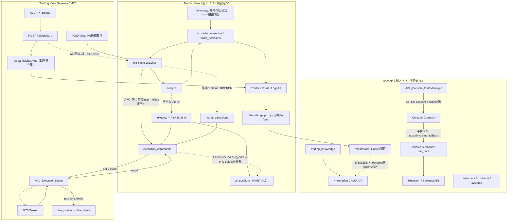
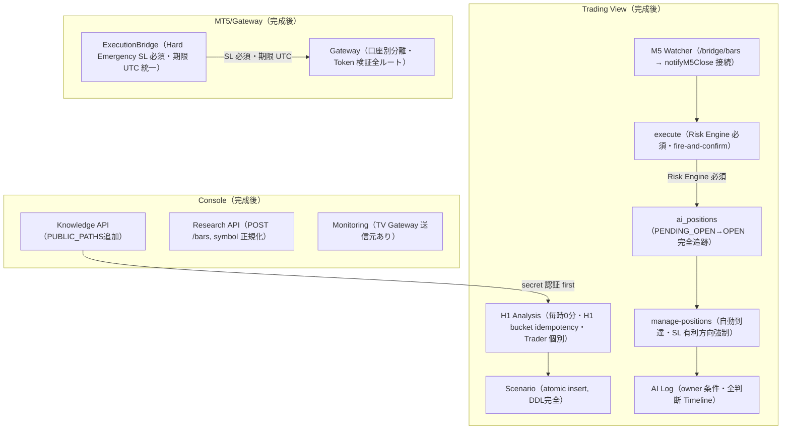

# AVL-FX 要件定義・基本設計書 v2.0
## Single Source of Truth — Master Document
### 初版: 2026-09-23 / v2.0 監査統合: 2026-09-23

---

> **このドキュメントの使い方**
> - AVL-FX 全体の "何を作れば完成か" の定義書です
> - v2.0 では別 AI セッションによる実コード監査（AVLFX_CURRENT_SYSTEM_AUDIT.md）を統合しました
> - **CURRENT** = 実コード確認済みの現状 / **TARGET** = 完成形設計 / **GAP** = 差分
> - 新機能アイデアは原則 FUTURE へ追加し、v1.0 完成条件を増やさないルールとします
> - 関連文書: `docs/AVLFX_CURRENT_SYSTEM_AUDIT.md`（全 83 問題・証拠リンク付き）

> **Current milestone status (2026-09-26 updated)**
> - Stage 1: **COMPLETE**
> - Stage 2: **COMPLETE**
> - Stage 3: **COMPLETE**（Production Integration Verification は実環境確認対象）
> - Stage 4: **COMPLETE — LOCAL PRODUCTION-PATH CORE RUNTIME VERIFIED**
> - Stage 5: **COMPLETE**（Task 5A〜5D / AUDIT-011・013・014・015 RESOLVED）
> - Stage 6: **COMPLETE — TWO-CUSTOMER ISOLATION VERIFIED**（Task 6A〜6F-V COMPLETE）
> - Stage 7: **COMPLETE — AI TRADER INTEGRATED VERIFICATION PASSED**（Task 7A〜7H COMPLETE）
> - Stage 8: **COMPLETE — CONSOLE BUSINESS INFRASTRUCTURE VERIFIED**（Task 8A〜8G COMPLETE）
> - Stage 9: **COMPLETE — TRADING VIEW FEATURE COMPLETE**
> - Stage 10-A: **COMPLETE — PRODUCTION INFRASTRUCTURE VERIFIED**
> - Stage 10-B: **COMPLETE — DEMO RUNTIME PRE-FLIGHT VERIFIED**
> - Stage 10-C: **SUSPENDED — SUPERSEDED BY V2 FINAL CUSTOMER SELF-CONTAINED E2E**
>
> Stage 10-C の自然エントリー候補待ちは終了。Stage 10-C で定義した全 E2E 要件は V2 Final Gate へ移管済み。  
> V2 実装は Stage 10-C 完走を待たず開始可能。  
> Stage 1〜10-B の完成成果・安全性基盤はすべて V2 へ継承する。  
> V2 最終ゴール: docs/v2/V2_FINAL_E2E_GATE.md — Customer Self-Contained Controlled DEMO E2E
>
> 過去の監査時点の記述は履歴として保持し、現在の検証済み状態とは区別する。Stage 4はlocal PostgreSQLと外部境界のmockを使ったProduction code path検証であり、Production Readyを意味しない。

---

## 目次

1. [製品定義と責任境界](#1-製品定義と責任境界)
2. [P0 CORE RUNTIME — 最重要定義](#2-p0-core-runtime--最重要定義)
3. [確認された全問題一覧](#3-確認された全問題一覧)
4. [システム構成図](#4-システム構成図)
5. [AVLFX Console 詳細設計](#5-avlfx-console-詳細設計)
6. [AVLFX Trading View 詳細設計](#6-avlfx-trading-view-詳細設計)
7. [AI Trader 詳細設計](#7-ai-trader-詳細設計)
8. [セキュリティ・安全設計](#8-セキュリティ安全設計)
9. [データベース全テーブル一覧](#9-データベース全テーブル一覧)
10. [CURRENT / TARGET / GAP 詳細](#10-current--target--gap-詳細)
11. [v1.0 Definition of Done](#11-v10-definition-of-done)
12. [完成ロードマップ](#12-完成ロードマップ)
13. [実環境確認必要事項（UNKNOWN）](#13-実環境確認必要事項unknown)
14. [ドキュメント体系と競合一覧](#14-ドキュメント体系と競合一覧)
15. [最終レポート](#15-最終レポート)

---

## 1. 製品定義と責任境界

### 1-1. AVL-FX とは何か

AVL-FX は、**AVL（Asia Vision Link）が顧客に提供するカスタム開発型 GOLD 取引システム**です。

| 提供形態 | 説明 |
|---|---|
| CUSTOM DEVELOPMENT | 顧客ごと専用システムを開発・納品 |
| SYSTEM SALE | 開発済みシステムの納品 |
| MONTHLY SYSTEM MANAGEMENT | 月額システム管理 |
| AVL RESEARCH DATA ACCESS | 月額 Historical Data 研究アクセス |

**当面は GOLD（XAUUSD）専用。アーキテクチャは Multi-Symbol 対応可能設計とする。**

### 1-2. 2システム構成（統合禁止）

| 項目 | Console | Trading View |
|---|---|---|
| 対象 | AVL 管理者 | 顧客（エンドユーザー） |
| 目的 | データ管理・研究・顧客管理基盤 | GOLD 取引・AI トレーダー運用 |
| URL | avl-fx-console.vercel.app | 顧客ごと個別 Vercel |
| Railway | avl-fx-console-production | remarkable-cooperation（顧客ごと） |
| Supabase | Console 専用プロジェクト | Customer 専用プロジェクト |
| MT5 EA | AVL_Console_DataManager.ex5 | AVL_FX_Bridge.ex5 + AVL_ExecutionBridge.ex5 |

**この 2 システム分離は絶対に元に戻してはいけない。**

### 1-3. 責任境界マップ

```
AVL 所有・管理
  Console Supabase（GOLD Historical Data / AI Knowledge / 顧客管理）
  Console Gateway（市場データ収集のみ、取引なし）
  Console Next.js（Vercel）
  Research API（認証付き、Customer への Historical Data 提供）

顧客 側で独立
  Customer Trading View（顧客専用 Vercel）
  Customer Gateway（顧客専用 Railway）
  Customer Supabase（Customer Trading DB）
  Customer MT5 + Broker
```

---

## 2. P0 CORE RUNTIME — 最重要定義

### 2-0. Historical Audit State

旧チェーンと断絶表示は、2026-09-23 initial audit時点の記録としてSection 3および監査ファイルに保持する。現在の検証済み状態とは区別する。

### 2-1. Current Stage 4 Verified Runtime

```
Console Knowledge
  ↓
AI Trader Profile / frozen Trader Version
  ↓
H1 Closed Bar → handleH1StrategyRequest()
  ↓
RuntimeService.hourlyAnalysis()
  ↓
Atomic Scenario → HOURLY_ANALYSIS log
  ↓
M5 Closed Bar → handleM5CloseRequest()
  ↓
RuntimeService.entryRecheck()
  ↓
Common Risk → Common Execution → execution_commands
  ↓
Gateway processExecutionResult() → ai_positions OPEN
  ↓
M5 Position branch → RuntimeService.positionReview()
  ↓
CLOSE / MODIFY → Gateway result and reconciliation
  ↓
ai_positions CLOSED → Trade Outcome → AI Logs
```

**Local Production-path verification: PASS.** Primary lifecycle、25 safety variants、idempotency、fail-closed、owner isolation、multi-Trader independenceをlocal/mock環境で確認済み。Real Customer 001 Demo MT5 E2Eは未確認で、Stage 10の対象である。

### 2-2. Initial Auditで確認されたCORE RUNTIME断絶箇所

CR-001〜CR-008とAUDIT-001〜083は削除せず履歴として保持する。Stage 1〜4で解決済みのCurrent Statusは以下のとおり。

| ID | Initial status | Current status | Resolved stage |
|---|---|---|---|
| CR-001 Knowledge → TV | BROKEN | RESOLVED（実環境確認は未実施） | Stage 3 |
| CR-002 EA → M5 Watcher | BROKEN | RESOLVED・local production path verified | Stage 4 |
| CR-003 Entry fail closed | BROKEN | RESOLVED | Stage 1 / 4 |
| CR-004 Risk bypass | PARTIAL | RESOLVED in verified runtime path | Stage 1 / 4 |
| CR-005 Hard Broker SL | BROKEN | RESOLVED・valid/invalid safety verified | Stage 1 / 4 |
| CR-006 FILLED → ai_positions OPEN | BROKEN | RESOLVED・local production path verified | Stage 4 |
| CR-007 Position Management | BROKEN | RESOLVED・local production path verified | Stage 4 |
| CR-008 AI Log owner | BROKEN | RESOLVED・local owner correlation verified | Stage 1 / 4 |

---

## 3. 確認された全問題一覧

監査日: 2026-09-23 / 監査者: 別 AI セッション
全問題は `docs/AVLFX_CURRENT_SYSTEM_AUDIT.md` に証拠付きで記録されています。
**すべてのコード確認済み問題（CONFIRMED_CODE/OPEN）。実事故の発生を断定するものではありません。**

### P0（12 件）— 不正/無審査注文・保護消失・口座境界に関わる重大コード欠陥

| ID | System | 問題 |
|---|---|---|
| AUDIT-004 | TV | M5 直接注文が Risk Engine を迂回 |
| AUDIT-005 | TV | AI 失敗時に ENTER（catch が enter:true を返す） |
| AUDIT-006 | TV | 市場データ不足時に ENTER（M5/M1 が 5 本未満なら enter:true） |
| AUDIT-011 | TV/EA | 注文有効期限に余分な 9 時間（COMMAND_EXPIRY_SECONDS=9\*3600+305） |
| AUDIT-018 | Gateway | 接続 ID API が ID を無視（別口座の価格を自口座価格として使用し得る） |
| AUDIT-019 | Gateway | 価格・バー保存キーが口座非分離（同銘柄・異接続で上書き） |
| AUDIT-020 | Gateway | WS 認証・ユーザー別配信分離なし（全接続へ broadcast） |
| AUDIT-021 | Gateway | ヘッダー存在のみで auth 通過するルート（bars/ticks） |
| AUDIT-022 | Gateway | 実行結果保存に接続 ID 条件なし（他接続の command 更新可能） |
| AUDIT-024 | TV | AI Log Scenario に user_id 条件なし（他ユーザーデータ混入） |
| AUDIT-076 | EA | Broker-side SL必須化・MODIFY_SL保護でSL消失を拒否（独立保険レイヤーはStage 4） |
| AUDIT-078 | Gateway | Heartbeat が token 検証せず口座情報更新 |

### P1（37 件）— 主要経路断絶・保存/実行状態不整合

| ID | System | 問題 |
|---|---|---|
| AUDIT-001 | TV/MT5 | 通常 EA の M5 通知なし（/bridge/bars → notifyM5Close 未接続） |
| AUDIT-002 | TV | Position Management 自動到達不能（早期 continue） |
| AUDIT-003 | TV | M5 直接注文で ai_positions を作成しない |
| AUDIT-007 | TV | 直接注文 INSERT 失敗を確認しない |
| AUDIT-008 | TV | 直接エントリーの排他制御不足 |
| AUDIT-009 | TV | 補助 Cron が保有・実行状態を上書き（TRIGGERED/WATCHING に上書き） |
| AUDIT-010 | TV/EA | UI 本番案内と DEMO 限定実行が矛盾 |
| AUDIT-012 | EA/Gateway | Claim 前の REJECTED/EXPIRED を DB 更新できない（PENDING 残留） |
| AUDIT-013 | Gateway | 消えた live_positions を CLOSED へ更新しない |
| AUDIT-014 | TV/Gateway | MODIFY 後 SL/TP を ai_positions へ同期しない |
| AUDIT-015 | TV/EA | SL 不利方向変更をコードが禁止していない（プロンプトのみ） |
| AUDIT-016 | TV | 価格取得失敗時（0 価格）に管理判断を続行 |
| AUDIT-023 | Gateway | 旧 /orders 受付が認証なし |
| AUDIT-027 | TV | AI Trader Builder API がない（/api/ai/trader/build が存在しない） |
| AUDIT-028 | TV | 新規 Trader の strategy_id と手動承認要件が不一致（422 エラー） |
| AUDIT-029 | TV | 手動承認の action 変換不足（ENTER_LONG/SHORT が BUY/SELL CHECK と不一致） |
| AUDIT-030 | TV | 手動承認が AI 追跡レコードへ接続しない |
| AUDIT-032 | TV | AI JSON 構造・数値検証不足 |
| AUDIT-033 | TV | TP 方向/最低 RR/条件付き証拠金検査不足 |
| AUDIT-038 | TV | 同一 active Scenario への競合対策不足（非トランザクション） |
| AUDIT-039 | TV | 旧 Scenario 失効後の保存失敗（有効 Scenario がなくなる可能性） |
| AUDIT-041 | TV DB | AUTO/STOPPED を migration が許容しない（migration と runtime の不一致） |
| AUDIT-042 | TV DB | Scenario 列の追加 migration 不足（entry_side 等 14 列が DDL なし） |
| AUDIT-043 | TV DB | INVALIDATED と INVALID の不一致（Scenario 保存失敗） |
| AUDIT-044 | TV DB | ai_analysis_logs CREATE migration なし |
| AUDIT-046 | TV | execute/Review 呼び出しを待たない（fire-and-forget） |
| AUDIT-056 | CON/TV | Knowledge API が middleware で遮断（login へ転送） |
| AUDIT-062 | CON/TV | Walk Forward fallback が GET、Console は POST のみ（method 不一致） |
| AUDIT-064 | Gateway | USD 除去が一般 FX シンボルを壊す（EURUSD→EUR） |
| AUDIT-069 | CON DB | ea_registry CREATE migration なし |
| AUDIT-073 | CON | TV パスワードを平文保存（tv_password カラム） |
| AUDIT-074 | CON | EA 一覧 API の認証なし（middleware 公開 prefix） |
| AUDIT-075 | CON/TV | Customer setup の複数システム更新失敗を見落とす |
| AUDIT-077 | TV/CON DB | 補助テーブル CREATE 不足（economic_events, news_items, trade_history 等） |
| AUDIT-079 | TV | PENDING_OPEN を Watcher が OPEN-only select で除外 |
| AUDIT-082 | TV | 履歴 API が個人接続へ分離されていない |
| AUDIT-083 | TV | Economic Calendar Cron route に GET handler なし（POST のみ） |

### P2（30 件）— 機能/監査性/運用整合の不足

| ID | System | 問題 |
|---|---|---|
| AUDIT-017 | TV | PnL を価格差×固定係数で計算（市場・lot 仕様非考慮） |
| AUDIT-025 | TV | Gateway 疎通と個人 MT5 online が別（接続表示が不正確） |
| AUDIT-026 | TV | autoConnect=false でも既定接続を実行 |
| AUDIT-031 | TV | H1 Cron が同ユーザー×市場の全 Trader に代表 Scenario をコピー |
| AUDIT-034 | TV | max_positions 等の設定が実行へ反映されない（固定値使用） |
| AUDIT-035 | TV | lot 丸め桁数を 1/2 桁固定（0.001 刻み等に非対応） |
| AUDIT-036 | TV | H1 という説明と Cron 頻度の不一致（現在毎時 05 分・本番未確認） |
| AUDIT-037 | TV | H1 と 60 分 Watcher の分析起点が独立して競合し得る |
| AUDIT-040 | TV | H1 保存失敗でも ok 結果を返す（偽 success） |
| AUDIT-045 | TV | 事後ログ UPDATE が void で実行されない（await なし） |
| AUDIT-047 | TV | Review フラグを配送成功前に立てる |
| AUDIT-048 | TV | AI Log が全判断の台帳ではない（H1/FILLED/CLOSED の 3 種のみ） |
| AUDIT-049 | TV | 手動/Watcher 分析が AI Log Timeline に出ない（H1_STRATEGY 限定） |
| AUDIT-050 | TV | WAIT/HOLD/TP/SL 判断理由が Timeline に表示されない |
| AUDIT-051 | TV | DB エラーと空ログを区別しない（data??[] で隠蔽） |
| AUDIT-054 | TV | useMonitor 呼び出し元なし（旧 LEGACY hook） |
| AUDIT-055 | TV | Positions UI（Gateway）と AI 管理（ai_positions）のデータ源が別 |
| AUDIT-057 | CON/TV | Knowledge 取得失敗時に知識なし分析継続（fallback が空配列） |
| AUDIT-058 | CON/TV | Knowledge の過去本文が保存されない（上書き version++ のみ） |
| AUDIT-059 | CON/TV | H1 と個別分析の Knowledge 選択方式が違う |
| AUDIT-060 | CON/TV | Knowledge の market/timeframe 属性を分析側が十分絞らない |
| AUDIT-063 | TV/CON | GOLD#固定と GOLD 正規化が経路で混在 |
| AUDIT-065 | CON | bars-summary が GOLD# 固定（GOLD で保存済みデータが見つからない） |
| AUDIT-066 | CON DB | get_bar_stats RPC CREATE 定義なし（Historical 画面が空） |
| AUDIT-067 | CON | 古い欠損・修正を差分同期しない（新しいバーのみ） |
| AUDIT-068 | CON | gold_data_config が EA 制御へ未接続（UI 変更が収集変更を意味しない） |
| AUDIT-070 | CON/TV | Console EA 登録 HTTP 失敗を TV が判定しない |
| AUDIT-071 | CON/TV | Console Monitoring の TV 送信元なし（受信側のみ存在） |
| AUDIT-072 | CON | console_audit_log 書き込み元なし（表示 UI のみ） |
| AUDIT-080 | TV | 経済指標 actual の更新未接続（常に null） |

### P3（4 件）— 限定的表示/旧機能/コメント不整合

| ID | System | 問題 |
|---|---|---|
| AUDIT-052 | TV | AI Log に自動更新なし（手動リロード必要） |
| AUDIT-053 | TV | 旧 aiLogs が永続化対象外（リロードで消失） |
| AUDIT-061 | CON | URL 自動取込/AI 生成なし（区分選択のみ） |
| AUDIT-081 | CON | 自動同期 OFF コメントと 3h Runtime 不一致 |

---

## 4. システム構成図

### 4-A. 現在の接続状態（実コード確認済み）



### 4-B. TARGET アーキテクチャ（完成形）



---

## 5. AVLFX Console 詳細設計

### 5-1. Initial Audit Snapshot — 実装状態

| コンポーネント | STATUS（監査後） | 詳細 |
|---|---|---|
| Console Next.js 16.2.12 | IMPLEMENTED | Vercel デプロイ済み |
| Console Gateway（Express + WS） | PARTIAL | データ収集あり、3h 自動同期コメントと不一致 |
| Console Supabase | PARTIAL | bar_data 203 万本+、一部 RPC/DDL 不足 |
| ADMIN_EMAILS 認証 | IMPLEMENTED | allowlist メール認証 |
| AVL_Console_DataManager.ex5 | IMPLEMENTED | データ収集専用 EA（稼働状況 UNKNOWN） |
| AI Knowledge CRUD | IMPLEMENTED | 管理者 CRUD は動作 |
| **Knowledge → TV 提供** | **IMPLEMENTED** | **server-authenticated API → TV server client → selector → prompt/snapshot（Stage 3）** |
| 顧客管理 CRUD | IMPLEMENTED | customers/systems/contracts |
| Research API（bars） | PARTIAL | method 不一致（TV の Walk Forward が GET、Console は POST のみ） |
| Preview Backtest 計算 | IMPLEMENTED | spec→engine→report 返却 |
| get_bar_stats RPC | BROKEN | Historical 画面が使う RPC の CREATE 定義なし（AUDIT-066） |
| gold_data_config | PARTIAL | UI→DB 更新あり、EA・Gateway への制御信号なし（AUDIT-068） |
| Console EA Registry | PARTIAL | UI/API あり、ea_registry テーブル CREATE migration なし（AUDIT-069） |
| EA Registry GET 認証 | BROKEN | GET /api/ea-registry に認証なし（AUDIT-074） |
| console_audit_log | PARTIAL | テーブル・UI あり、書き込み元なし（AUDIT-072） |
| TV パスワード保存 | BROKEN | customers.tv_password に平文保存（AUDIT-073） |
| Monitoring 受信 | PARTIAL | API/DB/UI あり、TV Gateway 側の送信元なし（AUDIT-071） |
| Customer Setup | PARTIAL | 複数 DB・Auth 更新の失敗処理不足（AUDIT-075） |

### 5-2. Console bar_data スキーマ（実装済み）

```sql
PRIMARY KEY (symbol, timeframe, time_utc)
-- 差分同期: bars.filter(b.time > latestMs) のみ（古い欠損・修正は対象外 AUDIT-067）
```

**現在の symbol 不整合：**
- Console Gateway が保存: `GOLD`（suffix 除去）
- bars-summary が検索: `GOLD#`（不一致 AUDIT-065）

### 5-3. AI Knowledge スキーマ（実装済み）

```
id / title / category / summary / content / ai_usage
market[] / timeframes[] / tags[] / source_type / source_url
status (DRAFT → ACTIVE → ARCHIVED) / version（上書き ++）/ editor_note
```

**⚠️ 過去本文バージョン保存なし（AUDIT-058）**：`version` カウンタのみ。AI が使用した知識本文を遡れない。

**Initial audit finding（AUDIT-056、Stage 3でRESOLVED）**：
- TV は `x-knowledge-api-secret` ヘッダーで Console に fetch
- Console middleware が Cookie なしを判定して `/login` へ転送
- handler に到達しない → TV は常に offline（空配列）で分析継続（Initial Audit時点）

**Current Stage 3 status**：Console authenticated server API → TV server-side client → deterministic selector → AI prompt → Knowledge snapshot。Knowledge unavailable時はnew-entryをfail closedする。Production Integration Verificationは実環境確認対象。

### 5-4. Research API 設計（PARTIAL）

```
TV Trader Walk Forward
  → GET /api/research/bars ← BROKEN（Console は POST のみ）
  
TV Preview Backtest
  → POST /api/research/backtest（x-backtest-secret）← IMPLEMENTED

Console bars-summary  
  → GET /api/research/bars-summary（symbol=GOLD#固定）← PARTIAL（symbol 不一致）
```

---

## 6. AVLFX Trading View 詳細設計

### 6-1. Initial Audit Snapshot — 実装状態

| コンポーネント | STATUS（監査後） | 詳細 |
|---|---|---|
| Customer 認証 | IMPLEMENTED | Supabase Auth email/password |
| MT5 接続設定 | PARTIAL | token/DB 系と global Gateway 系が併存（AUDIT-025） |
| realtime 価格 | PARTIAL | global symbol store（口座非分離 AUDIT-018,019） |
| Chart | PARTIAL | lightweight-charts + AVLChart。個人口座専用データの保証なし |
| Economic Calendar | PARTIAL | UI あり、economic_events CREATE DDL なし（AUDIT-077）、actual 常 null（AUDIT-080）、Cron route に GET handler なし（AUDIT-083） |
| News | IMPLEMENTED | 外部 RSS 直返し（DB 保存なし。外部サービス稼働 UNKNOWN） |
| ポジション表示 | PARTIAL | Gateway イベント（AI 追跡 ai_positions とは別 AUDIT-055） |
| 取引履歴 | PARTIAL | global Gateway/trade_history（個人分離なし AUDIT-082） |
| AI Trader 一覧・CRUD | PARTIAL | 保存 API あり、Builder 生成 API なし（AUDIT-027） |
| AI Trader Builder 生成 | NOT_IMPLEMENTED | `/api/ai/trader/build` が存在しない（AUDIT-027） |
| 手動承認（decide） | PARTIAL | strategy_id 不一致で 422（AUDIT-028）、action 変換不足（AUDIT-029） |
| AI Log Timeline | PARTIAL | H1/FILLED/CLOSED の 3 種のみ、owner 条件なし（AUDIT-024）、自動更新なし（AUDIT-052） |
| autoConnect | PARTIAL | OFF 設定が停止にならない（AUDIT-026） |
| SaaS コード | LEGACY | user_subscriptions / Stripe 残存 |

### 6-2. MT5 接続のデュアル経路問題

以下はInitial Audit時点の記録である。Current status: Task 6BでGatewayのcanonical runtime tick/bar/latest-price/M5 stateはconnection-scopedへ移行済み、Task 6Cでcustomer REST/Trading View proxyのconnection-scoped cutover、Task 6Dでauthenticated WebSocket routingを完了した。最終的な二顧客統合検証はTask 6Eで実施する。

**現状（問題）：**
- `ConnectionManager.ts`：Gateway の health/WS が成功 → "接続済み" 表示
- `useUserMT5Connection`：DB の heartbeat が古い → "切断" 表示
- 表示上の接続が個人 MT5 の稼働・注文権限を保証しない

**⚠️ Gateway データ非分離（P0 AUDIT-018,019）：**
- `/connections/:connectionId/tick/:symbol` → `tickStore[symbol]`（connectionId 無視）
- 複数顧客が同じ Gateway を使う場合、別口座の価格を自口座として使用し得る

上記2行はInitial Audit findingとして保持する。Historical status: AUDIT-019 PARTIAL（canonical runtime stateは解決、legacy/global APIと`bar_data` persistenceは未解決）。Current status: AUDIT-019 RESOLVED — Stage 6F/6F-VでProduction PostgreSQLのconnection-scoped persistence、RLS、legacy NULL isolationを検証済み。

### 6-3. チャート実装状態

```
現在: lightweight-charts v5.2 + AVLChart.tsx
  → /api/live/connection/bars → global Gateway /bars（口座非分離）
  
TARGET: TradingView Charting Library（ライセンス取得後）
  → TVDatafeed / IDataProvider は実装済み（差替え準備完了）
  
⚠️ MockDataProvider は MOCK（乱数生成）
   現在の稼働 Chart は MockDataProvider を使っていない
```

### 6-4. News / Economic Calendar の実態

**News（IMPLEMENTED - 外部 RSS）：**
- RSS 直返し（DB 保存なし）
- news_items テーブルへの書き込み経路は存在しない
- 外部サービス稼働は UNKNOWN

**Economic Calendar（PARTIAL）：**
- economic_events テーブルの CREATE DDL が migration ファイルにない（AUDIT-077）
- 6 時間 Cron の route が POST のみ export → vercel.json の GET 起動に未対応（AUDIT-083）
- UI は Forex Factory 直接取得（DB 経由なし）
- `actual` フィールドが常に null（更新経路なし AUDIT-080）

---

## 7. AI Trader 詳細設計

> **Current Stage 4 runtime status:** H1/M5/Position production handlers are cut over to the common RuntimeService. The historical subsections below retain the initial audit findings for traceability; their “現在” wording refers to that audit snapshot unless explicitly marked Current.

### 7-0. Current verified runtime

- H1: closed-bar gate → per-Trader `hourlyAnalysis()` → atomic Scenario RPC → `WATCHING_ENTRY`
- M5 Entry: `handleM5CloseRequest()` → `entryRecheck()` → Common Risk → Common Execution
- M5 Position/H1 while Position: `positionReview()` with canonical triggers
- FILLED: Gateway result processor → `ai_positions OPEN`
- CLOSE/reconciliation: Gateway production boundary → `ai_positions CLOSED` → Trade Outcome
- Runtime AI logs correlate user, trader, version, scenario/position, trigger, decision, timestamp, and Knowledge snapshot

### 7-1. Initial Audit Snapshot — AI Trader Profile スキーマ

**問題点：**
- `execution_mode` の PATCH が AUTO/STOPPED を使用、migration は ANALYSIS_ONLY/MANUAL_APPROVAL/DEMO_AUTONOMOUS のみ許可（AUDIT-041）
- H1 は代表 Profile のみ使用（全 Trader に同一 Scenario をコピー AUDIT-031）
- max_positions 等の設定値が実行に反映されない（固定値使用 AUDIT-034）

### 7-2. Initial Audit Snapshot — H1 Analysis

**現在実装の問題：**

1. **Cron スケジュール**：vercel.json が `5 * * * *`（毎時 05 分）に変更済み（本番適用 UNKNOWN）。H1 バー確定との連動なし（AUDIT-036）
2. **Trader 個別ではない**：同ユーザー×市場の代表 Profile を 1 回だけ分析し、全 Trader に同一 Scenario を保存（AUDIT-031）
3. **H1/Watcher 競合**：H1 の `last_analysis_at` 更新なし、60 分 Watcher との二重起動が起こり得る（AUDIT-037）
4. **Scenario 列 DDL なし**：entry_side, entry_price_low/high, suggested_sl/tp 等 14 列の ALTER migration が未収録（AUDIT-042）
5. **保存 atomicity なし**：旧 Scenario 失効と新規 INSERT が分離（AUDIT-038,039）
6. **保存失敗を隠蔽**：INSERT エラー後も ok 結果を返す（AUDIT-040）
7. **Knowledge BROKEN**：Console middleware により Knowledge が取得できない状態で分析（AUDIT-056）

**TARGET（正式要件）：**
```
H1 バー確定（毎時 0 分）を起点とし、以下を保証すること：
  1. H1 bucket idempotency: 同一 H1 バーについて Trader ごとに 1 回だけ分析
  2. Trader 個別分析: 各 Trader の personality/instructions を使用
  3. atomic Scenario 更新: 旧失効と新規 INSERT をトランザクション（または DB 関数）で実行
  4. 保存失敗は明示的エラーとして返す
  5. Console Knowledge が取得できない場合は分析を SKIP（enter:false で返す）
```

### 7-3. Initial Audit Snapshot — M5 Watcher

**現在の経路：**
```
通常 EA（AVL_FX_Bridge）
  → POST /bridge/bars
  → upsertBar()
  → notifyM5Close 呼出しなし ← BROKEN AUDIT-001

別経路 /bar（単体バー）
  → notifyM5Close() あり
  → POST /api/watcher/m5-close ← 動作するが通常 EA は使わない

補助 Cron /api/cron/watch-traders（5 分ごと）← 動作するが精度低い
```

**TARGET：**
```
AVL_FX_Bridge の /bridge/bars ハンドラで M5 バー確定を検出したら
→ notifyM5Close() を必ず呼出し
→ POST /api/watcher/m5-close をメイントリガーとする
```

### 7-4. Initial Audit Snapshot — Entry Recheck

**P0 問題：AUDIT-005, 006**
```javascript
// 現状コード（危険）
} catch {
  return { enter: true, reason: "ai_check_failed_enter_anyway" }  // ← AI失敗でENTER
}

if (m5Bars.length < 5 || m1Bars.length < 5) {
  return { enter: true, ... }  // ← データ不足でENTER
}
```

**TARGET：**
```javascript
// 正しい設計（Fail Closed）
} catch {
  return { enter: false, reason: "ai_check_failed_no_entry" }  // ← AI失敗=WAIT
}

if (m5Bars.length < 5 || m1Bars.length < 5) {
  return { enter: false, reason: "insufficient_market_data" }  // ← データ不足=WAIT
}
```

### 7-5. Initial Audit Snapshot — Risk Engine

**実装済みチェック（16 件）：** Demo Guard / Hedging / Account 鮮度 / Symbol Spec / Daily Limits / Duplicate / Tick 鮮度 / Spread / Expiry / Lot 計算 / Stop Level / Margin / Total Exposure / Global Kill / Trader Kill / Account Mode

**問題点：**
- **迂回経路（P0 AUDIT-004）**：M5 直接注文は `/execute` も `runRiskEngine` も呼ばない
- **TP 方向検査なし（P1 AUDIT-033）**：TP が entry 方向と逆でも通過
- **最低 RR 検査なし（P1 AUDIT-033）**：minimum_rr が Risk Engine で検証されない
- **Margin 条件付き（P1 AUDIT-033）**：`marginInitial > 0` の時だけ証拠金比較
- **固定鮮度値（P2 AUDIT-034）**：Profile の設定値を使わず 60 秒/10 秒固定

### 7-6. Initial Audit Snapshot — Execution Engine

**P0 問題：AUDIT-076（最重要）**
```mql5
// EA の現状（危険）
if (roundedSL のブローカー制約違反) {
  roundedSL = 0;  // SL なしで発注
  // "安全側" とコメントされているが実際は SL ゼロ
}
```

**TARGET：**
```mql5
if (roundedSL のブローカー制約違反) {
  // SL=0 で発注しない
  // hard_emergency_sl フィールドを使用するか、
  // stops_level の最小値で Hard Emergency SL を設定する
  // それでも設定できない場合は注文キャンセル
}
```

**AUDIT-011（P0 期限問題）：**
```
現状: COMMAND_EXPIRY_SECONDS = 9 * 3600 + 300（9時間5分）
     + EA の UTC offset 補正
TARGET: UTC で統一した適切な有効期限（5〜15 分）
```

**AUDIT-012（P1 Claim 前結果問題）：**
```
EA が Claim 前に REJECTED/EXPIRED を送信
→ submitCommandResult は CLAIMED/EXECUTING のみ更新
→ command が PENDING に残留
TARGET: pre-claim 拒否結果を EXPIRED/REJECTED に更新できる経路
```

### 7-7. Initial Audit Snapshot — ai_positions 追跡

**断絶 1（P1 AUDIT-003）：**
- M5 直接注文経路: ai_positions を一切作成しない

**断絶 2（P1 AUDIT-079）：**
```
通常 /execute → ai_positions INSERT（PENDING_OPEN）
Watcher handlePositionState → WHERE status = 'OPEN' だけ select
→ PENDING_OPEN が select されない → OPEN 昇格が永遠に起きない
```

**TARGET：**
```
FILLED callback
→ ai_positions を PENDING_OPEN → OPEN に更新（position_ticket 付き）
→ handlePositionState が PENDING_OPEN も含む select で処理
```

### 7-8. Initial Audit Snapshot — Position Management

**断絶（P1 AUDIT-002）：**
```javascript
// Watcher の現状
if (watcher_state === 'POSITION' || watcher_state === 'EXECUTING') {
  handlePositionState(...)
  continue;  // ← ここで次の Trader ループへ。manage-positions に到達しない
}
// この下の manage-positions 呼出しには永遠に到達しない
```

**TARGET：**
```
watcher_state = POSITION/EXECUTING の Trader は
handlePositionState() の後に manage-positions を呼出す
（continue を削除または条件を再設計）
```

### 7-9. Initial Audit Snapshot — SL/TP Recheck の問題

**SL 有利方向制約なし（P1 AUDIT-015）：**
- API は `new_sl` が truthy なら MODIFY_SL コマンドを作成
- EA は現在 SL との有利比較をしない
- **TARGET**：新 SL が現在 SL より損失方向の場合は最大許容損失上限チェック後に Risk Engine が拒否

これはInitial Audit時点の記録である。Current status: **RESOLVED — Stage 5C**。Serverの決定論的validatorとExecutionBridgeのbroker-state guardにより、BUY/LONGはSLを下げられず、SELL/SHORTはSLを上げられない。無効または未設定のcurrent SLはfail closedとする。

**ai_positions の SL/TP 同期なし（P1 AUDIT-014）：**
- MODIFY 後の新 SL/TP が ai_positions に反映されない
- 次の AI 管理判断が古い値を参照する

これはInitial Audit時点の記録である。Current status: **RESOLVED — Stage 5B**。Gatewayの`processExecutionResult()`が、成功した`MODIFY_SL`/`MODIFY_TP`結果を所有者・connection・OPEN positionへ相関付け、broker-confirmed値を対応する`stop_loss`/`take_profit`へ同期する。失敗・保留・古い結果・CLOSED positionは同期しない。

### 7-10. Initial Audit Snapshot — AI Log の実態

**現在表示されるもの（3 種のみ）：**
1. `scenario` - `trigger_type = 'H1_STRATEGY'` の Scenario（他 trigger は非表示）
2. `entry` - `status = 'FILLED'` かつ `action IN ('BUY', 'SELL')` の execution_commands
3. `close` - `status = 'CLOSED'` の ai_positions

**問題点（P0 AUDIT-024）：**
- Scenario 取得が Admin Client + user_id 条件なし → 全ユーザーの Scenario が混入

**表示されないもの：**
- Watcher による Entry Recheck 判断（watcher_events に記録はある）
- WAIT 判断
- HOLD/MODIFY_SL/MODIFY_TP 判断
- 手動/Watcher トリガー分析（H1_STRATEGY 以外）
- Position Review
- Dry Run 結果

**TARGET：**
```
全 AI 判断の証跡を Timeline に表示
  → Scenario（全 trigger_type）
  → WAIT 判断（watcher_events）
  → Entry（FILLED）
  → HOLD/MODIFY/CLOSE 判断（execution_commands + metadata）
  → Close（ai_positions CLOSED）
  → Review（trade_reviews）
すべて owner 条件（user_id）で正しく分離すること
```

---

## 8. セキュリティ・安全設計

### 8-1. Initial Audit Snapshot — P0 セキュリティリスク

この表はInitial Audit時点のリスク記録である。Stage 1〜4で解決済みのRisk bypass、Entry fail-open、Hard Broker SL、AI Log owner isolation、Gateway result ownershipはCurrent status overlay（Section 2、8-0）を優先する。Stage 5/6の残件はOPENとして扱う。

| ID | リスク | 詳細 |
|---|---|---|
| AUDIT-018 | 接続 ID API が ID を無視 | /connections/:id 系エンドポイントが global store を返す |
| AUDIT-019 | 価格・バー保存キーが口座非分離 | symbol のみでキー管理。複数接続で上書き |
| AUDIT-020 | WS 全接続 broadcast | 認証・owner 分離なし。口座情報が全接続へ配信 |
| AUDIT-021 | bars/ticks に認証なし | Connection ID ヘッダーの存在のみで通過 |
| AUDIT-022 | 実行結果の接続制約なし | 既知 command_id があれば他接続から結果更新可能 |
| AUDIT-076 | SL=0 で発注 | Hard Emergency SL が未実装。無保護ポジション |
| AUDIT-078 | Heartbeat token 検証なし | 既知 connection_id で偽 heartbeat/残高更新可能 |

### 8-2. Trading Safety（確認された問題）

| 項目 | 現状 | 判定 |
|---|---|---|
| Risk Engine bypass | M5 直接注文は Risk Engine 外 | **FAIL / P0** |
| AI 失敗時 Entry | catch → enter:true | **FAIL-OPEN / P0** |
| データ不足時 Entry | M5/M1 < 5 → enter:true | **FAIL-OPEN / P0** |
| 注文期限 | server 9h+5m + EA UTC 補正（二重） | **不一致 / P0** |
| Hard Emergency SL | Broker-side SL必須化・stops_level・MODIFY_SL保護 | **Stage 1 Broker Guard IMPLEMENTED**（独立保険レイヤーはStage 4） |
| SL 不利方向制約 | Initial Auditではプロンプトのみ。Current: Server validator + EA broker-state guard（Stage 5C） | **RESOLVED — Stage 5C** |
| ai_positions 追跡 | 直接経路は未作成、通常は PENDING_OPEN→OPEN 未接続 | **BROKEN / P1** |
| Position close sync | Initial Auditではlive_positions消失同期なし。Current: complete snapshot reconciliation（Stage 5D） | **RESOLVED — Stage 5D** |
| Kill Switch | Global / Trader / Emergency Stop / trading_enabled | PARTIAL（Hard SL と別）|

### 8-3. LIVE_AUTONOMOUS への条件（変更なし）

LIVE_AUTONOMOUS は **Phase 4 以降**。以下がすべて揃うまで実装しない：
- Demo で 1 ヶ月以上の実績（CORE RUNTIME E2E PASS が前提）
- Hard Emergency SL 実装完了
- Gateway 口座分離完了
- Portfolio Controller での Total Exposure 制御
- 弁護士確認済みの利用規約

---

## 9. データベース全テーブル一覧

### 9-0. Current migration status

Trading View Customer DBは001→033をlocal PostgreSQLへFresh Apply済み。Upgrade validationもPASS、Stage 2 schema testsは5/5 PASS。Production Supabaseへの適用は行っていない。以下のテーブル状態表はInitial Audit Snapshotを含むため、Stage 2/4のCurrent statusは上記検証結果を優先する。

### 9-A. Trading View Supabase（監査反映）

| テーブル | STATUS | 備考 |
|---|---|---|
| bar_data | IMPLEMENTED | Customer Supabase OHLCV Mirror |
| cot_positions | IMPLEMENTED | COT データ |
| news_items | PARTIAL | CREATE DDL 未収録（AUDIT-077）、書き込み経路なし |
| economic_events | PARTIAL | CREATE DDL 未収録（AUDIT-077）、actual 常 null |
| trade_history | PARTIAL | CREATE DDL 未収録（AUDIT-077）、個人分離なし |
| trade_audit_log | PARTIAL | CREATE DDL 未収録（AUDIT-077） |
| strategy_registry | IMPLEMENTED | EA Builder 用 |
| strategy_versions | IMPLEMENTED | |
| strategy_signals | IMPLEMENTED | |
| strategy_runtime_state | IMPLEMENTED | |
| backtest_jobs/results/trades | IMPLEMENTED | |
| optimization_jobs/candidates | IMPLEMENTED | |
| walk_forward_jobs | IMPLEMENTED | |
| monte_carlo_results | IMPLEMENTED | |
| strategy_ai_analyses | IMPLEMENTED | |
| strategy_improvements | IMPLEMENTED | |
| strategy_phase4d_interpretations | IMPLEMENTED | |
| user_subscriptions | LEGACY | **削除予定（Stripe SaaS）** |
| mt5_connections | IMPLEMENTED | balance/equity/margin カラムあり |
| symbol_specs | IMPLEMENTED | USD 除去正規化に問題（AUDIT-064） |
| execution_commands | IMPLEMENTED | |
| live_positions | RESOLVED — Stage 5D | complete snapshotでconnection-scoped missing rowsをCLOSED化 |
| live_deals | IMPLEMENTED | |
| ai_traders | PARTIAL | execution_mode CHECK と runtime 不一致（AUDIT-041） |
| ai_trader_versions | PARTIAL | magic_number, risk 設定が実行未反映 |
| ai_trader_knowledge | PARTIAL | 本文スナップショットなし（AUDIT-058） |
| ai_trader_scenarios | PARTIAL | **14 列の ALTER migration 未収録（AUDIT-042）** |
| trade_decisions | IMPLEMENTED | |
| trade_outcomes | IMPLEMENTED | |
| trade_reviews | IMPLEMENTED | |
| experience_memories | IMPLEMENTED | HYPOTHESIS のみ、VALIDATED 昇格は手動 |
| watcher_events | IMPLEMENTED | |
| ai_positions | PARTIAL | PENDING_OPEN→OPEN 移行が自動では起きない（AUDIT-079） |
| system_settings | IMPLEMENTED | Global Kill Switch |
| dry_run_logs | IMPLEMENTED | |
| ai_analysis_logs | PARTIAL | **CREATE migration 未収録（AUDIT-044）** |
| cron_schedules | IMPLEMENTED（027） | |
| gateway_state | IMPLEMENTED（027） | |

### 9-B. Console Supabase（監査反映）

| テーブル | STATUS | 備考 |
|---|---|---|
| bar_data | IMPLEMENTED | 203 万本+（GOLD 全 TF）、symbol 正規化問題あり |
| market_data_sync_jobs | IMPLEMENTED | |
| gold_data_config | PARTIAL | EA 制御への反映なし（AUDIT-068） |
| customers | IMPLEMENTED | tv_password 平文問題（AUDIT-073） |
| customer_systems | IMPLEMENTED | |
| customer_contracts | IMPLEMENTED | |
| strategy_registry | IMPLEMENTED | |
| strategy_versions | IMPLEMENTED | |
| strategy_shares | IMPLEMENTED | |
| research_access_log | IMPLEMENTED | |
| system_tokens | IMPLEMENTED | |
| system_health_logs | IMPLEMENTED | |
| deployments | IMPLEMENTED | 手動記録のみ |
| console_audit_log | PARTIAL | 書き込み元なし（AUDIT-072） |
| trading_knowledge | PARTIAL | TV への公開が middleware でブロック（AUDIT-056） |
| ea_registry | PARTIAL | **CREATE migration 未収録（AUDIT-069）** |
| ticks | PARTIAL | system 診断が参照するが CREATE 定義なし |
| get_bar_stats() | BROKEN | UI が使う RPC 未定義（AUDIT-066）。get_bar_data_status のみ存在 |

---

## 10. CURRENT / TARGET / GAP 詳細

### 10-0. Current status overlay

GAP-001〜GAP-014は削除せず、Initial Auditの追跡IDとして保持する。Stage 1〜5で解決済みのruntime GAPはRESOLVED、Stage 6以降の項目はOPENとする。

| GAP | Current status | Resolution / scope |
|---|---|---|
| GAP-001 Knowledge経路 | RESOLVED — Stage 3 | server API/client/selector、fail closed。実環境確認は未実施 |
| GAP-002 M5通常EA経路 | RESOLVED — Stage 4 | production M5 handler verified |
| GAP-003 Entry fail closed | RESOLVED — Stage 1/4 | AI/market/Knowledge failures block entry |
| GAP-004 Risk迂回 | RESOLVED in verified path | Common Risk → Common Execution |
| GAP-005 Hard Broker SL | RESOLVED — Stage 1/4 | valid/invalid protection verified |
| GAP-006 注文期限UTC | RESOLVED — Stage 5A | 300秒のUTC absolute expiry、fail-closed |
| GAP-007 PENDING_OPEN→OPEN | RESOLVED — Stage 4 | Gateway result correlation |
| GAP-008 Position到達 | RESOLVED — Stage 4 | positionReview path |
| GAP-009 AI Log owner | RESOLVED — Stage 1/4 | owner correlation |
| GAP-010 H1個別化/idempotency | RESOLVED — Stage 4 | per-Trader + atomic/idempotent |
| GAP-011 Scenario DDL | RESOLVED — Stage 2/4 | migrations 029/032/033 |
| GAP-012 Gateway full account isolation | RESOLVED — Stage 6F-V | Production PostgreSQL schema/RLS and two-customer REST/WebSocket/runtime isolation verified; Stage 6 remains non-Production-Ready pending separate operational release work |
| GAP-013 Heartbeat token | RESOLVED — Stage 1 | auth fail closed |
| GAP-014 Economic Calendar method | OPEN — Stage 9 | UI/operations scope |

以下の個別記述はInitial Audit時点のCURRENT/TARGET/GAPであり、上表のCurrent statusを優先する。

### GAP-001: Knowledge 経路（最優先）

| | 内容 |
|---|---|
| CURRENT | Console middleware が `/api/trading-knowledge` を Cookie なしと判定 → `/login` 転送。TV からは永遠に知識なし分析 |
| TARGET | `/api/trading-knowledge` を Console の `PUBLIC_PATHS` に追加し、handler 内で `x-knowledge-api-secret` 検証を最初に実行 |
| GAP | Console middleware.ts の PUBLIC_PATHS 修正 1 行 + handler の認証順序修正 |

### GAP-002: M5 Watcher 通常 EA 経路

| | 内容 |
|---|---|
| CURRENT | 通常 EA が `/bridge/bars` に POST → `upsertBar()` のみ → M5 通知なし |
| TARGET | `/bridge/bars` ハンドラで M5 バー確定を検出したら `notifyM5Close()` を呼出す |
| GAP | Gateway `index.ts` の /bridge/bars ハンドラに M5 検出ロジック追加（/bar にある実装を移植） |

### GAP-003: Entry Recheck Fail Open → Fail Closed

| | 内容 |
|---|---|
| CURRENT | catch が `enter: true` を返す。データ不足でも `enter: true` |
| TARGET | AI 失敗・データ不足はすべて `enter: false`（Fail Closed） |
| GAP | Entry Recheck 関数の catch/guard の戻り値修正 |

### GAP-004: Risk Engine 迂回

| | 内容 |
|---|---|
| CURRENT | M5 直接注文経路が Risk Engine を完全バイパス |
| TARGET | 全注文経路が Risk Engine を通ること（直接分岐を削除または /execute を必須呼出しに） |
| GAP | Watcher の直接注文分岐の削除・/execute 経由への統一 |

### GAP-005: Hard Emergency SL（Stage 4の独立保険レイヤー）

| | 内容 |
|---|---|
| CURRENT | EA が stops_level 違反時に `roundedSL = 0` にして発注（SL なし） |
| TARGET | SL が設定できない場合は発注しない。または stops_level の最小距離で Hard SL を強制設定 |
| GAP | ExecutionBridge EA の SL 検証ロジック修正（SL=0 を禁止） |

### GAP-006: 注文期限の二重補正

| | 内容 |
|---|---|
| CURRENT | Server: `9 * 3600 + 300` 秒。EA の ParseISO も UTC offset を補正（二重） |
| TARGET | UTC で統一。expires_at は UTC ISO 文字列、EA は UTC として直接使用 |
| GAP | Server の COMMAND_EXPIRY_SECONDS を適切な値（5〜15 分）に修正。EA の offset 補正を削除 |

### GAP-007: PENDING_OPEN → OPEN 移行

| | 内容 |
|---|---|
| CURRENT | /execute が PENDING_OPEN を作成するが、Watcher の handlePositionState が `status = 'OPEN'` のみ select |
| TARGET | FILLED callback → ai_positions を PENDING_OPEN → OPEN + position_ticket 更新 |
| GAP | FILLED 時の ai_positions 更新ロジック。handlePositionState の select 条件を PENDING_OPEN も含む形に修正 |

### GAP-008: Position Management 自動到達

| | 内容 |
|---|---|
| CURRENT | POSITION/EXECUTING 状態の Trader が handlePositionState() の後に `continue` でスキップ |
| TARGET | handlePositionState() の後に manage-positions を呼出す |
| GAP | Watcher の `continue` を条件付きに変更（POSITION_REVIEWED 後のみ skip） |

### GAP-009: AI Log owner 条件

| | 内容 |
|---|---|
| CURRENT | Scenario ログが Admin Client で user_id 条件なし → 全ユーザーデータが混入 |
| TARGET | `.eq('user_id', userId)` 条件を追加 |
| GAP | `/api/logs/trader-activity` の Scenario クエリに user_id 条件追加 1 行 |

### GAP-010: H1 Analysis の Trader 個別化と Idempotency

| | 内容 |
|---|---|
| CURRENT | 同ユーザー×市場グループの代表 Profile で 1 回分析し、全 Trader に同一 Scenario を保存 |
| TARGET | 各 Trader を個別分析。H1 bucket（同一 H1 バー時刻）ごとに 1 回だけ（idempotency） |
| GAP | H1 ルートのループ構造を全 Trader 個別処理に変更。cron_schedules テーブルで重複防止 |

### GAP-011: Scenario DDL の追加 migration

| | 内容 |
|---|---|
| CURRENT | entry_side / entry_price_low / entry_price_high / suggested_sl / suggested_tp / reasoning_summary / key_levels 等 14 列が migration ファイルにない |
| TARGET | ALTER TABLE migration を追加 |
| GAP | Migration ファイルの追加 |

### GAP-012: Gateway Gateway 口座分離

| | 内容 |
|---|---|
| CURRENT | tickStore/barStore が `symbol` のみのキー。connectionId は無視 |
| TARGET | ストアキーを `connectionId:symbol` に変更。WS も owner 別配信 |
| GAP | Gateway index.ts の store キー変更・WS 認証追加 |

### GAP-013: Heartbeat token 検証

| | 内容 |
|---|---|
| CURRENT | `/bridge/heartbeat` が Connection ID ヘッダーの存在のみで `updateBridgeHeartbeat` を呼出す |
| TARGET | `verifyBridgeAuth()` を通す |
| GAP | /bridge/heartbeat に verifyBridgeAuth 1 行追加 |

### GAP-014: Economic Calendar Cron method

| | 内容 |
|---|---|
| CURRENT | vercel.json が sync-economic-calendar を Cron 登録しているが、route は POST のみ export |
| TARGET | GET handler を export（他の Cron route 同様） |
| GAP | sync-economic-calendar/route.ts に `export async function GET` の alias 追加 |

---

## 11. v1.0 Definition of Done

**このチェックリストがすべて [x] になれば AVL-FX v1.0 は完成。**
**P0 CORE RUNTIME は Customer 001 の Demo MT5 で E2E PASS すること。**

記号：`[ ]` = NOT STARTED / `[~]` = PARTIAL / `[x]` = COMPLETE / `[!]` = BLOCKED

### P0 CORE RUNTIME（E2E チェックリスト）

```
[x] CR-001: Console Knowledge → TV 経路（Stage 3 RESOLVED。実環境確認は別途）
[x] CR-002: 通常 EA → M5 Watcher 接続（Stage 4 local production-path verified）
[x] CR-003: Entry Recheck Fail Closed（Stage 1/4 verified）
[x] CR-004: 全注文経路が Risk Engine を通過する（Stage 1/4 verified path）
[x] CR-005: Broker-side Hard SL Guard + Stage 4 production-path safety verified
[x] CR-006: FILLED → ai_positions OPEN（Stage 4 local production-path verified）
[x] CR-007: Position Management 自動到達（Stage 4 verified）
[x] CR-008: AI Log owner/correlation（Stage 1/4 verified）
[ ] P0-E2E: Customer 001 Demo MT5 で CORE RUNTIME が 1 サイクル完走
```

### Safety / Security 前提条件

```
[x] GAP-005: 独立Hard Emergency SL（Stage 1/4 production-path verified）
[x] GAP-006: 注文期限 UTC 統一（9時間補正の廃止）- MUST（Stage 5A / AUDIT-011 RESOLVED）
[x] GAP-012: Gateway 口座分離（connectionId でキー管理）- MUST（Stage 6F-V Production PostgreSQL isolation verified）
[x] GAP-013: Heartbeat token 検証 - MUST（Stage 1 RESOLVED）
[x] AUDIT-021: bars/ticks 認証強化 - Stage 1 RESOLVED
[x] AUDIT-022: 実行結果 connectionId 条件追加 - Stage 1 RESOLVED
[x] AUDIT-020: WS 認証・owner 別配信 - MUST（Stage 6D/6E RESOLVED）
[ ] AUDIT-073: TV パスワード平文保存の廃止 - MUST
[ ] AUDIT-074: EA Registry GET 認証追加 - MUST
```

### DB Schema 完全性

```
[x] AUDIT-042: ai_trader_scenarios 14 列 ALTER migration 追加（Stage 2）
[x] AUDIT-043: INVALIDATED → INVALID 統一（canonical + legacy compatibility）
[x] AUDIT-041: execution_mode CHECK 修正（Stage 2）
[x] AUDIT-044: ai_analysis_logs CREATE migration 追加（Stage 2）
[ ] AUDIT-069: ea_registry CREATE migration 追加
[ ] AUDIT-077: economic_events / news_items / trade_history / trade_audit_log CREATE 追加
[ ] AUDIT-066: get_bar_stats RPC 作成（Console）
```

### AI Trader 機能完全性

```
[x] H1 Analysis - Trader 個別化（Stage 4）
[x] H1 Analysis - H1 bucket idempotency（Stage 4）
[x] Scenario - atomic 保存（Stage 4 RPC）
[x] Scenario - 保存失敗は明示的エラー返却（Stage 4）
[x] M5 Watcher - 通常 EA 経路接続（Stage 4）
[x] Entry Recheck - Fail Closed（Stage 1/4）
[x] Risk Engine - 全経路通過・TP/RR 検査追加（AUDIT-033）
[~] Execution - Hard SL 必須・期限 UTC 統一
[x] ai_positions - PENDING_OPEN→OPEN 遷移（Stage 4）
[x] Position Management - 自動到達（Stage 4）
[x] ai_positions - MODIFY後SL/TP同期（Stage 5B / AUDIT-014）
[x] TP Recheck - SL/TP candidate 到達の専用 Watcher トリガー
[x] SL Recheck - SL 有利方向強制（Stage 5C / AUDIT-015）
[x] AI Log - 全判断 Timeline + owner 条件（AUDIT-024,048）
[x] Trade Review - fire-and-confirm（AUDIT-046,047 修正）
```

### Console 機能完全性

```
[x] Knowledge → TV 経路（Stage 3、実環境確認は別途）
[x] H1 Idempotency（Stage 4 atomic/runtime claims）
[ ] Research API method 統一（Walk Forward の GET → POST 修正）
[ ] Symbol 正規化統一（GOLD# / GOLD 不一致の解消）
[ ] get_bar_stats RPC 作成
[ ] Admin UI: ADMIN_EMAILS 管理
```

### Trading View 機能完全性

```
[x] AI Trader Builder 生成 API（/api/ai/trader/build 実装 AUDIT-027）
[x] 手動承認 strategy_id 問題修正（AUDIT-028）
[x] 手動承認 action 変換（ENTER_LONG/SHORT → BUY/SELL AUDIT-029）
[~] Economic Calendar Cron GET handler 追加（AUDIT-083）
[ ] SaaS コード削除（user_subscriptions / Stripe）
[ ] autoConnect=false の正常動作（AUDIT-026）
```

### 運用前提

```
[ ] Customer 001: Demo MT5 接続の実環境確認（ENV-006,010）
[ ] Customer 001: symbol_specs の実 Broker シンボル確認（ENV-011）
[ ] Customer 001: P0 CORE RUNTIME E2E PASS
[ ] Demo で 1 週間以上の継続稼働確認
```

---

## 12. 完成ロードマップ

### ロードマップ設計原則

1. **依存関係優先**：下位レイヤーが上位レイヤーの前提
2. **Security/Safety 最優先**：P0 問題は最初のステージで対応
3. **Database First**：Schema が壊れているとすべてが崩れる
4. **CORE RUNTIME チェーン順**：断絶箇所を上から修正

---

### Stage 1: P0 Safety / Security 緊急修正 ✅ COMPLETE（Codex final remediation）
*初回: 2026-09-23 / Remediation 1: 2026-09-23 / Structural Remediation: 2026-09-23*

> **注記**: 2回の Codex 独立監査で P0/P1 が追加確認。Structural Architecture 修正済み。

**目的**：取引安全性とセキュリティの最低限を確保する。これを完了するまで Demo 自動実行を有効にしてはいけない。

| 作業 | AUDIT ID | STATUS | 修正ファイル |
|---|---|---|---|
| Hard Emergency SL（新規注文SL必須化） | AUDIT-076 | ✅ RESOLVED | `ea/AVL_ExecutionBridge.mq5` |
| Entry Recheck Fail Closed | AUDIT-005, 006 | ✅ RESOLVED | `src/app/api/watcher/m5-close/route.ts` |
| Gateway: Heartbeat token 検証 + schema validation | AUDIT-078 | ✅ RESOLVED | `gateway/src/index.ts` |
| Gateway: 全 bars/ticks 書込みエンドポイント認証 | AUDIT-021 | ✅ RESOLVED | `gateway/src/index.ts` |
| 実行結果 connectionId 条件 + broadcast 0-row 制御 | AUDIT-022 | ✅ RESOLVED | `gateway/src/executionStore.ts`, `index.ts` |
| AI Log owner 条件（JOIN user_id 含む） | AUDIT-024 | ✅ RESOLVED | `src/app/api/logs/trader-activity/route.ts` |
| Risk Engine 迂回経路の廃止（M5直接注文） | AUDIT-004 | ✅ RESOLVED | `src/app/api/watcher/m5-close/route.ts` |
| P0-1: evaluate-strategies 安全ゲート | Codex P0-1 | ✅ RESOLVED | `src/app/api/cron/evaluate-strategies/route.ts` |
| P0-2: analyze市場データ FAIL CLOSED | Codex P0-2 | ✅ RESOLVED | `src/app/api/traders/[id]/analyze/route.ts` |
| P0-3: MODIFY_SL 保護（0化禁止） | Codex P0-3 | ✅ RESOLVED | `manage-positions/route.ts`, `ea/AVL_ExecutionBridge.mq5` |
| /bridge/disconnect トークン検証 | Codex P1 | ✅ RESOLVED | `gateway/src/index.ts` |
| Token cache disconnect 時の即時無効化 | Codex P1 | ✅ RESOLVED | `gateway/src/index.ts` |

> **注記 — Hard Emergency SL のStage境界**: Stage 1の必須要件はBroker-side SL Guard（新規注文SL必須、stops_level、MODIFY方向保護）です。AIのSLとは独立した保険レイヤーはCR-005/GAP-005としてStage 4へ正式配置し、Stage 1 DoDには含めません。

**新規モジュール**: `src/lib/ai-trader/market-data-validator.ts`（純粋関数、テストから import 可能）

**テスト**: 44 件 PASS / 0 FAIL（`npx tsx src/infrastructure/trading/__tests__/stage1-safety.test.ts`）
**TypeScript**: TV clean / Gateway clean
**MT5 orders sent**: 0

---

### Stage 2: Database Schema 完全化 ✅ COMPLETE
*（Runtime が正しく動くための DB 前提）*

2026-09-23 最終検証: 完全な一時LOCAL PostgreSQLへ全31 migrationを古い順に適用し、Fresh ApplyおよびStage 2 corrective migrationのupgrade pathがPASS。Production Supabaseへの適用は行っていない。

| 作業 | AUDIT ID | 修正対象 |
|---|---|---|
| ai_trader_scenarios version/entry/log列 ALTER migration | AUDIT-042 | ✅ `029_stage2_schema_completion.sql` |
| INVALIDATED / INVALID 統一 | AUDIT-043 | ✅ Trading View canonical status: `INVALIDATED` + legacy `INVALID` |
| execution_mode CHECK 修正 | AUDIT-041 | ✅ `025_ai_trader_phase3.sql` の `DEMO_AUTONOMOUS` を維持 |
| ai_analysis_logs CREATE migration | AUDIT-044 | ✅ `029_stage2_schema_completion.sql` |
| economic_events / news_items / trade_history CREATE | AUDIT-077 | ✅ `006_shared_runtime_tables.sql` |
| ea_registry CREATE migration | AUDIT-069 | Console-owned / Trading View対象外 |
| get_bar_stats RPC 作成 | AUDIT-066 | Console-owned。Trading Viewは既存 `get_bar_data_status()` をcanonical使用 |

---

### Stage 3: Console Knowledge → TV 経路修正 ✅ COMPLETE（2026-09-23）
*（AI Trader が知識を使う前提）*

Console server API secret認証、middlewareのinteractive redirect除外、Trading View server-side client、ACTIVE Knowledgeのdeterministic selection、analysis prompt投入、Knowledge metadata snapshot保存、取得失敗時のnew-entry fail closedを実装・検証した。Knowledge本文の完全immutable history、URL ingestion、AI-generated Knowledge creationは後続対象。

| 作業 | AUDIT ID | 修正対象 |
|---|---|---|
| Console middleware に API例外追加 | AUDIT-056 | ✅ `/api/trading-knowledge` はhandler認証へ到達 |
| handler 内 server secret 認証 | AUDIT-056 | ✅ timing-safe比較、missing/wrong/未設定拒否 |
| TV Knowledge client / selector / prompt / snapshot | Stage 3 | ✅ server-only、ACTIVE限定、fail closed |

---

### Stage 4: CORE RUNTIME チェーン修正 ✅ COMPLETE — LOCAL PRODUCTION-PATH CORE RUNTIME VERIFIED
*Completion: 2026-09-24*

4A Entry Cutover、4B Position Cutover、4C H1 Cutover、4D-DI-A H1 DI、4D-DI-B M5 DI、4D-DI-C Gateway DI、4D-1 Primary Lifecycle、4D-2 Safety Verificationを完了した。

Evidence: Primary Lifecycle PASS、Safety 25/25 PASS、Stage 1 48/48、Stage 2 schema 5/5、Stage 4 Runtime/Gateway 15/15、Fresh/Upgrade migrations PASS、Trading View/Gateway typecheck PASS、Trading View/Gateway build PASS。ConsoleはこのStage 4 workspaceでは未検証。Production changes NONE、MT5 orders 0、`demo_execution_enabled=false`。

Stage 4はlocal PostgreSQL + mocked external boundariesによるProduction code path検証であり、Production Readyやreal Customer 001 E2Eを意味しない。

---

### Stage 5: 注文期限・SL 同期修正 ✅ COMPLETE
*Completion: 2026-09-24*

#### Task 5A: 注文期限 UTC 統一 ✅ COMPLETE（AUDIT-011 RESOLVED）

Canonical expiry is 300 seconds. All new execution-command expiry timestamps use absolute UTC ISO values. Invalid or missing expiry is fail closed; the exact expiry boundary is rejected. Trading View, Runtime, Gateway payloads, and ExecutionBridge expiry handling retain UTC semantics without fixed JST offset.

#### Task 5B: MODIFY結果のai_positions SL/TP同期 ✅ COMPLETE（AUDIT-014 RESOLVED）

Successful broker `FILLED` results for `MODIFY_SL` and `MODIFY_TP` now update the canonical `ai_positions.stop_loss` / `ai_positions.take_profit` mirror through the Gateway result processor. Synchronization is owner/connection/position scoped, occurs only after broker success, preserves position status, rejects stale out-of-order results, and surfaces synchronization failures. Failed, pending, duplicate, and CLOSED-position modifications do not overwrite the mirror.

#### Task 5C: SL有利方向強制 ✅ COMPLETE（AUDIT-015 RESOLVED）

Existing-position `MODIFY_SL` now passes a shared deterministic favorable-direction validator before command creation. BUY/LONG requires `new SL >= current SL`; SELL/SHORT requires `new SL <= current SL`. Invalid current/new values fail closed, tick normalization is supported, and initial entry SL validation remains separate. The ExecutionBridge re-reads actual broker `POSITION_SL` and `POSITION_TYPE` and rejects unfavorable changes before `PositionModify`.

#### Task 5D: live_positions完全snapshot CLOSED同期 ✅ COMPLETE（AUDIT-013 RESOLVED）

The MT5 position payload now declares `snapshot_complete=true` when it enumerates the complete broker-managed position set. Gateway reconciliation validates every item, upserts present positions, and only then closes missing OPEN `live_positions` rows for the same authenticated connection and owner. Partial, unknown, invalid, empty-error, and persistence-failure paths do not mass-close positions; an explicit empty complete snapshot closes all matching OPEN rows. No rows are deleted.

#### Stage 5 tracked items

| 作業 | AUDIT ID |
|---|---|
| 注文期限 UTC 統一（9 時間補正廃止） | AUDIT-011 RESOLVED — Stage 5A |
| MODIFY 後 ai_positions SL/TP 同期 | AUDIT-014 RESOLVED — Stage 5B |
| SL 有利方向強制（コード制約） | AUDIT-015 RESOLVED — Stage 5C |
| live_positions CLOSED 更新 | AUDIT-013 RESOLVED — Stage 5D |

---

### Stage 6: Gateway 口座分離（COMPLETE — TWO-CUSTOMER ISOLATION VERIFIED）

Task 6A audit/design freeze, Task 6B runtime market-state isolation, Task 6C connection-scoped REST/Trading View proxy cutover, Task 6D WebSocket authentication/routing, Task 6E two-customer verification, and Task 6F/6F-V persistent `bar_data` isolation validation are complete. Customer-facing realtime sockets use short-lived server-issued scoped credentials and connection-only delivery. Production PostgreSQL validates the connection-scoped `bar_data` schema and RLS; ambiguous legacy NULL rows remain archive data excluded from customer runtime. Stage 7 remains NOT STARTED.

#### Stage 6B evidence — 2026-09-24

- Connection market store: `gateway/src/connectionMarketStore.ts`
- Canonical keys: `connectionId:symbol` and `connectionId:symbol:timeframe`
- Same-symbol tick/bar collision tests: PASS
- Unknown-connection and no-fallback tests: PASS
- M5 deduplication isolation: PASS
- Stage 1 safety: 48/48 PASS
- Stage 4 production lifecycle and safety: PASS
- Stage 5A–5D regressions: PASS
- Trading View/Gateway typecheck: PASS
- New migrations, Production DB/deploy/ENV changes: NONE

At the time of Task 6B, persistent `bar_data` remained a connection-specific bridge feed persisted under a symbol/timeframe key; safe connection-specific persistence was explicitly deferred. Task 6F/6F-V later added and validated the approved connection-scoped schema.

#### Stage 6C evidence — 2026-09-24

- Trading View tick proxy: `/api/live/connection/ticks` → `GET /connections/:connectionId/tick/:symbol`
- Trading View bars proxy: `/api/live/connection/bars` → `GET /connections/:connectionId/bars/:symbol/:timeframe`
- Proxy ownership: authenticated Supabase user must own the requested `mt5_connections` row; lookup errors fail closed.
- Browser `GatewayClient` uses server-side proxies for ticks, bars, positions, and account; bridge/Gateway secrets are not exposed to browser code.
- Customer AI analyze/chat market context now requires an owned connection and uses the same scoped tick/bar Gateway paths; missing/invalid ownership fails closed.
- Global `/tick/:symbol` and `/bars/:symbol/:timeframe` are no longer used by the customer production market-data path. Legacy routes remain for later API classification/cutover.
- Scoped tick/bar, same-symbol isolation, no-fallback, Stage 1–5, Stage 4, and Gateway regressions: PASS. Trading View/Gateway typecheck and build: PASS.
- At the time of Task 6C, persistent `bar_data` remained symbol/timeframe keyed and was not authoritative for the customer proxy; connection-scoped persistence was deferred to the separately approved Task 6F migration.
- Historical Task 6C status: AUDIT-018 resolved for customer REST/proxy market-data paths; AUDIT-019 partial pending persistent `bar_data`; AUDIT-020 resolved for authenticated scoped WebSocket routing; GAP-012 in progress.

#### Stage 6D evidence — 2026-09-24

- Browser WebSocket credential: server-issued, 60-second HMAC-signed scoped access token; raw EA connection token, Gateway secret, and service-role key are not exposed.
- Gateway `/ws`: validates token signature, expiry, and exact `connectionId` before registering the socket.
- `SUBSCRIBE_CONNECTION` client/server mismatch removed; one socket is bound to one authorized connection and reconnects authenticate again.
- TICK, BAR, ACCOUNT, POSITIONS, ORDERS, EXECUTION_RESULT, EA_CONNECTED, HEARTBEAT, DISCONNECT, SYMBOLS, and INDICATORS use connection-scoped delivery. Symbol/indicator/order payload stores are connection-scoped for streamed data.
- Sensitive global broadcast call sites: 0 (unused helper declaration retained for compatibility only).
- WebSocket isolation tests: 4/4 PASS. Stage 6B, Stage 6C, Stage 5A–5D, Stage 4, Gateway DI, and Stage 1 48/48 regressions: PASS. Trading View/Gateway typecheck and build: PASS.
- Historical Task 6D status: AUDIT-020 resolved for authenticated customer WebSocket routing; GAP-012 remained in progress pending Task 6E final two-customer verification.

#### Stage 6E/6F-V final evidence — 2026-09-24

- Two-customer verification used the same `GOLD` symbol with distinct connection-scoped tick, bar, account, position, order, execution-result, snapshot, REST, and WebSocket data. Cross-connection reads, event delivery, snapshot closure, and execution-result mutation were zero; same-ticket A/B positions remained isolated.
- `034_bar_data_connection_isolation.sql` was applied once to the approved Production Supabase project after read-only preflight and backup/recovery availability checks. Existing rows were preserved and remained `connection_id IS NULL`; no legacy ownership was inferred. Production fresh `001 → 034` was **NOT RUN BY DESIGN**. Production upgrade validation `033 → 034` and actual PostgreSQL schema/RLS validation passed.
- Final `bar_data` identity is `(connection_id, symbol, timeframe, time_utc)`, with nullable `connection_id` for ambiguous legacy rows, FK to `mt5_connections(id) ON DELETE CASCADE`, connection-scoped indexes, and owner RLS. Customer readers and Gateway restore exclude NULL/global rows and require owned connection scope. Temporary validation users/connections/rows were cleaned up; existing customer data was unchanged.
- Stage 6F focused tests, Stage 6E verification, Stage 6B–6D, Stage 5A–5D, Stage 4 lifecycle/safety/runtime/Gateway DI, Stage 1 safety 48/48, Trading View/Gateway typecheck, and builds: PASS.
- Task 6E = COMPLETE — TWO-CUSTOMER ISOLATION VERIFIED. Task 6F = COMPLETE — PERSISTENT BAR_DATA CONNECTION ISOLATION. Task 6F-V = COMPLETE — ACTUAL PRODUCTION POSTGRESQL VALIDATION VERIFIED. AUDIT-018, AUDIT-019, AUDIT-020, and GAP-012 = RESOLVED. Stage 7 remains NOT STARTED. This status is an isolation verification result, not a Production Ready claim.

| 作業 | AUDIT ID |
|---|---|
| store キーを connectionId:symbol に変更 | AUDIT-018, 019 |
| WS 認証・owner 別配信 | AUDIT-020 |
| bars/ticks の connectionId 分離 | AUDIT-018 |

---

### Stage 7: AI Trader 機能完成

#### Stage 7A audit/design freeze — 2026-09-24

Task 7Aは監査のみ完了し、Task 7BでBuilderの契約・保存境界を実装した。Stage 7のProduction implementationはTask 7C以降を含め未完了である。現在のコードにはAI Trader Builder UI/API、AI Trader保存、Manual Approval→Common Risk→Common Execution、H1/Entry/Position Review、AI analysis log、Trade Reviewの各部品が存在する。一方、次の残件を実コードで確認した。

- Builderは`/api/ai/trader/build`とZod schemaを持つが、`strategy_id`/`strategy_registry`接続、完全な意味検証、原子的一括保存は未完了。
- Risk EngineはSL方向、finite値、鮮度、spread、lot step、exposure、expiryを検証するが、Profileの`minimum_rr`/`max_positions`を決定論的に適用せず、TP方向とminimum RRの検証がない。
- Manual Approvalはowner検証、ENTER_LONG/SHORT→BUY/SELL変換、Common Risk、Common Execution、decision idempotencyを持つ。AI Logへの承認イベントとcommand相関は完全ではない。
- Position ReviewはM5経路から起動するが、TP/SL candidate専用triggerはなく、HOLD/CLOSE/MODIFY_SL/EXTEND_TP処理とHard Emergency SLの独立性を確認した。
- AI Log Timeline APIは全判断の台帳ではなく、Trade Reviewはfire-and-forgetで配送成功前に`review_dispatched`を立てるため、再試行・schema validation・明示的DB失敗処理が未完了。

Frozen order: 7B Builder（COMPLETE） → 7C Manual Approval/correlation → 7D Profile/Risk enforcement → 7E TP/SL candidate watcher → 7F AI Log timeline → 7G Trade Review reliability → 7H full verification. Stage 1〜6の安全基盤は再設計しない。Task 7BではBuilder validator、保存再検証、safe lifecycle、失敗時compensationを追加し、migration・Production DB/ENV/deployは変更していない。

#### Stage 7B — AI Trader Builder contract / persistence — 2026-09-24

既存`AITraderBuilder.tsx`と`/api/ai/trader/build`を再利用し、`src/lib/aiTraderSchema.ts`のBuilder専用strict schemaと決定論的normalizerを保存APIと共有した。必須profile項目、GOLD市場、対応時間足、finite/range/integer検証、重複時間足の正規化、未知キー拒否を実装し、AI出力のpartial recoveryを削除した。`/api/traders`も同じvalidatorで再検証し、DRAFT/`ANALYSIS_ONLY`で保存する。`strategy_id`はPhase 1の既存設計どおりNULL（strategy_registry非依存）で、magic numberは既存execution pathがversionへ安定保存する責務を維持する。

Version 1の作成またはKnowledge snapshotの失敗時は、作成したTraderを補償削除して成功を返さない。これは既存migrationを変更せずに行う保存境界である。Builder focused tests 14/14、Stage 1〜6回帰、typecheck、Trading View/Gateway buildはPASS。Task 7C〜7Hは未開始、Stage 7はIN PROGRESSのままとする。

#### Stage 7C — Manual Approval atomicity / correlation / idempotency — 2026-09-24

`POST /api/traders/[id]/decide`は、owner・decision・期限を確認した後、`PENDING`から`APPROVED`または`REJECTED`へ単一UPDATEでclaimする。競合する承認は1件だけがRisk/Executionへ進み、後続要求はterminal statusを返す。Risk拒否・例外・command作成失敗・監査ログ失敗はREJECTEDへfail closedし、execution commandを追加しない。

承認イベントは既存`ai_analysis_logs`へ`MANUAL_APPROVAL`として記録し、decision、trader、version、scenario、connection、commandの相関を保持する。`execution_commands`には既存canonical columnsを使い、不足するversion/scenarioはmetadataへ記録する。`ENTER_LONG`/`ENTER_SHORT`はCommon Risk→Common Executionを経てBUY/SELLへ変換され、直接Gateway/MT5経路はない。Task 7C focused tests 5/5、Task 7B、Stage 1〜6、Stage 4、Stage 5、typecheck/buildはPASS。Task 7D〜7Hは未開始。

#### Stage 7D — AI Trader Profile / Risk deterministic enforcement — 2026-09-24

Common Risk（`src/lib/ai-trader/risk-engine.ts`）へ、server-sideのAI Trader Version profileを明示的に渡す経路を固定した。BUY/SELLのTP方向、minimum RR（正規化したreward/risk距離）、`max_positions`（trader/owner scopedのOPEN/PENDING件数）を決定論的に検査し、profile欠落・不正値・件数取得失敗はfail closedとする。Manual Approvalは`MANUAL_APPROVAL`と明示承認コンテキストを要求し、`ANALYSIS_ONLY`は実行せず、legacy `AUTO`は拒否する。

証拠金はAI Trader経路で正の`margin_initial`と有効なfree marginを必須化し、不明・不足を拒否する。lotはvolume stepの桁数を固定せず、0.0001まで切り捨て正規化する。既存のCommon Risk→Common Execution→execution_commands境界、Stage 1〜6の安全経路、Hard Emergency SLを変更していない。Task 7D focused 8/8、Task 7B 14/14、Task 7C 5/5、Stage 1 48/48、Stage 4〜6回帰、typecheck/buildはPASS。Task 7E〜7HはNOT STARTED、Stage 7はIN PROGRESSのままとする。

Current status overlay: AUDIT-033 = **RESOLVED**（TP方向、minimum RR、margin fail-closed）、AUDIT-034 = **RESOLVED**（profileのmax_positions/risk値をCommon Riskへ接続）、AUDIT-035 = **RESOLVED**（broker volume stepの任意精度）。Spread/slippageの未対応範囲とTP/SL候補WatcherはTask 7E以降に残す。

#### Stage 7E — TP/SL candidate watcher and dedicated AI recheck triggers — 2026-09-24

純粋な`position-candidate-detector.ts`を追加し、entryからTP/SLまでの進捗がv1.0中央設定の最終20%（0.8）に入った場合だけ、LONG/SHORT対称に`TP_RECHECK`または`SL_RECHECK`を返す。無効geometry、非有限値、曖昧な候補はfail closedする。候補検出はAI・DB・Gateway・MT5を呼ばず、Hard Emergency SLを変更しない。

既存`handleManagePositions`から候補を検出し、候補発生時のみ`RuntimeService.positionReview()`へ専用triggerを渡す。HOLD/CLOSE/MODIFY_SL/EXTEND_TP、Stage 5C favorable SL validator、既存position command writer、`positionReviewIdempotencyKey`を再利用するため、同一position/bar/triggerの重複review・commandを抑止する。AI logは`TP_RECHECK`/`SL_RECHECK`として既存writerへ流れる。

Task 7E focused tests 9/9、Task 7B/7C/7D、Stage 1 safety 48/48、Stage 4〜6 regressions、typecheck/buildはPASS。Task 7F〜7HとStage 8〜10はNOT STARTED、Stage 7はIN PROGRESSのままとする。

| 作業 | AUDIT ID |
|---|---|
| AI Trader Builder 生成 API 実装 | AUDIT-027 |
| 手動承認 strategy_id / action 修正 | AUDIT-028, 029 |
| TP/SL candidate 専用 Watcher トリガー | GAP（新規） |
| Risk Engine: TP 方向・RR・Margin 完全化 | AUDIT-033 |
| Profile 設定値を実行に反映 | AUDIT-034 |
| AI Log: 全判断 Timeline（全 trigger_type） | AUDIT-048, 049, 050 |
| Trade Review: fire-and-confirm | AUDIT-046, 047 |

---

### Stage 8: Console 機能完成

| 作業 | AUDIT ID |
|---|---|
| Research API method 統一 | AUDIT-062 |
| Symbol 正規化統一（GOLD# / GOLD） | AUDIT-063, 065 |
| EA Registry 認証強化 | AUDIT-074 |
| Console TV パスワード平文廃止 | AUDIT-073 |
| console_audit_log 書き込み元追加 | AUDIT-072 |
| gold_data_config → EA 制御接続 | AUDIT-068 |

---

### Stage 9: Trading View 機能完成

| 作業 |
|---|
| SaaS コード削除（user_subscriptions / Stripe） |
| Economic Calendar Cron GET handler 追加 |
| autoConnect=false 正常動作 |
| AI Log 自動更新 |
| TradingView Charting Library 取得・設定 |

---

### Stage 10: Customer 001 E2E テスト

| 作業 |
|---|
| Demo MT5 + GOLD# 実接続確認 |
| Dry Run 全チェック PASS 確認 |
| P0 CORE RUNTIME 1 サイクル完走 |
| Kill Switch 動作確認 |
| 1 週間継続稼働確認 |

---

### v1.0 完成条件（SUPERSEDED — 歴史的定義として保持）

> ~~**Stage 1〜10 がすべて完了し、P0 CORE RUNTIME E2E PASS = AVL-FX v1.0 完成**~~  
>
> **SUPERSEDED by V2 Final E2E Gate (2026-09-26)**  
>
> 旧 v1.0 Definition of Done は以下のように移管されました:  
> - Stage 1〜9: **COMPLETE / FROZEN**（成果は V2 Safety Baseline として継承）  
> - Stage 10-A/B: **COMPLETE / FROZEN**  
> - Stage 10-C: **SUSPENDED — SUPERSEDED BY V2 FINAL CUSTOMER SELF-CONTAINED E2E**  
>
> 最終的な production qualification は **V2 Final Customer Self-Contained DEMO E2E** が担います。  
> 旧 V1 Architecture 上での Stage 10-C Natural Trade 完走は行いません。  
> V2 定義: docs/v2/V2_FINAL_E2E_GATE.md

---

### MUST HAVE（v1.0）

Stage 1〜10（上記すべて）

### SHOULD HAVE（v1.0 に含めると望ましい）

- Research API: fetchBarsFallback 廃止（Console Research API 完全移行）
- Experience Memory → New Version フロー UI
- Customer Onboarding ガイド整備
- Console 本番 GitHub → Vercel 自動デプロイ

### FUTURE（v1.0 完成を妨げない）

- GOLD 以外の本格運用
- 100 AI Traders + Portfolio Controller
- Public AI Trader Marketplace
- Advanced AI Learning（Walk Forward 後の自動新バージョン提案）
- LIVE_AUTONOMOUS Trading（Demo 実績 1 ヶ月以上・弁護士確認後）
- Mobile ネイティブアプリ
- Large-scale Research Cluster
- 著名トレーダー手法参考 Profile

---

## 13. 実環境確認必要事項（UNKNOWN）

以下 20 件はコードから確定できない実環境の状態です。実装前に確認が必要です。

| ID | 対象 | 確認が必要な内容 |
|---|---|---|
| ENV-001 | Production TV Supabase | 実テーブル/カラム/RPC。ai_trader_scenarios 14 列の適用状況 |
| ENV-002 | Production Console Supabase | ea_registry / ticks / get_bar_stats の存在 |
| ENV-003 | Vercel Cron | 実行設定と HTTP method、成功・405 履歴 |
| ENV-004 | Railway TV Gateway | 稼働 build、instance 数、storage 永続性 |
| ENV-005 | Railway Console Gateway | 3h 同期の実履歴、storage 状態 |
| ENV-006 | Running MT5 EAs | 両 TV EA の実際の起動状況（Bridge + ExecutionBridge） |
| ENV-007 | EX5/MQ5 一致 | バイナリの日時・配布 hash と MQ5 source の一致 |
| ENV-008 | Connection ID/token | 各 EA・DB・user の対応、hash 照合 |
| ENV-009 | Gateway/App URL | EA・TV・CON が指す本番接続先 |
| ENV-010 | DEMO/HEDGING/flags | 実口座 type/mode、InpDemoOnly、kill switch 状態 |
| ENV-011 | Actual symbol specs | 実ブローカーシンボル名・tick size・lot step |
| ENV-012 | Live market data | M5 通知の実履歴、tick 鮮度、broker timestamp |
| ENV-013 | AI provider | 実 model 設定の有効性、呼出成功/遅延 |
| ENV-014 | Actual fills/tickets | FILLED 証拠、PENDING_OPEN 残留の有無 |
| ENV-015 | Position protection | 現ポジションの実 SL/TP、DB mirror との一致 |
| ENV-016 | Concurrency/recovery | 複数 instance での重複実行実績 |
| ENV-017 | Console integration | Knowledge redirect の実動作、Research 応答 |
| ENV-018 | Historical data quality | bar_data 欠損・時刻順・バックテスト再現性 |
| ENV-019 | Third-party news/calendar | RSS / Forex Factory の実応答 |
| ENV-020 | Undiscovered components | リポジトリ外の送信者・DB job・独自 patch |

---

## 14. ドキュメント体系と競合一覧

### 既存ドキュメント体系

| ドキュメント | 場所 | 役割 |
|---|---|---|
| **本書（AVLFX要件定義・基本設計書.md）** | TV docs/ | **MASTER** |
| AVLFX_CURRENT_SYSTEM_AUDIT.md | TV docs/ | 実コード監査（83 問題・証拠付き）|
| AVLFX_CONSOLE_ROADMAP.md | Console docs/ | Console 詳細 Stage 定義 |
| AVLFX_TRADINGVIEW_ROADMAP.md | TV docs/ | TV 詳細 Stage 定義 |
| CONSOLE_TRADINGVIEW_COMPLETE_SEPARATION.md | Console docs/ | 分離完了記録 |
| AVLFX_MASTER_REQUIREMENTS.md | Console docs/ | Console からの Master Document 参照 |

### DOCUMENT CONFLICT 一覧

| # | 競合 | 本書の判断 |
|---|---|---|
| DC-001 | MASTER v1.0 で AI Trader を 70% 完成と評価。監査では CORE RUNTIME が多数断絶 | v2.0 で修正。E2E runtime を重視した再評価 |
| DC-002 | MASTER v1.0 で M5 Watcher を IMPLEMENTED と評価。監査では通常 EA 経路断絶 | v2.0 で PARTIAL に修正 |
| DC-003 | Console Roadmap で Trading View は「C1〜C9 完成後」と記載。実際は並行開発 | 並行開発を認める。Stage は本書を優先 |
| DC-004 | MASTER v1.0 では Hard Emergency SL を PARTIAL と評価。監査では SL=0 発注を確認 | P0 に格上げ |
| DC-005 | 旧設計書では「Knowledge IMPLEMENTED」。実際は middleware 遮断で BROKEN | v2.0 で修正 |

---

## 15. 最終レポート

> **Current milestone status (authoritative — updated 2026-09-26):**  
> Stage 1 COMPLETE / Stage 2 COMPLETE / Stage 3 COMPLETE / **Stage 4 COMPLETE — LOCAL PRODUCTION-PATH CORE RUNTIME VERIFIED** / **Stage 5 COMPLETE**（Task 5A〜5D COMPLETE）/ **Stage 6 COMPLETE — TWO-CUSTOMER ISOLATION VERIFIED**（6A〜6F-V COMPLETE）/ **Stage 7 COMPLETE — AI TRADER INTEGRATED VERIFICATION PASSED**（7A〜7H COMPLETE）/ **Stage 8 COMPLETE — CONSOLE BUSINESS INFRASTRUCTURE VERIFIED**（8A〜8G COMPLETE; Production artifact deployed）/ **Stage 9 COMPLETE — TRADING VIEW FEATURE COMPLETE** / **Stage 10-A COMPLETE — PRODUCTION INFRASTRUCTURE VERIFIED** / **Stage 10-B COMPLETE — DEMO RUNTIME PRE-FLIGHT VERIFIED** / **Stage 10-C: SUSPENDED — SUPERSEDED BY V2 FINAL CUSTOMER SELF-CONTAINED E2E**
>
> **V1 IMPLEMENTATION BASELINE**: Stage 1〜10-B の全完成成果は V2 Safety Baseline として継承される。  
> **FINAL PRODUCTION QUALIFICATION**: V2 Final Customer Self-Contained DEMO E2E → docs/v2/V2_FINAL_E2E_GATE.md  
> **V2 IMPLEMENTATION**: Stage 10-C 完走を待たず開始可能。
>
> 以下の完成率・件数はInitial Audit Snapshotとして履歴保持する。現在の完成率として再利用しない。
### Current Stage 4 completion evidence

- Primary Production-path Lifecycle: PASS
- Safety / idempotency / isolation variants: 25/25 PASS
- Fresh migrations 001→033: PASS
- Upgrade migration validation: PASS
- Stage 1 regression: 48/48 PASS
- Stage 2 schema: 5/5 PASS
- Stage 3 Knowledge: PASS
- Stage 4 Runtime / Gateway: 15/15 PASS
- Trading View typecheck/build: PASS
- Gateway typecheck/build: PASS
- Console typecheck/build: Stage 4 workspaceでは未検証（Console package absent）
- Production DB/deploy/ENV changes: NONE
- MT5 orders: 0
- `demo_execution_enabled`: false

### Current Stage 5 completion evidence

- Task 5A UTC expiry: PASS（300 seconds, fail closed）
- Task 5B MODIFY SL/TP result synchronization: PASS
- Task 5C favorable-direction SL enforcement: PASS
- Task 5D complete snapshot reconciliation: PASS
- Stage 5 final regression: PASS
- New migrations / Production DB/deploy/ENV changes: NONE
- MT5 orders: 0
- `demo_execution_enabled`: false

### Current Stage 6 final evidence

- Task 6A audit/design freeze: COMPLETE
- Task 6B runtime market-state isolation: COMPLETE
- Task 6C REST/API and Trading View proxy cutover: COMPLETE
- Task 6D WebSocket authentication and routing: COMPLETE
- Canonical tick/bar/latest-price/M5 state: connection-scoped
- Same-symbol collision and no-fallback tests: PASS
- AUDIT-019: RESOLVED（Production PostgreSQL `bar_data` persistence is connection-scoped; ambiguous legacy NULL rows remain excluded from customer runtime）
- AUDIT-018: RESOLVED（customer REST/proxy market-data paths and final two-customer verification are connection-scoped）
- AUDIT-020: RESOLVED（authenticated scoped WebSocket routing and final two-customer verification）
- GAP-012: RESOLVED — Stage 6F-V
- Stage 6, Tasks 6A〜6F-V: COMPLETE / Stage 7: COMPLETE — AI TRADER INTEGRATED VERIFICATION PASSED（Task 7A〜7H COMPLETE）

### Current Stage 7 evidence

- Task 7A audit/design freeze: COMPLETE
- Task 7B Builder contract/validation/persistence: COMPLETE
- Task 7C Manual Approval atomicity/correlation/idempotency: COMPLETE
- Task 7D Profile/Risk deterministic enforcement: COMPLETE
- Task 7E TP/SL candidate watcher and dedicated recheck triggers: COMPLETE
- Task 7F AI Log full decision timeline / owner-safe API / automatic refresh: COMPLETE
- Task 7G Trade Review reliable awaited delivery / strict validation / idempotent completion: COMPLETE
- AUDIT-033 / AUDIT-034 / AUDIT-035: RESOLVED by current code and focused regression tests
- Task 7D focused tests: 8/8; Task 7E focused tests: 9/9; Stage 1 safety: 48/48; Stage 4–6 regressions, typecheck, and builds: PASS
- Production DB/deploy/ENV changes: NONE; MT5 orders: 0; `demo_execution_enabled`: false
- AUDIT-048 / AUDIT-049 / AUDIT-050 / AUDIT-051 / AUDIT-052: RESOLVED by canonical `ai_analysis_logs` timeline, explicit API errors, and bounded polling
- AUDIT-046 / AUDIT-047: RESOLVED by durable review claim, awaited persistence confirmation, retry-safe completion marker, and strict response validation
- Task 7H integrated lifecycle verification: COMPLETE; Stage 8–10: NOT STARTED

Stage 5で解決した注文期限、ai_positions SL/TP同期、SL有利方向制約、live_positions complete snapshot同期をCurrent statusへ反映した。Gateway full account isolation、Console/Trading View機能、Customer 001 real Demo MT5 E2EはOPENまたはNOT STARTEDとして残す。AUDIT-011/013/014/015はRESOLVED（Stage 5A〜5D）。

### 1. 監査ファイルから取り込んだ問題総数

**83 件**（AUDIT-001〜083）

### 2. P0 件数

**12 件**（AUDIT-004, 005, 006, 011, 018, 019, 020, 021, 022, 024, 076, 078）

### 3. P1 件数

**37 件**

### 4. P2 件数

**30 件**

### 5. P3 件数

**4 件**

### Initial Audit Snapshot — 6. 更新後の v1.0 完成率

**推定 38%**（v1.0 = 68% から大幅下方修正）

E2E runtime の連続性を重視し、「ファイルが存在する」「API が定義されている」だけでは完成とみなしません。

### Initial Audit Snapshot — 7. Console 完成率

**約 60%**（v1.0 = 75% から修正）

- 基本 CRUD・bar_data・Research API: 完成
- Knowledge → TV 経路: BROKEN
- Historical 表示: BROKEN（get_bar_stats 未定義）
- EA Registry: DDL なし
- Monitoring 送信元: なし

### Initial Audit Snapshot — 8. Trading View 完成率

**約 45%**（v1.0 = 65% から修正）

- Auth・Chart（基本）・Calendar・History: 実装
- AI Trader Builder 生成 API: 未実装
- CORE RUNTIME: 多数断絶

### Initial Audit Snapshot — 9. AI Trader Core 完成率

**約 25%**（v1.0 = 70% から大幅下方修正）

CORE RUNTIME チェーンの 8 箇所断絶を重視した評価。
「コードが存在する」が「E2E が成立する」と同義ではない。

### Initial Audit Snapshot — 10. MT5 / Gateway 完成率

**約 55%**（v1.0 = 90% から修正）

- Data Bridge EA: 機能する
- ExecutionBridge: 基本動作あるが SL=0 / 期限 / claim 前結果に P0 問題
- Gateway: 口座分離なし・一部認証なし（P0 複数件）

### Initial Audit Snapshot — 11. v1.0 MUST HAVE 数（チェックリスト項目）

**約 55 項目**（P0 CORE RUNTIME 9 + Safety/Security 9 + DB Schema 7 + AI Trader 機能 15 + Console 6 + TV 6 + 運用前提 4）

### Initial Audit Snapshot — 12. 現在 COMPLETE の MUST HAVE 数

**約 8 項目**（基本インフラ・Auth・EA 基本機能・Strategy Backtest 等）

### Initial Audit Snapshot — 13. PARTIAL 数

**約 32 項目**

### Initial Audit Snapshot — 14. NOT STARTED / BLOCKED 数

**約 15 項目**

### 15. 最終 Stage 数

**10 Stage**

### 16. Stage 一覧

1. P0 Safety/Security 緊急修正
2. Database Schema 完全化
3. Console Knowledge → TV 経路修正
4. CORE RUNTIME チェーン修正（上流から）
5. 注文期限・SL 同期修正
6. Gateway 口座分離
7. AI Trader 機能完成
8. Console 機能完成
9. Trading View 機能完成
10. Customer 001 E2E テスト

### Initial Audit Snapshot — 17. P0 CORE RUNTIME の切断箇所（8箇所）

1. Console Knowledge → TV（middleware 遮断）
2. 通常 EA → M5 Watcher（/bridge/bars に通知なし）
3. Entry Recheck Fail Open（AI 失敗・データ不足で ENTER）
4. Risk Engine 迂回（M5 直接注文）
5. Hard Emergency SL 未実装（SL=0 で発注）
6. FILLED → ai_positions OPEN 遷移未接続
7. Position Management 自動到達不能
8. AI Log owner 条件なし（他ユーザーデータ混入）

### 18. 最初に実装すべき Stage

**Stage 1: P0 Safety/Security 緊急修正**

### 19. そのステージを最初にすべき理由

Safety と Security の問題が未解決のまま他の機能を実装しても意味がない。特に：

- **SL=0 発注（AUDIT-076）**：これが解決されない限り Demo 自動実行を有効にしてはいけない。EA が近いSLを持つ発注時にSLなし状態になる。
- **AI 失敗時 ENTER（AUDIT-005,006）**：知識取得失敗・データ不足で自動的に ENTER するのは根本的な設計ミス。これが残ると他の修正が無意味になる。
- **Gateway 認証（AUDIT-078,021）**：Heartbeat 偽造による口座残高改ざんが可能。Risk Engine の判断材料が汚染される。
- **AI Log owner 条件（AUDIT-024）**：他ユーザーのシナリオが混入する状態でシステムを稼働させてはいけない。

簡単に修正できるものを最初に選ぶのではなく、稼働させると危険なものを最初に解決します。

### 20. 最初に修正すべき 1 項目

> **AUDIT-005: Entry Recheck の `catch` が `enter: true` を返す（AI 失敗時 ENTER）**

理由：
- Stage 1 の中で最も短いコード変更（catch の戻り値 1 行）
- 最もリスクが高い（分析失敗 = 注文許可という根本的な inverted logic）
- 他の Stage への前提条件にもなる
- AUDIT-006（データ不足時 ENTER）と同時に修正できる（同ファイル）
- これが残ったまま「M5 Watcher の接続」や「Risk Engine 強化」を進めても、AI が壊れた状態で注文が出続ける

**ただし Stage 1 の全 7 件を連続して修正すること。1 件だけ修正して次の Stage に移らないこと。**

---

## POST-V1 Target Architecture (Customer Self-Contained)

V1 Production Complete 後に実装予定の設計ドキュメントは `docs/v2/` に格納しています。
この MASTER ドキュメントに V2 仕様の詳細は追記しません。

### POST-V1 基本方針（2026-09-26 確定）

```
CURRENT V1:
  Console Market Data → Customer Trading View（依存あり）
  Console Knowledge API → Customer AI Trader（Runtime fetch）
  2 EA per Customer（Market Bridge + Execution Bridge）

POST-V1 TARGET:
  Customer MT5 → Unified Bridge EA → Customer Gateway → Customer Supabase
  Customer AI Trader reads from Customer Supabase（Console runtime dependency なし）
  1 EA per Customer（Unified Bridge）
  Console = AVL Business & Infrastructure Management のみ
```

### docs/v2/ ドキュメント一覧

```
新規 / 最新:
  V2_REQUIREMENTS.md                    — POST-V1 要件定義（Customer Self-Contained）
  V2_ARCHITECTURE.md                    — POST-V1 全体アーキテクチャ・Mermaid図
  CUSTOMER_MARKET_DATA_ARCHITECTURE.md  — 顧客MT5市場データ永続化・バックフィル設計 ★
  UNIFIED_MT5_BRIDGE.md                 — Unified Bridge EA モジュール設計 ★
  CUSTOMER_KNOWLEDGE_ARCHITECTURE.md    — 顧客Knowledge Package ローカル化設計 ★
  AVL_CONSOLE_TARGET.md                 — Console Business/Infrastructure 新役割 ★
  LINE_NOTIFICATION_ARCHITECTURE.md     — LINE通知インフラ設計（変更なし）
  DYNAMIC_POSITION_SIZING.md            — 動的ロット計算設計
  AI_TRADER_PROFILE.md                  — トレーダースタイル・タイムフレームプロファイル
  AI_TRADER_BUILDER.md                  — Customer AI Trader Builder / Configuration（Console = admin provisioning only）
  V2_SECURITY_AND_FAILURE_SEMANTICS.md  — セキュリティ・障害時セマンティクス
  V2_IMPLEMENTATION_ROADMAP.md          — M0〜M12 実装ロードマップ
  AVL_DEVELOPMENT_ORCHESTRATOR.md       — Claude Code × Codex 自動化アーキテクチャ

廃止（Historical record として保持）:
  CENTRAL_MARKET_DATA.md               — 旧中央市場データ案（DEPRECATED）

最終ゴール定義:
  V2_FINAL_E2E_GATE.md                 — V2 Production Complete 条件 + V1 Stage 10-C 要件移管先 ★
```

**V2 実装はStage 10-C完了を待たずに開始します。**  
Stage 10-C は SUSPENDED — SUPERSEDED BY V2 FINAL CUSTOMER SELF-CONTAINED E2E です。  
Stage 10-C で定義した全 E2E 要件は V2 Final Gate（docs/v2/V2_FINAL_E2E_GATE.md）へ移管済みです。

CURRENT V1 の Stage 1〜10 記録、問題一覧、監査結果はこの Master ドキュメントに保持します。

---

## Future Architecture Overlay — V2 Stage 11+

> このセクションは現在未実装のStage 11+を記録する。  
> CURRENT / V1 / V2 Stage 1-10の2システム構成（Trading View + Console）は維持される。  
> Stage 11+は3システム構成を追加する。V1 historical architectureを削除・改変しない。

### System Configuration Change

```
CURRENT (V1 / V2 Stage 1-10):
  AVL FX Trading View  — 顧客専用Trading System
  AVL FX Console       — AVL内部管理システム

V2 Stage 11+:
  AVL FX Trading View  — 顧客専用Trading System（変更なし）
  AVL FX Console       — AVL内部管理システム（CMS・Onboarding・Billingを追加）
  AVL FX Website       — 公開WebサイトAcquisition / Application / Onboarding Entry ★NEW
```

この2→3システム移行はV2 Stage 10 Final E2E PASSを確認してから着手する。

### V2 Stage 11 対象機能

```
Stage 11A  Website Architecture Freeze
Stage 11B  Website Infrastructure（GitHub / Vercel / Supabase新規作成）
Stage 11C  Public Website / CMS Read
Stage 11D  Console Website CMS
Stage 11E  Application Workflow
Stage 11F  Contract / E-Signature
Stage 11G  Stripe Initial Payment
Stage 11H  Console Order Intake
Stage 11I  White Label Provisioning
Stage 11J  Delivery / Secure Setup
Stage 11K  MT5 Connection Verification（Server-side 10チェック）
Stage 11L  Managed Service Subscription（Stripe Recurring）
Stage 11M  LINE Business Notifications
Stage 11N  Stage 11 E2E
```

### Stage 11 Related Documents

```
docs/v2/AVL_FX_WEBSITE_ARCHITECTURE.md       — Websiteインフラ / 3システム責任境界
docs/v2/CUSTOMER_ONBOARDING_AND_DELIVERY.md  — Customer Journey / Delivery / MT5検証
docs/v2/WEBSITE_CMS_ARCHITECTURE.md          — CMS設計（Console → Website content flow）
docs/v2/WHITE_LABEL_BRANDING.md              — 顧客ごとWhite Label設定
docs/v2/CONTRACT_AND_PAYMENT_ARCHITECTURE.md — 契約・電子署名・Stripe
```

### Stage 11 Completion = V2 Production Complete (Commercial)

Stage 10 Final Gate = Trading System Production Qualification  
Stage 11 = Commercial Acquisition + Onboarding + Managed Service  

どちらもPASSした状態をAVL-FXの完全な商業稼働形態とする。

---

*初版: 2026-09-23 / v2.0 監査統合: 2026-09-23*
*監査ファイル: AVLFX_CURRENT_SYSTEM_AUDIT.md（83 問題・証拠付き）*
*V2設計追加: 2026-09-26 / V2ドキュメント: docs/v2/*
*Initial Audit Snapshotの完成率: v1.0 推定 68% → v2.0 再評価 38%。現在は任意の総合完成率を算出せず、Stage statusのみを正とする。*
