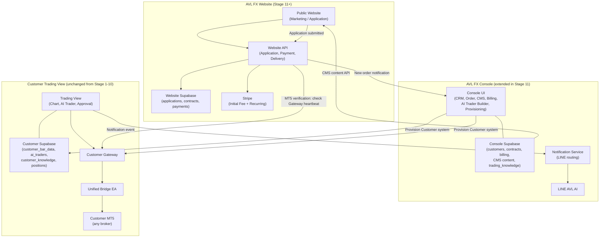

# AVL FX Website — Architecture

**Document type:** V2 Stage 11 Planned Architecture — NOT implemented  
**Status:** PLANNED — implementation begins after V2 Stage 10 Final E2E PASS  
**Created:** 2026-09-26  
**Parent:** [V2_ARCHITECTURE.md](./V2_ARCHITECTURE.md)  
**Roadmap:** [V2_IMPLEMENTATION_ROADMAP.md](./V2_IMPLEMENTATION_ROADMAP.md) Stage 11

---

## 1. Position in AVL-FX Product Family

AVL-FX will evolve into a three-system product family in Stage 11+:

```
CURRENT / V1 / V2 Stage 1-10:
  AVL FX Trading View  (Customer trading system)
  AVL FX Console       (AVL internal management)

V2 Stage 11+:
  AVL FX Trading View  (Customer trading system — unchanged)
  AVL FX Console       (AVL internal management — extended with CMS + Onboarding)
  AVL FX Website       (Public acquisition + application + onboarding entry point) ← NEW
```

The Website does NOT affect the V2 Stage 1-10 Trading System completion gate.  
V2 Stage 10 Final E2E PASS is required before Stage 11 begins.

---

## 2. AVL FX Website Responsibility

```
AVL FX Website:
  - Public marketing / product information
  - Customer acquisition
  - Application form
  - Contract presentation and acceptance
  - Electronic consent
  - Initial development fee payment (Stripe)
  - Onboarding entry point
  - MT5 connection verification page
  - Post-delivery customer portal entry
  - Legal document presentation

NOT responsible for:
  - Trading operations (belongs to Trading View)
  - AI Trader management (belongs to Trading View)
  - Console management functions (belongs to Console)
  - Knowledge management (belongs to Console)
  - LINE notification routing (belongs to Console)
```

---

## 3. Website Infrastructure (Stage 11 Target)

```
AVL FX Website Infrastructure:
  GitHub Repository:  AVL_FX_Website (new — created in Stage 11B)
  Vercel Project:     AVL FX Website (new — created in Stage 11B)
  Supabase Project:   AVL FX Website (new — created in Stage 11B)
  Domain:             [TBD at Stage 11B]

Completely independent of:
  Trading View Vercel / Supabase / Railway
  Console Vercel / Supabase
```

---

## 4. Website Supabase Responsibility

Website Supabase owns website-operational data only:

```
Website Supabase tables (proposed):
  applications         — customer application submissions
  onboarding_sessions  — active onboarding state
  contract_acceptances — signed contract references + audit metadata
  payment_intents      — Stripe payment workflow state
  delivery_tokens      — one-time secure delivery/setup tokens
  application_status   — current lifecycle state per application

NOT stored in Website Supabase:
  Customer trading data (belongs to Customer Trading View Supabase)
  Console admin data (belongs to Console Supabase)
  CMS content (owned by Console Supabase — see WEBSITE_CMS_ARCHITECTURE.md)
```

AVL staff do NOT manage Website Supabase directly via Supabase Dashboard.  
Website content is managed through AVL FX Console CMS.  
Application/order management is handled through AVL FX Console.

---

## 5. System Architecture Diagram (V2 Stage 11 Target)



---

## 6. Responsibility Boundary Matrix

| Concern | Website | Console | Trading View |
|---------|---------|---------|-------------|
| Marketing content | ✅ Serves | ✅ Authors (CMS) | ❌ |
| Customer application | ✅ Receives | ✅ Reviews | ❌ |
| Contract presentation | ✅ Presents | ✅ Manages versions | ❌ |
| Initial payment | ✅ Processes | ✅ Confirms | ❌ |
| Development management | ❌ | ✅ | ❌ |
| White label provisioning | ❌ | ✅ | ✅ Applies config |
| Customer Knowledge Package | ❌ | ✅ Creates/deploys | ✅ Uses locally |
| AI Trader runtime | ❌ | ✅ Configures | ✅ Executes |
| MT5 market data | ❌ | ❌ | ✅ Source of Truth |
| Execution | ❌ | ❌ | ✅ |
| Risk Engine | ❌ | ❌ | ✅ |
| LINE notifications | ❌ | ✅ Routes | ✅ Emits events |
| Recurring billing | ✅ Payment surface | ✅ Manages | ❌ |
| MT5 connection verification | ✅ UI entry | ❌ | ✅ Verifies |

---

## 7. Website Technology Stack (Target — to be confirmed at Stage 11A)

```
Framework:   Next.js (consistent with existing apps)
Hosting:     Vercel (consistent with existing apps)
Database:    Supabase (Website-dedicated project)
Payment:     Stripe (server-side only, no client-side secret)
Auth:        Supabase Auth or invite-only setup
CMS source:  Console Supabase (read via Console server API)
```

Framework/stack to be confirmed at Stage 11 Architecture Freeze (11A).  
Must be consistent with existing AVL-FX technology choices unless strong reason to diverge.

---

## 8. Security Constraints

```
✗ No service-role key exposed to browser
✗ No Stripe secret key in client code
✗ No plaintext password collection (customers.tv_password pattern NEVER repeated)
✗ No secrets in email body (invitation and setup use secure links)
✗ No CMS write credential in Website code (Website is read-only for CMS)
✗ No cross-system Supabase access (Website DB ≠ Console DB ≠ Customer DB)

✓ Stripe webhook signature verification mandatory
✓ Server-side Stripe secret only
✓ Customer password set by customer via invite/setup link
✓ One-time/short-lived delivery tokens for secure onboarding
✓ Audit log for all application/payment/delivery events
✓ Input validation and XSS sanitization on all forms
```

---

## 9. Related Stage 11 Documents

| Document | Content |
|---------|---------|
| [CUSTOMER_ONBOARDING_AND_DELIVERY.md](./CUSTOMER_ONBOARDING_AND_DELIVERY.md) | Full customer journey, delivery workflow, MT5 verification |
| [WEBSITE_CMS_ARCHITECTURE.md](./WEBSITE_CMS_ARCHITECTURE.md) | CMS design, Console → Website content flow |
| [WHITE_LABEL_BRANDING.md](./WHITE_LABEL_BRANDING.md) | White label configuration per customer |
| [CONTRACT_AND_PAYMENT_ARCHITECTURE.md](./CONTRACT_AND_PAYMENT_ARCHITECTURE.md) | Contract workflow, Stripe, billing lifecycle |
