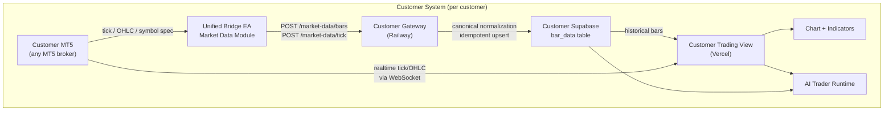
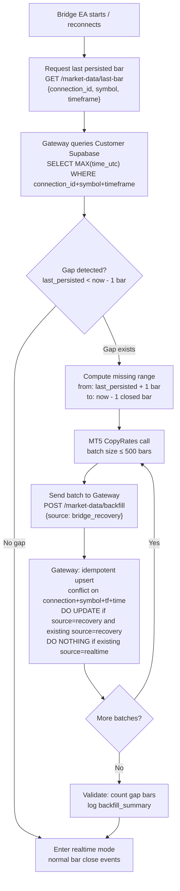

# AVL-FX — Customer Market Data Architecture

**Document type:** POST-V1 Target Architecture — NOT implemented  
**Status:** DESIGN PHASE  
**Created:** 2026-09-26  
**Supersedes:** [CENTRAL_MARKET_DATA.md](./CENTRAL_MARKET_DATA.md) (deprecated)  
**Parent:** [V2_ARCHITECTURE.md](./V2_ARCHITECTURE.md)

---

## 1. Core Principle

> **Customer MT5 = Source of Truth for that Customer**

Each Customer's own MT5 broker connection is the canonical and sole source of market data for that Customer's trading system.

```
Customer A (XM broker)     Customer B (Titan FX)     Customer C (FXGT)
      MT5                        MT5                       MT5
       ↓                          ↓                         ↓
  GOLD# prices              XAUUSD prices             GOLD prices
       ↓                          ↓                         ↓
  Customer A Bridge          Customer B Bridge         Customer C Bridge
       ↓                          ↓                         ↓
  Customer A Supabase        Customer B Supabase       Customer C Supabase
       ↓                          ↓                         ↓
  Customer A Trading View    Customer B Trading View   Customer C Trading View
```

No cross-customer market data sharing. No AVL central price distribution. Each customer's broker prices, spreads, symbol specifications, and timestamps are entirely owned by that customer's system.

---

## 2. Why Customer MT5 as Source of Truth

| Criterion | Customer MT5 | (Old) Central Market Data |
|-----------|-------------|--------------------------|
| AI analysis price matches execution price | ✅ Same broker | ❌ Requires price translation |
| Broker-specific spread captured | ✅ Actual broker spread | ❌ Different broker spread |
| Symbol specification accuracy | ✅ Customer's actual specs | ❌ May differ |
| Customer system independence | ✅ No AVL runtime dependency | ❌ AVL Central required |
| Customer data ownership | ✅ Customer owns their data | ❌ AVL owns all data |
| Broker independence | ✅ Each customer uses own broker | ❌ AVL must pick one broker |

---

## 3. Market Data Flow (TARGET)



**Canonical data path:**
1. Customer MT5 generates OHLC bars at each bar close
2. Unified Bridge EA sends bars to Customer Gateway
3. Gateway normalizes (UTC timestamp, canonical symbol, broker metadata) and upserts to Customer Supabase
4. Trading View reads historical bars from Customer Supabase
5. Trading View receives realtime bar updates via WebSocket from Customer Gateway
6. Chart, Indicators, and AI Trader all use the **same** Customer Market Data Layer

---

## 4. Canonical Bar Schema

### 4-1. customer_bar_data table

```sql
CREATE TABLE customer_bar_data (
  id                UUID        PRIMARY KEY DEFAULT gen_random_uuid(),

  -- Ownership and isolation
  user_id           UUID        NOT NULL REFERENCES auth.users(id),
  connection_id     UUID        NOT NULL REFERENCES mt5_connections(id) ON DELETE CASCADE,

  -- Symbol identification
  canonical_symbol  TEXT        NOT NULL,   -- e.g., 'GOLD'
  broker_symbol     TEXT        NOT NULL,   -- e.g., 'GOLD#', 'XAUUSD', 'GOLD'
  broker            TEXT,                   -- e.g., 'XM', 'TitanFX', 'FXGT'
  broker_server     TEXT,                   -- MT5 server name if available

  -- Timeframe
  timeframe         TEXT        NOT NULL,   -- 'M1','M5','M15','M30','H1','H4','D1','W1','MN1'

  -- Bar identity (canonical key)
  time_utc          TIMESTAMPTZ NOT NULL,   -- bar open time, normalized to UTC

  -- OHLCV
  open              NUMERIC(18,5) NOT NULL,
  high              NUMERIC(18,5) NOT NULL,
  low               NUMERIC(18,5) NOT NULL,
  close             NUMERIC(18,5) NOT NULL,
  tick_volume       BIGINT,                 -- MT5 tick count within bar
  spread            INTEGER,               -- typical spread in points

  -- Data quality metadata
  source            TEXT        NOT NULL DEFAULT 'bridge_realtime',
                                           -- 'bridge_realtime' | 'bridge_backfill' | 'bridge_recovery'
  is_confirmed      BOOLEAN     NOT NULL DEFAULT true,  -- false = forming/current bar
  received_at       TIMESTAMPTZ NOT NULL DEFAULT now(),
  updated_at        TIMESTAMPTZ NOT NULL DEFAULT now(),

  -- Canonical bar identity: one record per connection+symbol+timeframe+bar
  UNIQUE (connection_id, canonical_symbol, timeframe, time_utc)
);

-- Primary query pattern: get N bars for chart/analysis
CREATE INDEX idx_cbar_conn_sym_tf_time
  ON customer_bar_data (connection_id, canonical_symbol, timeframe, time_utc DESC);

-- Quality and recovery queries
CREATE INDEX idx_cbar_source_time
  ON customer_bar_data (connection_id, canonical_symbol, timeframe, source, time_utc DESC);
```

### 4-2. Required Fields

| Field | Required | Notes |
|-------|----------|-------|
| connection_id | Required | Customer isolation via mt5_connections |
| canonical_symbol | Required | Normalized symbol: always GOLD, never GOLD# |
| broker_symbol | Required | Actual MT5 symbol for reconciliation |
| timeframe | Required | Canonical string: M1, M5, M15, M30, H1, H4, D1, W1, MN1 |
| time_utc | Required | Bar open time normalized to UTC |
| open, high, low, close | Required | Price data |
| source | Required | Data lineage (realtime vs backfill) |
| received_at | Required | When AVL system received this bar |

### 4-3. Optional / Future Fields

```
tick_history:   Not stored by default (cost/performance).
                Tick data retained in-memory for realtime chart only.
                Not persisted to Supabase unless explicitly required.

bid_at_close:   Optional — the broker BID at bar close (useful for execution reference)
ask_at_close:   Optional — the broker ASK at bar close

data_gap_flag:  Boolean — set if this bar was detected as having a gap before it
quality_score:  Numeric — future data quality metric
```

---

## 5. Timeframe Strategy

### 5-1. Options Evaluated

**Option A: Multi-Timeframe Direct Transmission (send all TF from MT5)**
```
MT5 sends M1, M5, M15, M30, H1, H4, D1, W1 bars separately
Bridge sends each timeframe's bar close event independently
```

| Criterion | Score | Notes |
|-----------|-------|-------|
| Correctness | ✅ High | MT5 canonical bar boundaries for each TF |
| Broker candle boundary | ✅ Exact | MT5 constructs each TF natively |
| Timestamp consistency | ✅ Exact | MT5 bar open times per TF |
| MT5 server timezone | ✅ Handled by MT5 | MT5 normalizes to server time |
| Network traffic | ⚠️ Higher | N bars per TF × M timeframes |
| Supabase writes | ⚠️ Higher | More upserts |
| Storage | ⚠️ Higher | All TF stored independently |
| Query performance | ✅ Good | Direct table scan |
| Recovery complexity | ✅ Simple | CopyRates per TF independently |

**Option B: M1 Base + Server Aggregation**
```
MT5 sends only M1 bars
Server aggregates M1 → M5, M15, M30, H1, H4, D1, W1
```

| Criterion | Score | Notes |
|-----------|-------|-------|
| Correctness | ⚠️ Risk | Aggregation errors possible |
| Broker candle boundary | ❌ Approximate | Server aggregation may not match MT5 boundaries |
| Timestamp consistency | ⚠️ Risk | Session boundaries, DST changes |
| MT5 server timezone | ❌ Complex | Must replicate MT5 timezone logic server-side |
| Network traffic | ✅ Lower | M1 only from MT5 |
| Supabase writes | ✅ Lower | M1 writes only at source |
| Storage | ✅ Lower | M1 only from MT5 (but M1 is most granular) |
| Query performance | ✅ Equivalent | |
| Recovery complexity | ⚠️ Complex | Must re-aggregate on gap recovery |

### 5-2. Recommendation

**Option A (Multi-Timeframe Direct Transmission) is recommended** for initial implementation.

Rationale:
- Broker candle boundaries are exact (MT5-native)
- Simpler implementation (no aggregation logic)
- Recovery is independent per timeframe
- Correctness is higher (no risk of aggregation divergence from MT5's internal aggregation)
- With 10–50 customers and GOLD primary, storage/traffic cost is manageable

Option B may be revisited if storage costs become significant at scale.

### 5-3. Initial Timeframe Set

Initial deployment: **H1, M5** (matching V1 runtime requirements)

Full deployment target:

```
M1   — High frequency (optional, configurable)
M5   — Required for V1-compatible AI runtime
M15  — Recommended
M30  — Recommended
H1   — Required (AI Trader context TF)
H4   — Recommended (AI context)
D1   — Recommended (swing context)
W1   — Optional
MN1  — Optional (very low frequency)
```

Customer Trading View displays timeframes that are available in `customer_bar_data`.  
AI Trader runtime uses the timeframes defined in its `ai_trader_timeframe_profiles`.

---

## 6. Historical Backfill / Recovery

### 6-1. Problem

The Bridge EA may be offline for extended periods:
- MT5 shutdown / VPS restart / network outage
- Gateway restart / Railway restart
- Supabase outage
- EA restart after update

When the EA reconnects, `customer_bar_data` will have a gap. AI Trader must not use analysis windows with gaps.

### 6-2. Reconnect Recovery Flow



### 6-3. Backfill Design Requirements

```
Idempotent upsert:
  UNIQUE constraint: (connection_id, canonical_symbol, timeframe, time_utc)
  ON CONFLICT: update only if new data is fresher/better quality
  Never overwrite realtime bars with backfill bars

Duplicate protection:
  Unique constraint handles duplicates at DB level
  Bridge must not send the same bar twice per batch

Missing-bar detection:
  After backfill: verify expected bar count
  Log any remaining gaps as data_quality warnings

Reconnect backfill:
  EA requests last_bar on every reconnect
  Not only on first start

Timestamp normalization:
  All time_utc values: UTC, bar OPEN time
  MT5 bars use server time → normalize to UTC using broker server UTC offset
  Broker server UTC offset stored in mt5_connections metadata

Out-of-order handling:
  Idempotent upsert handles out-of-order batches
  DO NOT assume batches arrive in chronological order

Partial batch retry:
  If Gateway returns error for batch: retry entire batch (idempotent)
  Never assume partial success

Maximum batch size:
  500 bars per batch (configurable, start conservative)
  For large gaps (e.g., week offline): multiple batches with progress tracking

Rate limiting:
  Backfill does not starve realtime updates
  Backfill runs in background goroutine/timer in EA
  Realtime bar events take priority

Data quality validation:
  Reject bars where: open=0, close=0, high < low, time_utc in future
  Log validation failures to gateway error log
  Do not silently accept invalid bars
```

### 6-4. Data Completeness Check

```
At AI Trader analysis time:
  Verify: required_bars(timeframe, lookback) ≤ available_bars(timeframe)
  If insufficient bars: AI analysis fail closed (not silently degrade)
  Required lookback per timeframe profile: defined in ai_trader_timeframe_profiles
```

---

## 7. UTC Normalization

### 7-1. MT5 Broker Server Time

MT5 servers use broker-local time (often GMT+2 or GMT+3, varies by DST).  
`CopyRates()` returns bars in broker server time.

```
Normalization requirement:
  MT5 broker server UTC offset → stored in mt5_connections.broker_server_utc_offset
  Bridge EA: convert bar time to UTC before sending
  time_utc = bar_time_broker - broker_server_utc_offset_hours

Example:
  Broker server = GMT+2
  H1 bar open: 2026-09-26 10:00 (broker time)
  time_utc:    2026-09-26 08:00 UTC
```

### 7-2. Daylight Saving Time

MT5 broker server DST changes must be handled:  
- Broker server UTC offset may change on DST transition dates
- Store `broker_server_utc_offset` as metadata in `mt5_connections`
- Bridge EA should detect offset changes and update

---

## 8. Realtime Current Bar

During an active trading session, the "current bar" is forming (not yet closed).

```
Current bar handling:
  Bridge EA sends tick/OHLC updates for forming bar
  Gateway broadcasts to Trading View WebSocket (realtime display)
  Forming bar is NOT stored in customer_bar_data (is_confirmed = false)
  When bar closes: EA sends confirmed bar → stored with is_confirmed = true

Chart display:
  Historical bars: from customer_bar_data (confirmed bars)
  Current bar: from WebSocket (forming bar, ephemeral)
  UI merges historical + current for continuous chart display
```

---

## 9. Chart / Indicator / AI Consistency Requirement

```
REQUIREMENT: Chart, Indicators, and AI Trader MUST use the same canonical data source.

Source:   customer_bar_data table (+ realtime current bar from WebSocket)
For all:  Chart display, EMA/RSI indicators, AI Trader analysis, backtesting

PROHIBITED:
  - AI Trader using different data source than displayed chart
  - Chart using central market data while AI uses customer broker data
  - Indicator calculation on data not stored in customer_bar_data
```

---

## 10. Broker Independence

```
Canonical symbol mapping (customer-specific):
  GOLD# (XM)    → canonical_symbol = GOLD
  XAUUSD (TitanFX) → canonical_symbol = GOLD
  GOLD (FXGT)   → canonical_symbol = GOLD

Mapping source:
  Bridge EA reads broker_symbol from MT5 Symbol() function
  Gateway applies canonical mapping via symbol_specs.canonical_symbol
  customer_bar_data stores BOTH broker_symbol and canonical_symbol

All AI Trader queries use canonical_symbol.
Execution commands use broker_symbol (from symbol_specs).
```

---

## 11. Data Retention Policy

Target scale: 10–50 customers. Each with GOLD (primary) + potentially 1–2 other symbols.

### 11-1. Initial Retention Strategy

```
OHLC (H1, H4, D1, W1, MN1):  Long-term retention (indefinite initially)
OHLC (M1, M5, M15, M30):      Long-term retention (review at 12 months)
Tick data:                     NOT stored in Supabase (in-memory only for realtime chart)

Rationale:
  - OHLC data per customer is small: ~10 bars/day × 365 days × 8 TF = ~29,000 rows/year/customer
  - At 50 customers: 1.45M rows/year total (very manageable for Supabase)
  - Tick data volume is orders of magnitude higher: not justified for initial scope
```

### 11-2. Future Scaling

```
At significant scale (100+ customers):
  - Partition customer_bar_data by connection_id
  - Archive M1/M5 data older than N years to cold storage
  - Materialized views for H4, D1 aggregated from H1 (if Option B is adopted later)
  - Supabase Storage for historical export/backup
```

---

## 12. V1 → TARGET Migration

### 12-1. CURRENT V1 State

```
V1 currently:
  Console DataManager EA → Console Gateway → Console Supabase bar_data
  Customer Chart EA (AVL_FX_Bridge) → Customer Gateway → (no persistent storage of market data)
  Customer Trading View: reads from Console bar_data via Research API
```

### 12-2. TARGET State

```
TARGET:
  Customer Unified Bridge EA → Customer Gateway → Customer Supabase customer_bar_data
  Customer Trading View: reads from Customer Supabase (no Console dependency)
  Console: does NOT collect or distribute market data
```

### 12-3. Migration Safety

```
Migration order:
  1. Implement customer_bar_data schema (additive migration, no data loss)
  2. Implement Unified Bridge EA market data transmission
  3. Implement Customer Gateway bar persistence
  4. Customer Trading View switches to customer_bar_data
  5. Console market data dependency removed (phased, feature-flagged)
  6. Console DataManager EA retired (after Customer systems are self-contained)

Do not remove Console market data dependency until Customer system is verified self-contained.
Run both in parallel during transition.
```

---

## 13. Failure Semantics

| Failure | Effect |
|---------|--------|
| Customer MT5 unavailable | No new realtime data; analysis uses last confirmed bars; new entry prohibited (stale data) |
| Customer Gateway unavailable | Bars buffered in Bridge EA (limited buffer); reconnect triggers backfill |
| Customer Supabase unavailable | Persistence fails; bars not saved; Bridge must log and retry; AI must not use gaps silently |
| Bridge EA offline (minutes–hours) | Gap in customer_bar_data; reconnect triggers backfill |
| Bridge EA offline (days) | Large gap; backfill required; AI must verify completeness before analysis |
| Historical gap in AI window | AI analysis fail closed; do not interpolate missing bars |

```
INVARIANT: Silence is not success.
  - Missing bars must be detected, not assumed present
  - AI analysis verifies data completeness before running
  - Backfill logs successes and failures explicitly
```
