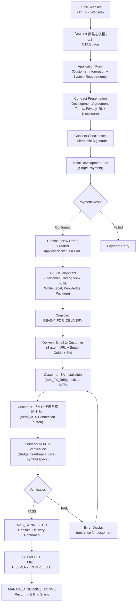

# AVL-FX — Customer Acquisition / Onboarding / Delivery Architecture

**Document type:** V2 Stage 11 Planned Architecture — NOT implemented  
**Status:** PLANNED — implementation begins after V2 Stage 10 Final E2E PASS  
**Created:** 2026-09-26  
**Parent:** [AVL_FX_WEBSITE_ARCHITECTURE.md](./AVL_FX_WEBSITE_ARCHITECTURE.md)

---

## 1. Full Customer Lifecycle State Machine

```
APPLICATION
    ↓
CONTRACT_PENDING
    ↓
PAYMENT_PENDING
    ↓
PAID
    ↓
DEVELOPMENT
    ↓
READY_FOR_DELIVERY
    ↓
WAITING_FOR_MT5_CONNECTION
    ↓
MT5_CONNECTED
    ↓
DELIVERED
    ↓
MANAGED_SERVICE_ACTIVE
```

Additional states:
```
SUSPENDED         — service suspended (payment failure, etc.)
PAYMENT_FAILED    — initial or recurring payment failed
MAINTENANCE_STOPPED — managed service paused (temporary)
CANCELLED         — contract terminated
```

---

## 2. Complete Customer Journey Flow



---

## 3. Application Form Design

### 3-1. Customer Information

```
Section: お客様情報

顧客タイプ:   ( ) 個人  ( ) 法人
氏名:         [                              ]
会社名:       [                              ] (法人の場合)
メールアドレス: [                              ]
電話番号:     [                              ]
```

### 3-2. System Requirements

```
Section: システム要件

希望システム名:  [                              ]
希望ブランド名:  [                              ]  (例: 田中FX)
希望ドメイン:   [                              ]  (例: tanaka-fx.com — 未確定でも可)
Broker:         [          ] (例: XM, Titan FX, FXGT, その他)
MT5利用状況:   ( ) MT5口座あり  ( ) これから開設

AI Traderの希望取引スタイル:
  ( ) Day Trading (H1/M5 中心)
  ( ) Scalping (M5/M1 中心)
  ( ) Swing (D1/H4 中心)
  ( ) 相談して決めたい

その他ご要望:
[                                              ]
[                                              ]
```

### 3-3. Branding Assets

```
Section: ブランド素材 (任意 — 後から提出も可)

ロゴ画像:      [ファイルを選択]  (PNG/SVG, 透過PNG推奨)
ファビコン:    [ファイルを選択]  (ICO/PNG)
カラーテーマ:  ( ) ダーク  ( ) ライト  ( ) お任せ
ブランドカラー: [     ] (HEXコード — 任意)
```

---

## 4. Password and Authentication Design

**CRITICAL SECURITY REQUIREMENT: No AVL staff can read customer passwords.**

```
Prohibited (NEVER implement):
  ✗ Collecting password in application form
  ✗ Storing plaintext password in DB (customers.tv_password pattern FORBIDDEN)
  ✗ Sending password in email body
  ✗ AVL admin reading/setting customer password

Target flow:
  AVL provisions Customer Supabase Auth user
      ↓
  Supabase sends invite email to customer's email address
  (or: AVL sends secure password setup link via Console)
      ↓
  Customer clicks link → sets their own password securely
      ↓
  AVL/Console NEVER sees the password
      ↓
  Customer logs into Trading View independently
```

---

## 5. Delivery Package Design

After development is complete, AVL sends a delivery email. The email contains:

```
Delivery Email Contents:
  ✓ Customer Trading View URL (e.g., tanaka-fx.vercel.app)
  ✓ Setup guide (PDF or Web URL)
  ✓ Link to download AVL_FX_Bridge.ex5 (secure download URL, time-limited)
  ✓ MT5 setup instructions
  ✓ Link to "MT5接続を確認する" page (authenticated, one-time token)

Delivery Email MUST NOT contain:
  ✗ Connection token (raw)
  ✗ Gateway secret
  ✗ Supabase service role key
  ✗ Any plaintext credentials
  ✗ Customer password
```

Secure delivery mechanism:
```
Console generates delivery_token (cryptographically random, time-limited, single-use)
  → stored in Website Supabase: delivery_tokens { customer_id, token_hash, expires_at, used }
  → Email link: https://avl-fx-website.com/onboard?token={raw_token}
  → Customer clicks link → authenticated onboarding page
  → Server validates token → serves secure setup steps
  → Token consumed after first valid use
```

---

## 6. MT5 Connection Verification

Customer presses "MT5接続を確認する" after EA installation.  
Server verifies actual connection state — customer self-report alone is insufficient.

### 6-1. Verification Steps

```
Step 1: Authenticated customer session verified
Step 2: Customer owns the MT5 connection record (connection_id verified)
Step 3: Unified Bridge heartbeat freshness check
         bridge_last_heartbeat > now - threshold (e.g., 60 seconds)
Step 4: Account snapshot valid
         equity > 0, account_type present, account_mode present
Step 5: Broker/account identity plausible
         broker matches expected broker in system config
Step 6: Required symbol detected in symbol_specs
         canonical_symbol = GOLD present for GOLD-focused traders
Step 7: Fresh tick received
         live quote timestamp fresh (within N seconds)
Step 8: Required timeframe bars received
         customer_bar_data has at least M bars for required TF (e.g., H1)
Step 9: Symbol specification received
         tick_size, tick_value, volume_min all non-zero
Step 10: Customer Supabase persistence confirmed
         bars actually stored and retrievable

All 10 checks PASS → MT5_CONNECTED
Any check FAIL → Return specific failure reason to customer → guidance displayed
```

### 6-2. Fail Closed

```
If ANY verification step fails:
  → MT5_CONNECTED state NOT set
  → Customer sees specific error message with resolution steps
  → Console receives VERIFICATION_FAILED notification
  → Customer can retry after fixing the issue
  
NEVER set MT5_CONNECTED based solely on customer button press.
```

---

## 7. Managed Service Activation

After DELIVERED confirmation:

```
DELIVERED
    ↓
AVL Console: manually confirms delivery (or auto-confirms after MT5_CONNECTED)
    ↓
Console sets: customer.status = DELIVERED
    ↓
Stripe subscription created (or first recurring charge scheduled)
    ↓
customer.status = MANAGED_SERVICE_ACTIVE
    ↓
LINE notification: DELIVERY_COMPLETED → Customer LINE
```

---

## 8. LINE Business Notifications (Stage 11)

Stage 11 adds business-lifecycle notifications distinct from trading runtime notifications:

```
Business event category:
  APPLICATION_RECEIVED    — AVL receives new application
  PAYMENT_CONFIRMED       — Initial development fee paid
  DEVELOPMENT_STARTED     — Development work begins
  SYSTEM_READY            — Trading View built and ready
  MT5_SETUP_REQUIRED      — Customer needs to install EA
  MT5_CONNECTED           — MT5 connection verified
  DELIVERY_COMPLETED      — System delivered and active
  BILLING_NOTICE          — Upcoming or completed billing

Trading event category (from V2 Stage 8, unchanged):
  H1_SCENARIO_UPDATED
  OWNER_APPROVAL_REQUIRED
  ORDER_FILLED
  POSITION_CLOSED
  SYSTEM_WARNING
  (etc.)

These two categories are separated in notification_events.source:
  source = 'business'  (Stage 11 events)
  source = 'runtime'   (Trading system events from V2 Stage 8)
```

LINE is never used for trade execution approval in Stage 11 initial.  
Trading approval remains in Customer Trading View only.

---

## 9. Customer Lifecycle Console View (Target)

Console Customer Detail screen should display all lifecycle information:

```
Customer Detail — 田中 慶樹様
─────────────────────────────────────────────
Status:         MANAGED_SERVICE_ACTIVE
Contract:       2026-09-26  |  Development + Monthly
Initial Payment: ¥300,000  PAID  2026-09-28

System:         田中FX
Trading View:   https://tanaka-fx.vercel.app
GitHub:         AVL_FX_Customer001
Vercel:         avl-fx-customer001
Railway:        customer001-gateway
Supabase:       customer001-trading
Domain:         tanaka-fx.com

MT5 Broker:     XM
MT5 Connection: ONLINE (heartbeat: 32s ago)
EA Version:     2.1.0
Bridge Health:  HEALTHY

LINE:           Linked ✓ (last: 2h ago)
Next Billing:   2026-10-25  ¥30,000

Development:    DELIVERED 2026-09-30
Delivery:       MT5_CONNECTED 2026-10-01
Service Start:  2026-10-01
```

---

## 10. Security Audit Requirements (Stage 11)

```
Application form:
  [ ] Input validation on all fields (server-side)
  [ ] XSS sanitization on free-text fields
  [ ] File upload validation (type, size, content)
  [ ] Rate limiting on application submission

Contract:
  [ ] Document version tracked
  [ ] Document hash stored at acceptance time
  [ ] Acceptance timestamp recorded
  [ ] IP address and user agent logged (for non-repudiation)

Payment (Stripe):
  [ ] Stripe webhook signature verification mandatory
  [ ] Stripe secret server-only (never in browser)
  [ ] Idempotency key per payment attempt
  [ ] Replay protection via Stripe event ID deduplication

Delivery:
  [ ] Delivery token single-use
  [ ] Delivery token expires in N hours (e.g., 72 hours)
  [ ] Token hash stored (not raw token)
  [ ] No credentials in email body

MT5 Verification:
  [ ] All 10 checks must pass (fail closed)
  [ ] Customer cannot bypass verification
  [ ] Verification logs stored for audit
```

---

## 11. Compliance Boundary Note

```
COMPLIANCE REVIEW REQUIRED:

The customer acquisition and onboarding architecture described in this document
covers: website operation, application processing, contract management, payment
processing, system delivery, and managed hosting service.

This document does NOT claim that any specific business activity is exempt from
or subject to Japanese financial regulations (金融商品取引法 and related laws),
consumer protection regulations, or other applicable requirements.

Specific compliance areas that require expert review before Stage 11 launch:
  - Electronic contract validity and requirements
  - Electronic signature legal requirements in Japan
  - Consumer cooling-off rights for development contracts
  - Risk disclosure obligations
  - Data protection and privacy (個人情報保護法)
  - Financial services regulations (if any trading-related service constitutes
    investment advisory or similar regulated activity)

AVL must obtain appropriate legal/compliance review before commercial operation.
```
