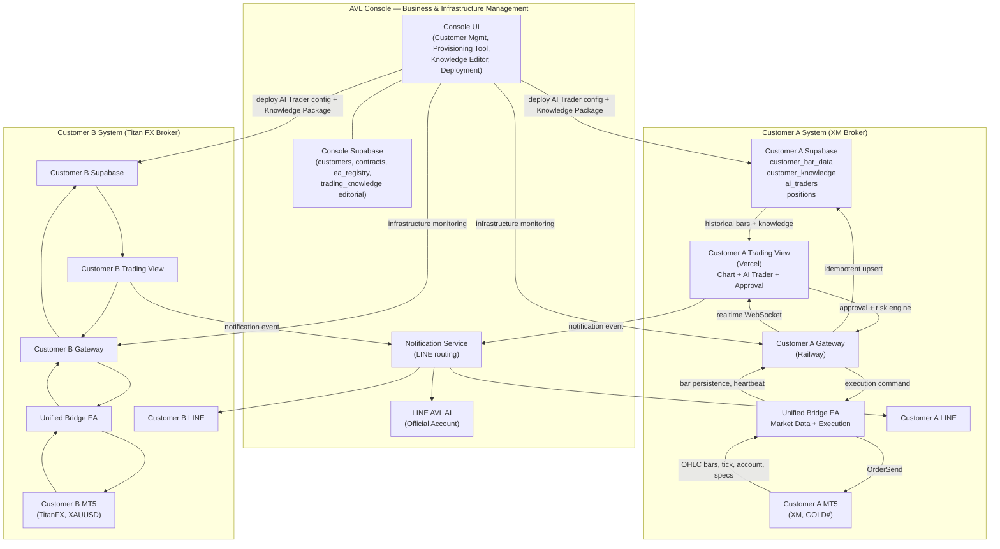
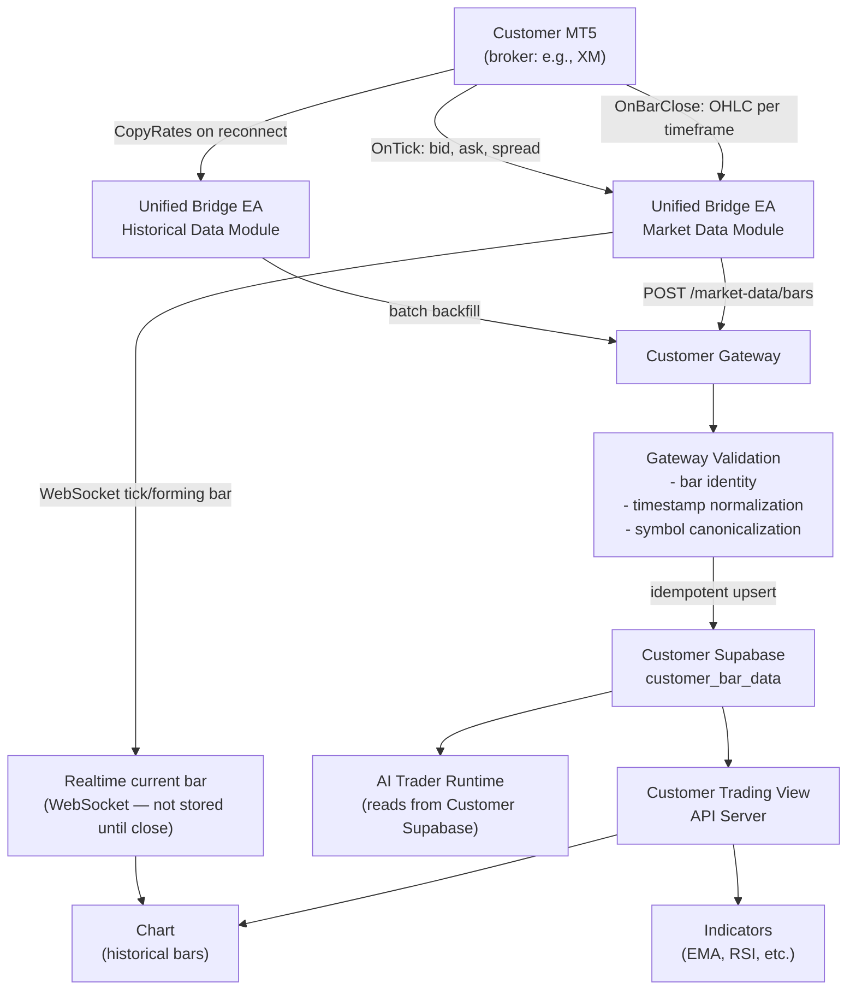
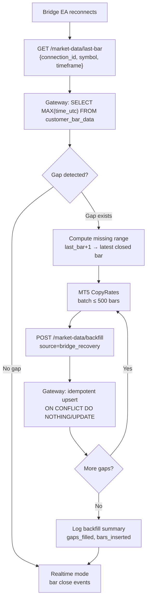
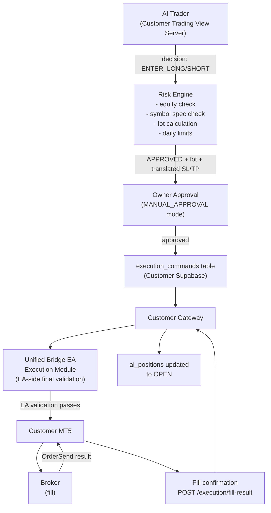
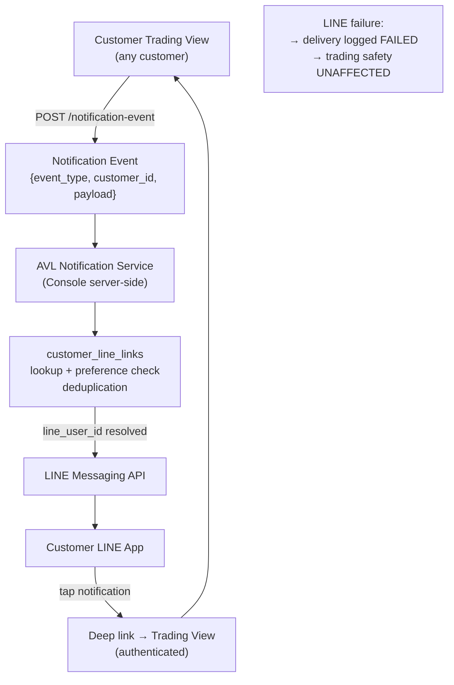
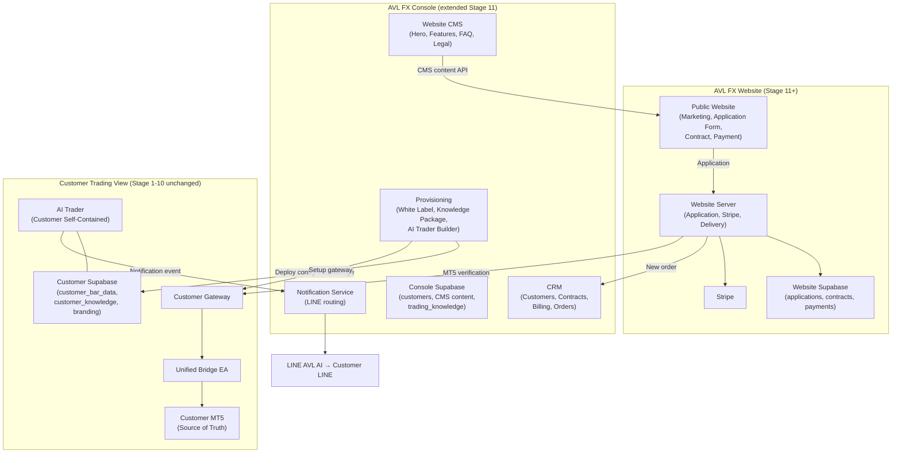

# AVL-FX — POST-V1 Target Architecture

**Document type:** POST-V1 Target Architecture — NOT implemented  
**Status:** DESIGN PHASE — V1 Stage 10-C SUSPENDED; V2 implementation starts now  
**Created:** 2026-09-26  
**Revised:** 2026-09-26 — Customer Self-Contained Architecture  

---

## 1. Architecture Principle

> **Customer Self-Contained Architecture**
>
> Each Customer's system is self-contained.  
> Customer AI Trader does NOT depend on AVL Console at runtime for market data or knowledge.  
> Customer MT5 is the canonical market data and execution price source for that Customer.

---

## 2. Diagram A — AVL-FX Full System (TARGET)

---

## 3. Diagram B — Customer Market Data Lifecycle (TARGET)

---

## 4. Diagram C — Historical Recovery on Reconnect

---

## 5. Diagram D — Execution Path (Unchanged from V1)

---

## 6. Diagram E — LINE Notification Flow

---

## 7. Component Responsibilities

### 7-1. AVL Console (TARGET)

| Responsibility | Status |
|---------------|--------|
| Customer / Contract / Revenue management | ✅ Retained |
| Deployment / infrastructure metadata | ✅ Retained |
| System health monitoring (heartbeat reception) | ✅ Retained |
| LINE Notification routing | ✅ Retained |
| AI Trader Builder (provisioning tool) | ✅ Retained (role clarified) |
| Knowledge editorial (for package creation) | ✅ Retained |
| EA Registry (administrative) | ✅ Retained |
| Central GOLD OHLC collection | ❌ REMOVED from TARGET |
| Real-time Knowledge API for customer AI Trader | ❌ REMOVED from TARGET |
| Customer market data distribution | ❌ REMOVED from TARGET |

### 7-2. Customer Unified Bridge EA

| Module | Responsibility |
|--------|---------------|
| Connection Module | Auth, reconnect, heartbeat |
| Market Data Module | OnTick, OnBarClose → Gateway |
| Historical Data Module | CopyRates, backfill on reconnect |
| Symbol Specification Module | MT5 symbol specs → Gateway |
| Account Module | equity, balance, margin → Gateway heartbeat |
| Position Module | position snapshot → Gateway |
| Deal/History Module | deal notifications → Gateway |
| Execution Module | command reception, OrderSend, fill confirmation |

### 7-3. Customer Gateway

| Responsibility | Notes |
|---------------|-------|
| Market data persistence | Validates + upserts to customer_bar_data |
| Last bar query | GET /market-data/last-bar for backfill coordination |
| Execution command management | GET /execution/pending-commands for Bridge |
| Fill/close result reception | POST /execution/fill-result → ai_positions |
| WebSocket server | Realtime chart data to Trading View |
| Heartbeat reception | Account + Bridge health data |
| Symbol spec reception | Updates symbol_specs table |
| Health reporting | To Console monitoring |

### 7-4. Customer Trading View

| Responsibility | Notes |
|---------------|-------|
| Chart | From customer_bar_data + WebSocket |
| Indicators | From customer_bar_data (same source as Chart) |
| AI Trader Runtime | Reads customer_bar_data + customer_knowledge |
| Risk Engine | Server-side, pre-execution validation |
| Manual Approval UI | Customer approves/rejects entries |
| LINE settings | Link/unlink, preferences |
| Notification event emission | To Console Notification Service |

---

## 8. CURRENT V1 vs TARGET POST-V1

### 8-1. Market Data

| Aspect | CURRENT V1 | TARGET POST-V1 |
|--------|-----------|----------------|
| AI analysis price source | Console bar_data (via Research API) | Customer Supabase customer_bar_data |
| Chart price source | Console bar_data + Customer Bridge realtime | Customer Supabase + Customer MT5 WebSocket |
| Market data persistence | Console Supabase (AVL-owned) | Customer Supabase (Customer-owned) |
| Broker price used | Console broker (XM central) | Customer's own broker |
| Customer independence | Depends on Console market data | Self-contained |

### 8-2. Knowledge

| Aspect | CURRENT V1 | TARGET POST-V1 |
|--------|-----------|----------------|
| Knowledge storage | Console Supabase | Console (authoring) + Customer Supabase (runtime) |
| Runtime knowledge access | Console API fetch at analysis time | Customer Supabase local read |
| Console dependency at runtime | YES | NO (zero runtime dependency) |
| Knowledge audit | knowledge_snapshot in ai_analysis_logs | Same, referencing customer_knowledge |

### 8-3. EA Architecture

| Aspect | CURRENT V1 | TARGET POST-V1 |
|--------|-----------|----------------|
| EA count per customer | 2 (Bridge + ExecutionBridge) | 1 (Unified Bridge) |
| Market data EA | AVL_FX_Bridge.ex5 | Unified Bridge Market Data Module |
| Execution EA | AVL_ExecutionBridge.ex5 | Unified Bridge Execution Module |
| Execution safety | Full V1 safety | Same safety, maintained |

### 8-4. Console Role

| Aspect | CURRENT V1 | TARGET POST-V1 |
|--------|-----------|----------------|
| Market data role | Collects + distributes | None (removed) |
| Knowledge role | Runtime provider | Editorial/authoring + package deployer |
| AI Trader role | N/A (V1) | Provisioning builder |
| Business role | Limited | Primary dashboard |

---

## 8. V2 Stage 11+ Future Architecture (Three-System)

> This section describes the Stage 11+ target. It does NOT affect Stage 1-10 Trading System completion.  
> V2 Stage 10 Final E2E PASS is required before Stage 11 begins.

**Stage 11 adds Website and expands Console. Trading View (Stage 1-10) is unchanged.**

---

## 9. Related Documents

| Document | Content | Status |
|---------|---------|--------|
| [V2_REQUIREMENTS.md](./V2_REQUIREMENTS.md) | Full POST-V1 requirements | Updated |
| [V2_FINAL_E2E_GATE.md](./V2_FINAL_E2E_GATE.md) | Final production gate (migrated from V1 Stage 10-C) | New |
| [CUSTOMER_MARKET_DATA_ARCHITECTURE.md](./CUSTOMER_MARKET_DATA_ARCHITECTURE.md) | Customer bar data schema, backfill, retention | New |
| [UNIFIED_MT5_BRIDGE.md](./UNIFIED_MT5_BRIDGE.md) | Unified Bridge EA module design | New |
| [CUSTOMER_KNOWLEDGE_ARCHITECTURE.md](./CUSTOMER_KNOWLEDGE_ARCHITECTURE.md) | Knowledge localization, package model | New |
| [AVL_CONSOLE_TARGET.md](./AVL_CONSOLE_TARGET.md) | Console Business/Infrastructure role | New |
| [LINE_NOTIFICATION_ARCHITECTURE.md](./LINE_NOTIFICATION_ARCHITECTURE.md) | LINE linking, routing, security | Unchanged |
| [DYNAMIC_POSITION_SIZING.md](./DYNAMIC_POSITION_SIZING.md) | Lot calculation, Risk Engine | Minor update |
| [AI_TRADER_PROFILE.md](./AI_TRADER_PROFILE.md) | Trading styles, timeframe roles | Unchanged |
| [AI_TRADER_BUILDER.md](./AI_TRADER_BUILDER.md) | Console provisioning tool | Minor update |
| [V2_SECURITY_AND_FAILURE_SEMANTICS.md](./V2_SECURITY_AND_FAILURE_SEMANTICS.md) | Security, failure isolation | Updated |
| [V2_IMPLEMENTATION_ROADMAP.md](./V2_IMPLEMENTATION_ROADMAP.md) | Migration stages, order | Updated |
| [AVL_DEVELOPMENT_ORCHESTRATOR.md](./AVL_DEVELOPMENT_ORCHESTRATOR.md) | Claude+Codex automation | Unchanged |
| [CENTRAL_MARKET_DATA.md](./CENTRAL_MARKET_DATA.md) | Old central market data plan | **DEPRECATED** |
| **Stage 11 Documents** | | |
| [AVL_FX_WEBSITE_ARCHITECTURE.md](./AVL_FX_WEBSITE_ARCHITECTURE.md) | Website infrastructure, 3-system diagram | New (Stage 11) |
| [CUSTOMER_ONBOARDING_AND_DELIVERY.md](./CUSTOMER_ONBOARDING_AND_DELIVERY.md) | Customer journey, delivery, MT5 verification | New (Stage 11) |
| [WEBSITE_CMS_ARCHITECTURE.md](./WEBSITE_CMS_ARCHITECTURE.md) | CMS design, Console→Website content flow | New (Stage 11) |
| [WHITE_LABEL_BRANDING.md](./WHITE_LABEL_BRANDING.md) | White label configuration per customer | New (Stage 11) |
| [CONTRACT_AND_PAYMENT_ARCHITECTURE.md](./CONTRACT_AND_PAYMENT_ARCHITECTURE.md) | Contract, e-signature, Stripe billing | New (Stage 11) |
